### ドローン部週報㉑

12/8(火)高田橋 ドローンバード定期訓練

こんにちは！ドローン部の神田です。先日行われたドローンバード定期訓練に学生隊員として初めて参加してきました。今回の訓練では特別にエアロセンスさんにご参加いただき先日発表されたばかりの新型機のデモ飛行を実施していただきました！

### ド迫力VTOL 機「Aerobo Wing」

今回の注目はやはり[エアロセンス社の新型VTOL型ドローン「Aerobo Wing」](https://aerosense.co.jp/vtol-as-vt01)でした！VTOLとはVertical Take-off and Landing aircraftの略称で垂直離着陸機を意味します。

「大規模・広範囲を1フライトで空撮することができ、測量、農業、災害調査から将来的にはセルラー通信による医薬品の長距離輸送まで実現」

実機の性能を間近で目にすることができ非常に貴重な経験となりました！

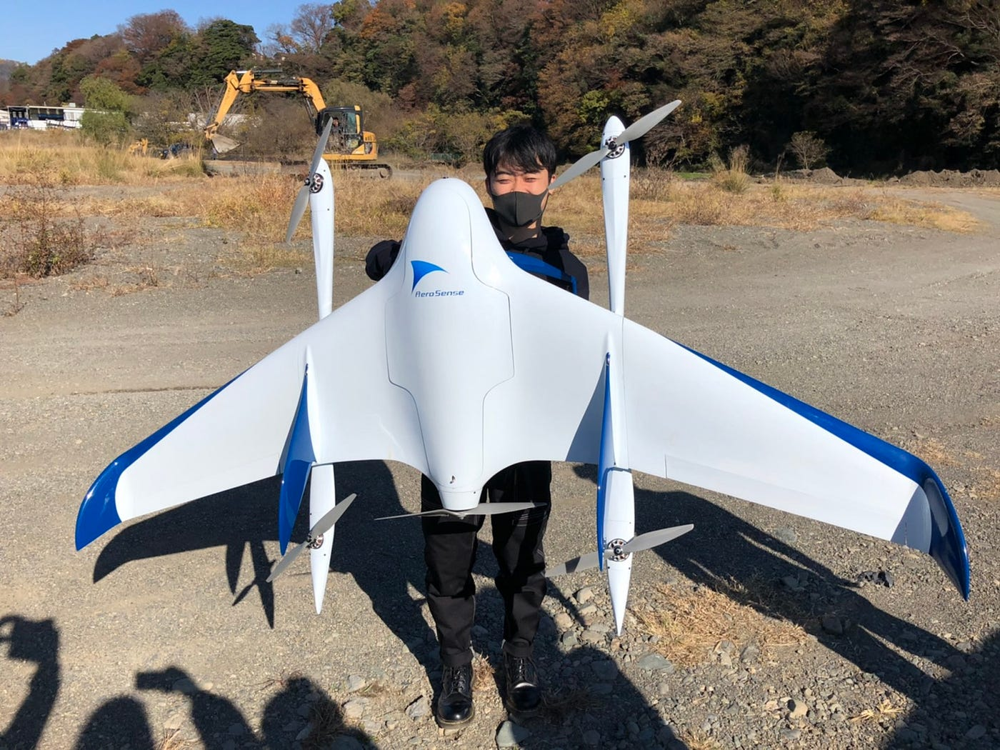

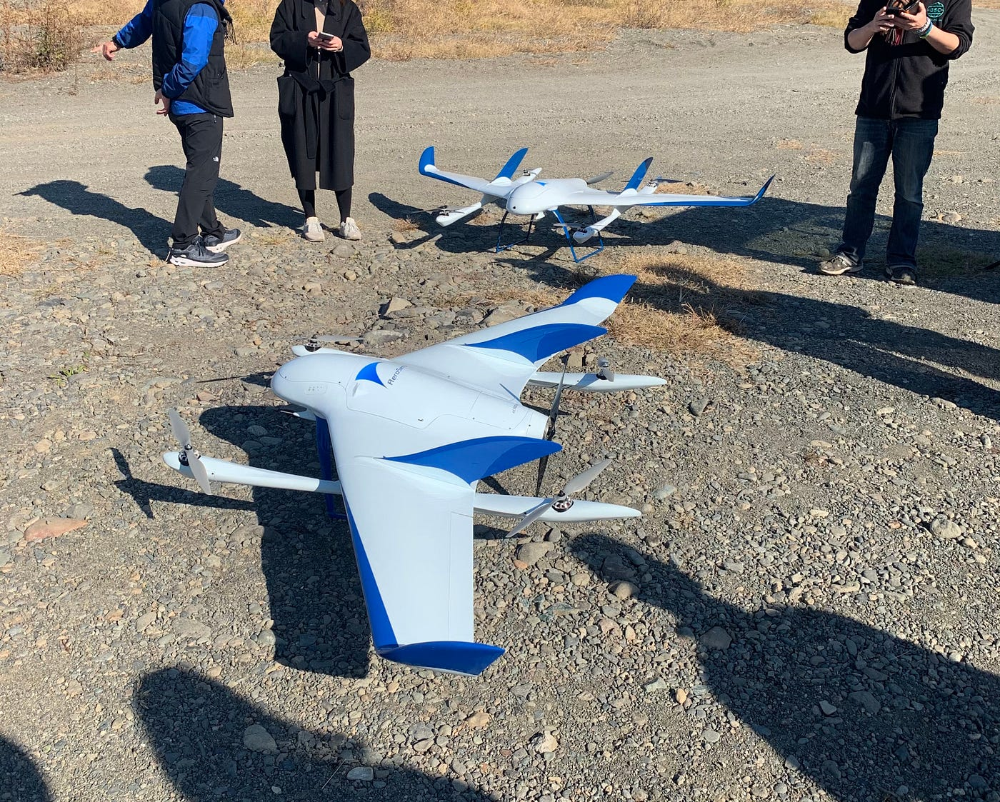

機体についていろいろお話をお伺いすると

> 重量：バッテリー含め約9kg

> 飛行時間：約50分

> 標準飛行速度：70km/hでmaxは100km/h、40km/h以下での水平飛行は不可

とのことでした。

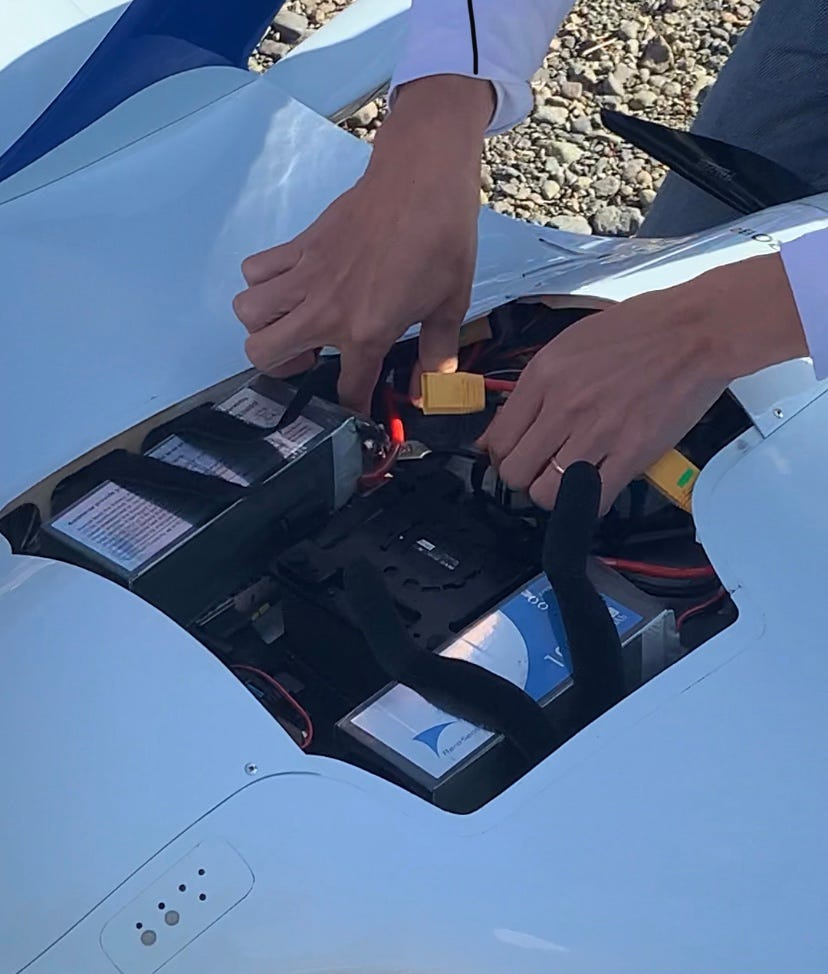

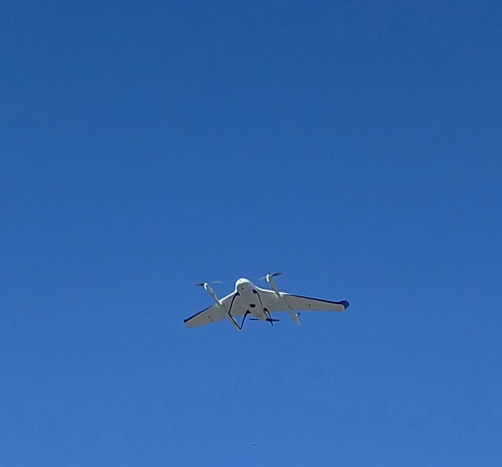

驚きだったのは重量が10kgに満たないことでした。この機体、翼部分が取りはずせるようになっており実際に片方の翼を持たせてもらいましたがものすごく軽くて拍子抜けしました。

そして気になるお値段ですがカメラ類など含め一機**900**万円ほどになるとのことでした。規格外ですね。。笑

### ANAFI USA

次にお披露目された機体はParrot社の[「ANAFI USA」](https://kmtech.jp/drone/parrot-anafi-usa)です！

通常のANAFIは中国で製造されていますがこの機体は米国で製造されています。

注目は3つのカメラ機能で、32倍ズーム、赤外線カメラによる熱画像処理、4K HDRビデオキャプチャ性能を備えておりサーモグラフィーによって救助者の位置や温度の高い危険な箇所、建築物の脆くなっている箇所などのホットスポットを素早く把握することを可能にしています。

実際私は操縦しませんでしたが見たところとても軽やかな飛行姿で操作性が良さそうな印象的を受けました。

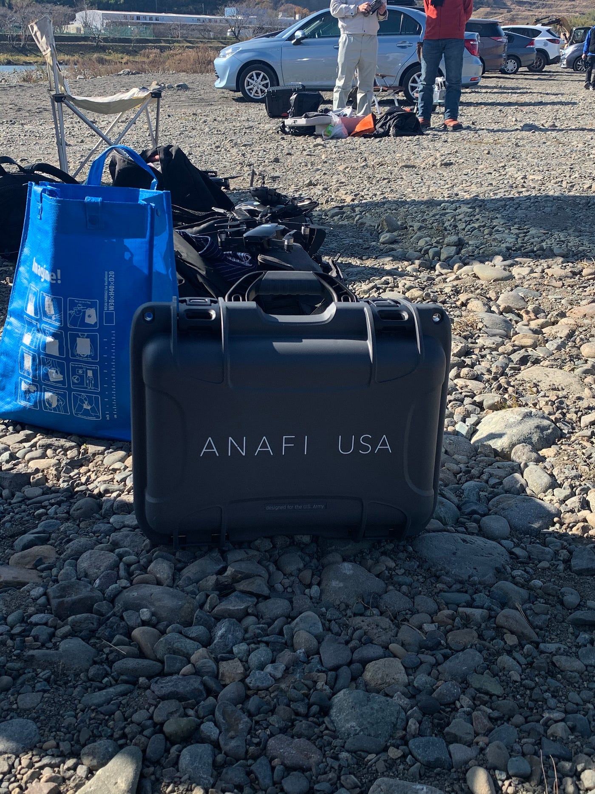

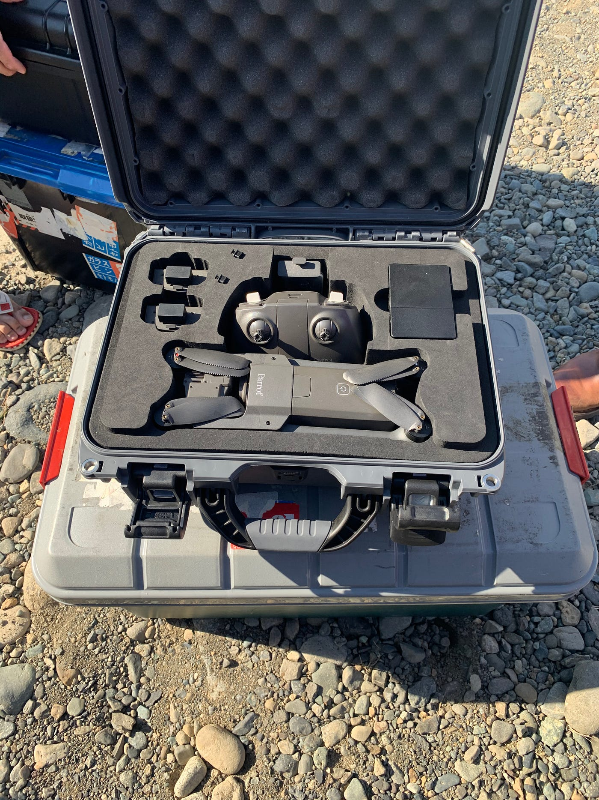

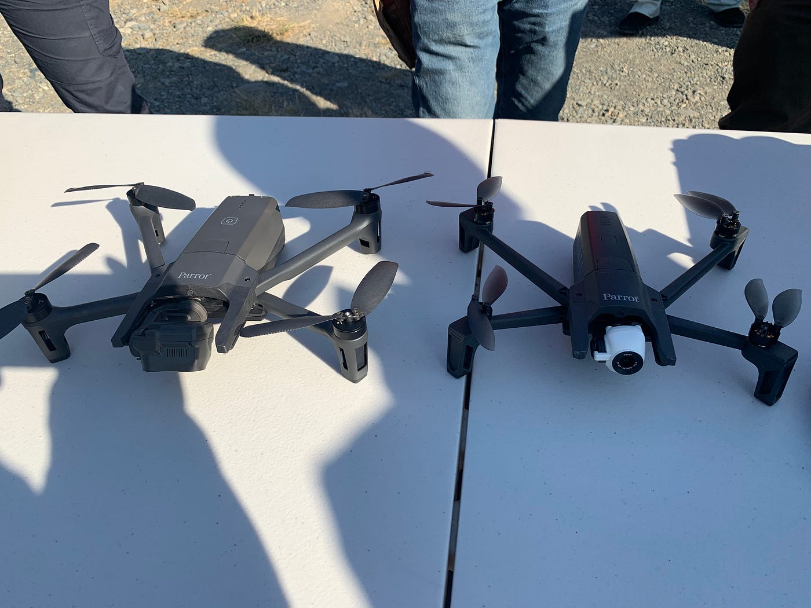

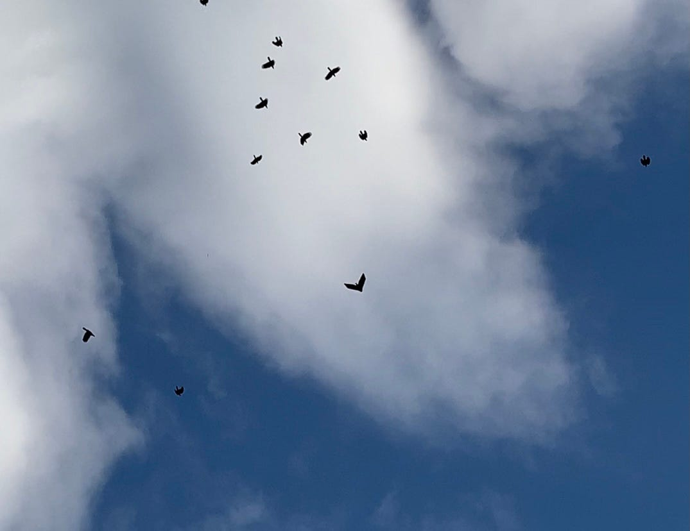

### マイクロドローンの世界

さて、今週の週報ではマイクロドローンについて取り上げていきたいと思います。今回のドローンバード訓練に参加されていた方の中にマイクロドローンを取り扱っていた方がおり、非常に興味深くお話をお伺いすることができました。

マイクロドローンとは文字通り、手の平に収まるほどのとても小さなドローンで、FPVゴーグルを使用したレースやフリースタイル用ドローンとして使われることが多いです。

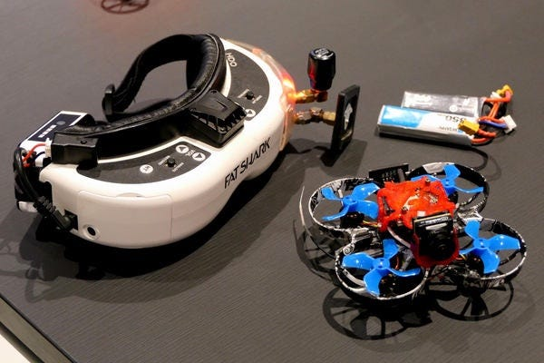

DJI製品などの大きなドローンに比べ安全センサや制御システムにたよらず操縦士の技術力に依存した飛行になるためドローンのマニュアル操縦練習に向いています。

#### シミュレーションソフトは室内練習に最適

実機でのマイクロドローンのFPV体験をさせていただいた後にソフトでの練習も経験しました。

PCで専用のシミュレーションソフト（有料）を開きプロポをつなぐだけで本物と遜色ない環境でドローン操縦ができます。実際にやらせていただきましたが確かにこれはほぼ同じ操作感でした。むしろムズかしい…

これを使えばわざわざ風の強い日に実機を飛ばさなくたって家でソファーに座りながらドローン操縦ができます。まあマイクロドローンであれば家の中で飛ばせるといえばそうですが私のようにせまいアパートで一人暮らししているような人には助かります笑

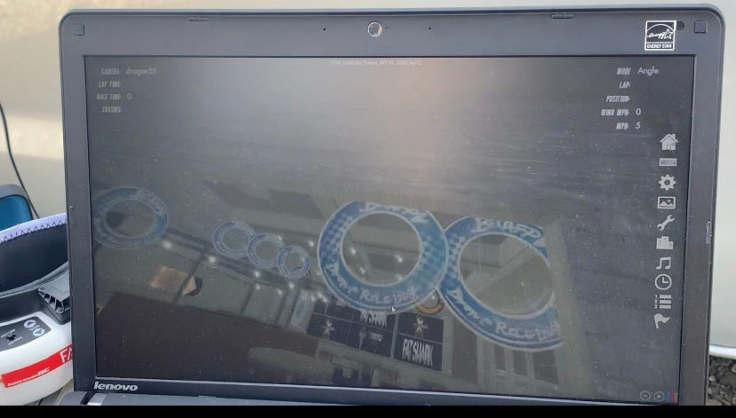

「マイクロドローンをセンサ系なしで飛ばせるまたはこのシミュレーションで自由に飛ばすことができればDJI等の製品の凄さをより実感でき、大きなドローン操縦が楽になる」

お話を聞く中でこの言葉がとても印象に残りました。これまではいつか自分のドローン、もちろんDJI製品のような完全にできあがったものを手にしたいとしか考えていませんでした。しかしこのマイクロドローンはプロポの設定からFPVのシステムの構築まで自分でやることができる。この自由度の高さとマニュアル飛行練習による操縦技能の習得も可能。これはたしかに学ぶものが多く魅力のある世界なのだろうなと感じました。

時間に余裕ができてきたら、マイクロドローン操縦の最初の一歩であるアマチュア無線局の免許取得から始めたいと思います。笑

### グラレコ

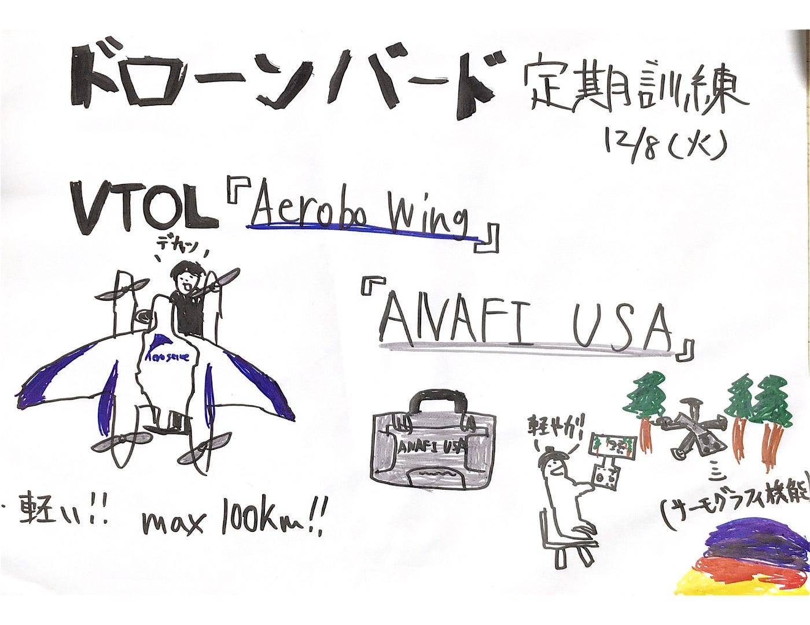
