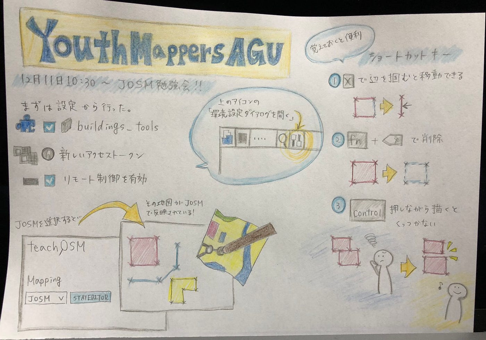

### JOSMって何、、、

こんにちは。

先週のゼミ活動、2年生にたくさん助けてもらった吉田です。

12月11日の10:30から奇跡的にみんなの予定が合ってオンラインでJOSMの勉強会を行いました。

画面共有をしてもらいながら一歩ずつ一歩ずつ丁寧にみんなで教えあって、、、、ってパソコン教室かな、、？と思うことがありましたが無事にみんな同じスタートラインにつけました！（はずです。）

まず、自分自身のパソコンにJOSMを入れるところから始めて、JAVAを入れたり、MAC自体の鍵を外したりと困惑することも多かったです。

[Download Java for Linux
Oracle Javaライセンスは、2019年4月16日以降のリリースに対して変更されました。 新しい Oracle Java SEのOracle Technology Networkライセンス契約は、以前のOracle…java.com](https://java.com/ja/download/)

[LearnOSM
この章では、JOSM(JavaOpenStreetMapEditor)…learnosm.org](https://learnosm.org/ja/josm/start-josm/)

マッピングできるように根本的な設定も行いました。

ID Editorよりもよりマッピングに特化していて専門的に感じました。

HOT Tasking ManagerやOSMの方がイラストがポップでかわいいけど…

初心者には最初の設定が多く、日本語に対応しているものの、MACとWindowsで表示が違ったり、専門用語が多かったりととっつきにくかったりするかもしれません。

ショートカットキーも教えてもらいましたが、まず基本的な動作に慣れようと思います、、、。

みんなが日中に集まることができてオンラインででもお話することができて楽しかったのが一番です🎶

