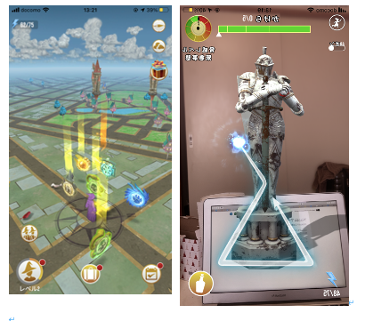
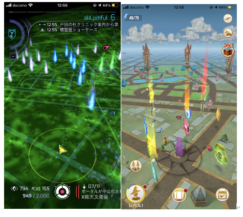
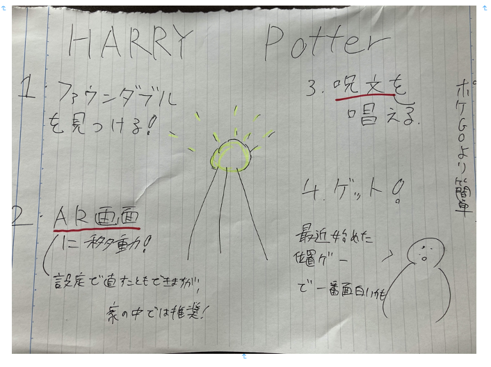

### Nianticで一番評価が高い位置ゲー

今回紹介する位置情報ゲームは、ハリーポッター：魔法同盟です

nianticが手がける位置ゲーの中で、最も評価が高く（app storeより）まだ触れたことがなかったのでやってみました。

ゲームの基本はスマートフォンを片手に歩き回り、あちこちにある「ファウンダブル」と呼ばれる魔法界のアイテムを回収していくことです。

序盤チュートリアルでは、とにかくファウンダブルを集めるように言われましたので、やってみます。ファウンダブルは、ポケgoでいうポケモンみたいな物なのでぷかぷか浮いています。

この、周りに光って浮いているのが、ファウンダブルです。タップすると、ARを用いた戦闘画面に移ります。呪文を唱えるために、矢印をなぞり、上手くいくとファウンダブルをゲットできるということです！

位置ゲーとしては、完成度は高いと思います！レイド戦やチームが分けられたりするので、ポケgoのハリーポッター版というのが一番説明するのが簡単だと思います！下の図はマップを比較するためにingressとハリポタを出してみました。ハリポタの方が見やすいですね。ingressがリンク貼られまくりな印象もありますが、、

ハリポタはレベル6に達すれば、職業を選べるなど様々にできることが増えるので、レベル6まで達しようと思います！

グラレコ

