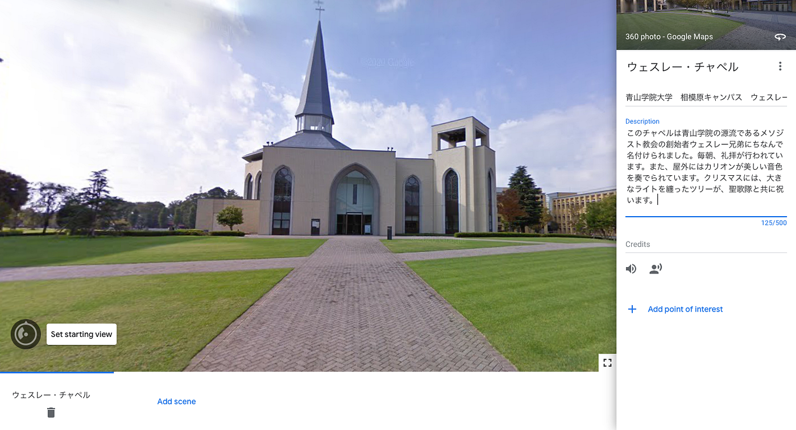
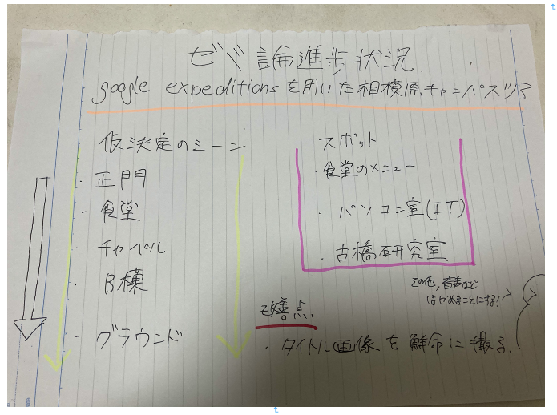

### アドベントカレンダー2020

ゼミ論進歩状況を報告したいと思います。

前回中間発表で説明した通り、google expeditionsを用いた相模原キャンパスツアーを行いたいと思います。現在、青学からのアカウントではなく、自分のアカウントで、どうような完成形を目指すか模索している最中です。決定したことは、スポットは4-5

> 正門：青学相模原キャンパスの創設：学部等

> 食堂：食事のメニュー、広さ、人数の説明

> チャペル：教会の歴史、礼拝の説明

> B棟：図書館、パソコンを用いた設備や授業内容（f棟e棟にある、留学生や外国人講師の紹介も入れるか模索中）

> グラウンド：駅伝部の強さ、（原監督の知名度？）など他部活動を調査

をメインに考えています。相模原キャンパスは結構小さいので、シーンを限定（縦並びに紹介）にして、左右で見渡せることにしたいと思います。よって、この並びにしたいです。ゼミ室の紹介も！！

シーンとは別に、スポットの追加ですが、b棟最上階からの景色を入れてもいいかなと考えました。後、食堂ですが学食を説明欄に入れるのではなく、スポットで良さそうな気がします。

後、pory（google steeet view ）を使われているのだが、室内の様子がとれないので、室内の紹介はやめようかなと思います。（ゼミ室は除く）

そして、紹介文は日本語で書いて、後に英語版を作り、一応二種類のツアー制作を考えています。音声や効果音の入れですが、正門についた場合のみ授業チャイムが鳴るように考えています。

publishしたのは、この[仮ツアー](https://poly.google.com/creator/tours/t/p/256R9fybYVF)だけでこの段階ではスポットは一つしかつけてないのですが、問題と改善点があります。

まず、タイトル画面の人の多さです。google street viewで正門前に行き、そのスクリーンショットを入れたのですが、人が多すぎるので相模原キャンパスに出向き写真を撮る必要がありそうです。

今回は、これで以上になります。いかに見やすく、簡潔に説明できるかを目指しているので、説明欄もなるべく簡略化したいと思います。チャペルの仮説明は終わったので、このように進めていくこととなります。

