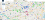
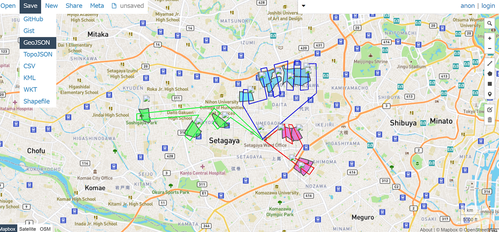
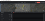
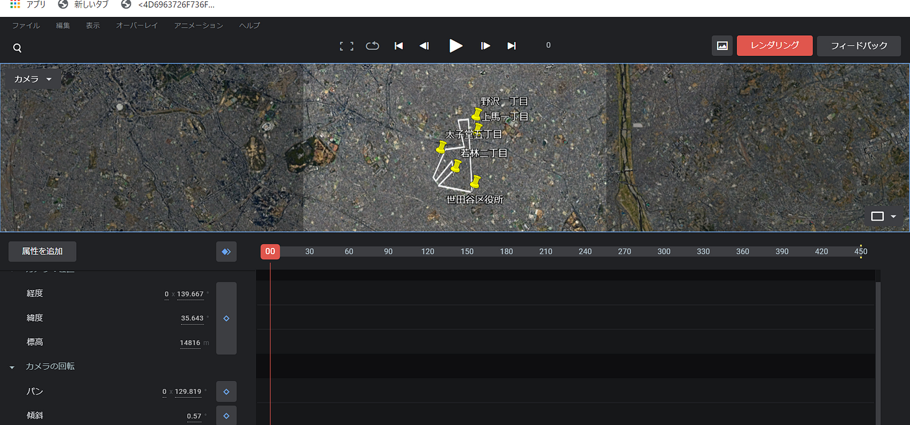
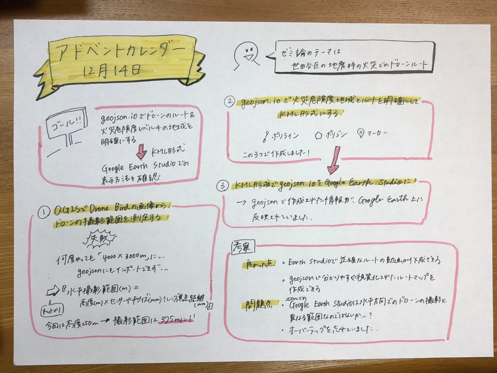

### アドベントカレンダー12月14日

#### [本間友那](https://yunapanpan.medium.com/?source=post_page-----40b8c3ea42e9--------------------------------)

#### [·Just now](https://yunapanpan.medium.com/%E3%82%A2%E3%83%89%E3%83%99%E3%83%B3%E3%83%88%E3%82%AB%E3%83%AC%E3%83%B3%E3%83%80%E3%83%BC12%E6%9C%8814%E6%97%A5-40b8c3ea42e9?source=post_page-----40b8c3ea42e9--------------------------------)

### ＃＃Introduction

私のゼミ論のテーマは世田谷区の地震時の火災が起きた時のドローンルートの動画の作成です。

今回はgeojson.ioでドローンのルートを視覚的に明確にし、そしてそのデータをKML形式でGoogle Earth Studioにインポートして、ルートを正確に動画に出来るかを確認することを目的にしました。

### ＃＃Method

①QGISでDrone Birdの画像からドローンの撮影範囲を測定する。

②geojson.ioで中間報告で調べた東京都の『地震に関する地域危険度測定調査 地域危険度一覧表（区市町別）』から世田谷区の火災危険度４の地域を明確にし、①での撮影範囲を基にドローンのルートを決める。

③geojson.ioで作成したKML形式をGoogle Earth Studioにインポートして確認する。

### ＃＃Result

### ＃＃＃撮影範囲の特定

QJISでDrone Birdの写真を計測すると、3000ｍ×4000ｍになってしまいうまくいきませんでした。さらに、geojson.ioで計測しようとしたのですが、写真をインポートすることが出来ませんでした。やむを得ず、ネットにのっていた、ドローンの撮影範囲の計算を使い範囲を推測してみました。

『計算式

・水平撮影範囲 (m) = 高度 (m) x センサー水平サイズ (mm) / レンズ焦点距離 (mm)

・垂直撮影範囲 (m) = 高度 (m) x センサー垂直サイズ (mm) / レンズ焦点距離 (mm)

#### [ドローンで撮影可能な範囲の計算 | ドローン撮影・航空写真｜株式会社クアッド](https://quadgraphy.com/blog/2195/)

#### [今回はドローンで俯瞰撮影した際の撮影可能な範囲の計算方法についてご紹介します。 事前の計算で算出可能ですので、工事などの記録撮影や不動産などの撮影時に便利です。 計算式は下記の通りです。 計算式 ・水平撮影範囲 (m) = 高度 (m)…](https://quadgraphy.com/blog/2195/)

#### [quadgraphy.com](https://quadgraphy.com/blog/2195/)

Phantom4 Pro

センサーサイズ（1インチ） = 水平13.2mm x 垂直8.8mm

焦点距離 = 8.8mm (フルサイズ換算24mm)』

Drone Birdは水平撮影で、災害時250ｍの高度から飛ばすと仮定すると

250×13.2÷8.8＝375

この式から撮影範囲は375ｍとしました。

### ＃＃＃geojson.ioで火災危険度地域とルートを明確にし、KML形式にする

[ピンク・赤]

①世田谷区役所②上馬1丁目③野沢1丁目④太子堂5丁目⑤若林2丁目

[青]

①世田谷区役所②松原4丁目③松原1丁目④羽根木2丁目⑤大原1丁目⑥北沢5丁目⑦北沢4丁目

［緑］

①世田谷区役所②経堂2丁目③船橋1丁目④上祖師谷３丁目

高度250ｍからだと375ｍの範囲を撮影できるはずなので、それを基にルートを考えました。

### ＃＃＃KML形式でgeojson.ioをGoogle Earth Studioにインポート

geojson.ioで入力したデータが反映されていました。

### ＃＃Discussion

### ＃＃＃良かった点

・geojson.ioで作成されたルートがGoogle Earth Studio上で表示されるので、Google Earth Studioで簡単で正確に予定したルート通りの動画が作れる。

・geojson.ioで誰にでも分かりやすいルートが作成できる

### ＃＃＃問題点

私の推測なので正しいか分からないのですが、Google Earth Studioは水平方向での撮影が、高度250ｍからのドローンの範囲とは異なるものだと思いました。今後geojsonで作ったものを基にした動画作成をどうすべきか考え直したいです。

