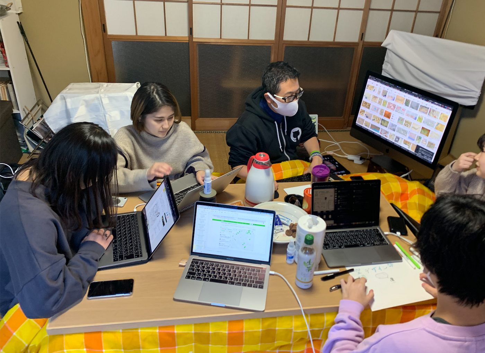
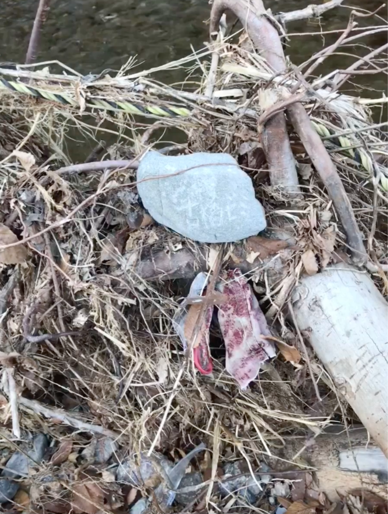

### 空間デザイン部合宿！！

空間デザイン部プラス佐藤かほるの5人が参加し、2020年12月7日に合宿を行いました！

### ＃＃合宿の様子

VLOG的なのも作ってみました＾＾
→[https://drive.google.com/file/d/1y27p0RXA0QZMggMbbb7nDwf-hV0DB7be/view?usp=sharing](https://drive.google.com/file/d/1y27p0RXA0QZMggMbbb7nDwf-hV0DB7be/view?usp=sharing)

### ＃＃空間デザイン部の新企画『お役立ちデザイン術集』について

前回の週報に記載したように、**『お役立ちデザイン術集』**を今後の空間デザイン部としての活動方針にしていこうと思います。

前回の週報はこちら↓

[空間デザイン部 週報
空間デザイン部、今後何する？medium.com](https://medium.com/furuhashilab/%E7%A9%BA%E9%96%93%E3%83%87%E3%82%B6%E3%82%A4%E3%83%B3%E9%83%A8-%E9%80%B1%E5%A0%B1-c0c821e26386)

話し合いの結果、お役立ちデザイン術集企画が決定し、
内容については…

> _**-デザインの四原則
-グラレコで役立つカラーチャート
-グラレコの際に気をつけるべきデザインポイント！
-スライド資料作成のデザインお役立ち術_**

の4つの案が挙がりました。

デザインの四大原則は以前すでに空間デザイン部でまとめた記事がありました！TEDx AoyamaGakuinUに参加する前の空間デザイン部が結成されてまもない5月20日に公開されています。懐かしい…。

[デザインこれだけはおさえておきたい基本原則４選！！
今回空間デザイン部では、これからの様々な活動を見越して「最低限専門知識を学ぶべきでは？」を考え、デザインの基礎中の基礎！を古橋先生バイブル本「ノンデザイナーズデザインブック」より学んできました！medium.com](https://medium.com/furuhashilab/%E3%83%87%E3%82%B6%E3%82%A4%E3%83%B3%E3%81%93%E3%82%8C%E3%81%A0%E3%81%91%E3%81%AF%E3%81%8A%E3%81%95%E3%81%88%E3%81%A6%E3%81%8A%E3%81%8D%E3%81%9F%E3%81%84%E5%9F%BA%E6%9C%AC%E5%8E%9F%E5%89%87%EF%BC%94%E9%81%B8-1e67a2b8dfad)

GitHubレポジトリ
[https://github.com/furuhashilab/fc_SpatialDesign/blob/main/design.md](https://github.com/furuhashilab/fc_SpatialDesign/blob/main/design.md)

### ＃＃まとめ

掘りごたつに入りながら、各メンバーのゼミ論相談やゲスト登壇のグラレコ作成、今後の空間デザイン部の活動方針などを話し合い、合宿を無事完了することができました。

今後は**『お役立ちデザイン術集』**を順々進めていき、活用していただけるようにしていきたいです！

#### グラレコ
