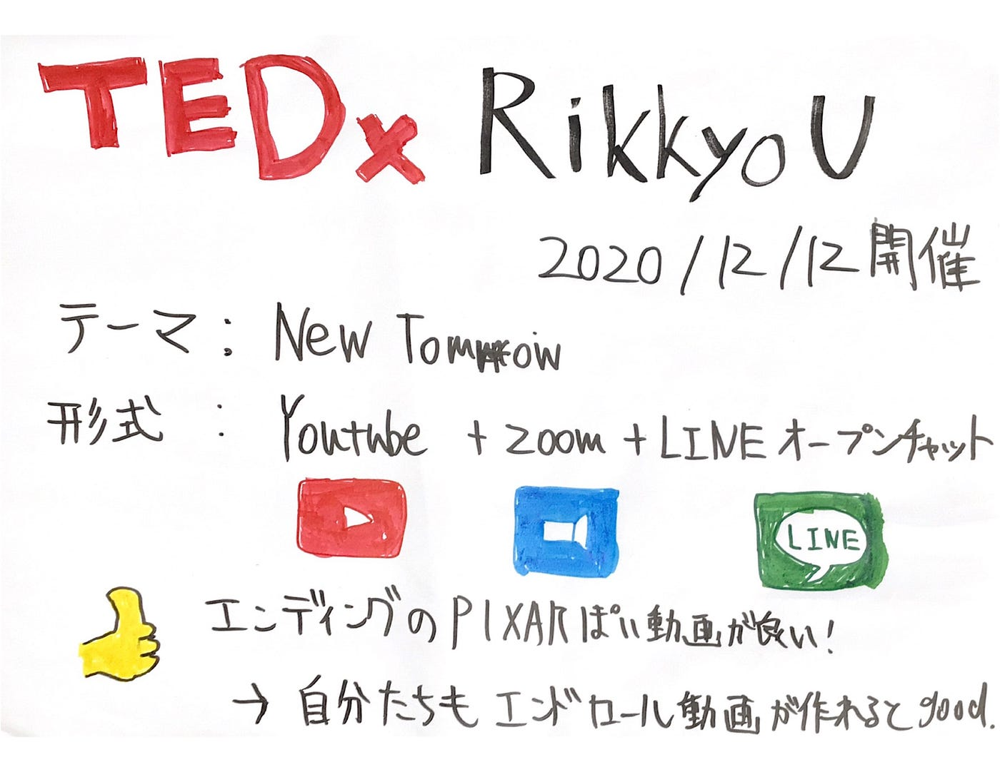

### 立教大学 TEDxにお邪魔しましてきました

お久しぶりです！神田です。12月も中旬に入り段々と本格的に寒くなってきましたね。皆さんいかがお過ごしでしょうか！

TEDxAoyamaGakuinUでは前回より他大学のTEDxオンライン開催にお邪魔し各大学の特徴、形式などをまとめてきました。

今回は12/12(土）に行われたTEDxRikkyoUオンラインイベントに参加しましたので簡単に概要をお伝えします！

### 立教大学 TEDx Rikkyo

> テーマ：”New Tomorrow”

> 主催：立教大学 人工知能科学研究科

> スピーカー数：５人(全員大学関係者)

> 開催方法：YouTubeとzoomとLINEのオープンチャット

<会場>

・リアルの会場(大学の一部ロビー的な場所？)で撮って、動画編集なし(パワポや写真の編集は一部あり)

＜技術面＞

カメラアングルは二種類（横から腰から上を撮影、正面から全身を撮影）

スライドは後ろのテレビモニターで表示。

たまに全画面表示でのスライド（写真）を表示。

<エンディング>

👍 PIXARっぽい動画が良い！メンバーの楽しそうな姿や作る側の苦労も伝わってきた。

→締めの動画(エンドロールとか)は自分たちも余裕があれば作りたい。

メンバーの馬場がより詳しい情報や、よかった点、フィードバックをまとめてくれているのでぜひご覧ください！

[Meet Google Drive - One place for all your files
Google Drive is a free way to keep your files backed up and easy to reach from any phone, tablet, or computer. Start…drive.google.com](https://drive.google.com/file/d/1DwlQ4ryv7MP0amA5WNW9lf7okE_PCJ81/view?usp=sharing)

