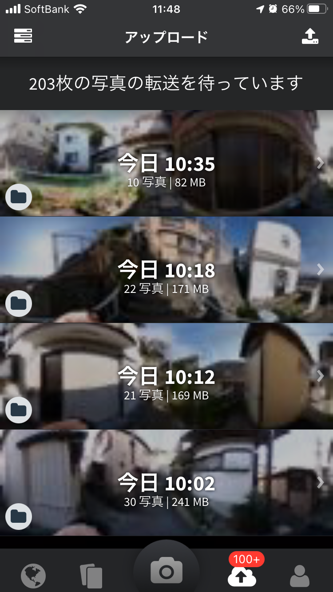
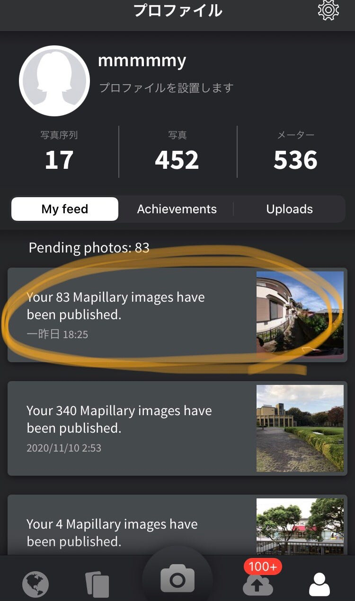
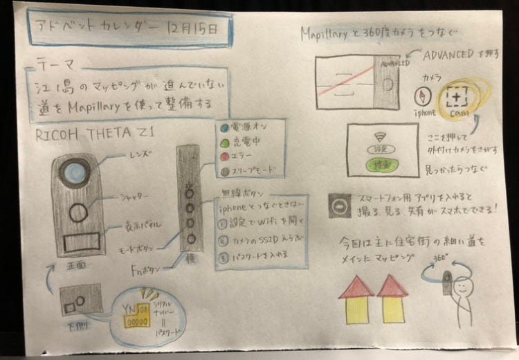

### 江ノ島のMapillary を整備してみた｜アドベントカレンダー12月15日

### Introduction

本日のアドベントカレンダーを担当します八尋舞美です。今回はゼミ論の進歩状況を書いていこうと思います。

前回の中間報告

[江ノ島のMapillary を整備してみた
ゼミ論では、江ノ島の道をMapillaryを使ってマッピングしていきます。medium.com](https://medium.com/furuhashilab/%E6%B1%9F%E3%83%8E%E5%B3%B6%E3%81%AEmapillary-%E3%82%92%E6%95%B4%E5%82%99%E3%81%97%E3%81%A6%E3%81%BF%E3%81%9F-27333751ef81)

前回はスマートフォンを使って写真を撮り、Mapillaryにアップロードしました。今回は360度カメラが届いたので、それを使って撮影してみました。実際に取りに行く前に、教えていただいた目黒さんの発表動画を見てMapillaryでのマッピングにおけるコツなどを学びました。

### Methods

1)オンライン説明書を読んで基本的な使い方を覚える

説明書→ [https://support.theta360.com/ja/manual/z1/](https://support.theta360.com/ja/manual/z1/)

スマートフォン用アプリ「THETA」にも動画での説明が載っている

2) Mapillaryと360度カメラをつないで撮影し、アップロードする

撮影手順

1. 360度カメラの電源を入れ、スマートフォンの設定からWifiを選択する。（パスワードはカメラの底に記載されているシリアルナンバー）

1. Mapillaryのアプリを開き、撮影画面のADVANCEDを押して360度カメラを接続させる。

1. スマートフォン用アプリ「THETA」を開いて映り具合を確認しながら撮影を開始する。（その際に念のため別で位置情報の記録としてStravaを同時につける）

1. 撮った画像をMapillaryでアップロードする。

### Result

今回は住宅街の細い道を中心にマッピングしていきました。

[Japan, image by mmmmmy
Map data at scale from street-level imagerywww.mapillary.com](https://www.mapillary.com/app/?focus=photo&pKey=Vj0sQKM2ozVXVYa1n3493X&lat=35.30018894352213&lng=139.4813405776042&z=17&x=0.4422958442212863&y=0.5701145825610586&zoom=0)

strava→[https://www.strava.com/activities/4464782656?share_sig=B8D438481607964792&utm_medium=social&utm_source=ios_share](https://www.strava.com/activities/4464782656?share_sig=B8D438481607964792&utm_medium=social&utm_source=ios_share)

[Japan, image by mmmmmy
Map data at scale from street-level imagerywww.mapillary.com](https://www.mapillary.com/app/?focus=photo&pKey=gkhXOHGsS7jaIkOLH8GObv&lat=35.30003563451234&lng=139.4813169739702&z=17&x=0.6053075594291382&y=0.5218821382248521&zoom=0)

Strava→[https://www.strava.com/activities/4464795147?share_sig=B28120B31607964757&utm_medium=social&utm_source=ios_share](https://www.strava.com/activities/4464795147?share_sig=B28120B31607964757&utm_medium=social&utm_source=ios_share)

[Japan, image by mmmmmy
Map data at scale from street-level imagerywww.mapillary.com](https://www.mapillary.com/app/?focus=photo&pKey=YdemkfNTMLMaB6tN7eMfsa&lat=35.30023393854561&lng=139.48166855306067&z=17&x=0.08980978900363856&y=0.6120700467453606&zoom=0)

Strava→[https://www.strava.com/activities/4464763889?share_sig=0B7EC19C1607964807&utm_medium=social&utm_source=ios_share](https://www.strava.com/activities/4464763889?share_sig=0B7EC19C1607964807&utm_medium=social&utm_source=ios_share)

[Japan, image by mmmmmy
Map data at scale from street-level imagerywww.mapillary.com](https://www.mapillary.com/app/?focus=photo&pKey=As3Um4C4ch16ZRMGhOQiw7&lat=35.30070554222621&lng=139.48182767248045&z=17)

Strava→[https://www.strava.com/activities/4464826365?share_sig=1A5412951607963537&utm_medium=social&utm_source=ios_share](https://www.strava.com/activities/4464826365?share_sig=1A5412951607963537&utm_medium=social&utm_source=ios_share)

撮影ができたらこのような感じで写真が溜まる。これを右上に出てくるアップロードのボタンを押して完了するのを待つ。数が多いと反映されるのに時間がかかることがある。

### Discussion

360度カメラを使って良かった点

・一回で全方向撮影できるため、往復しての撮影が不要

・シャッター音をオフにすることができるため静かに撮影可能

課題点

・フードを被ったり、頭上のなるべく高い位置から撮ったりしたが、自分が映り込んでしまうことが分かった。今後どうすればより映らずに取れるのかいろいろな角度から試してみようと思う。

グラレコ

