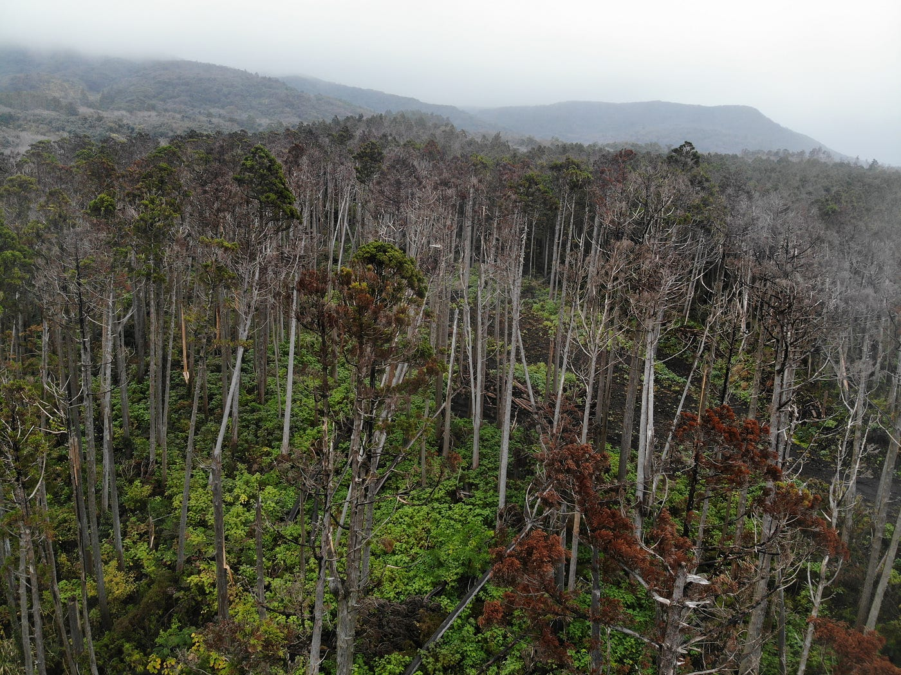
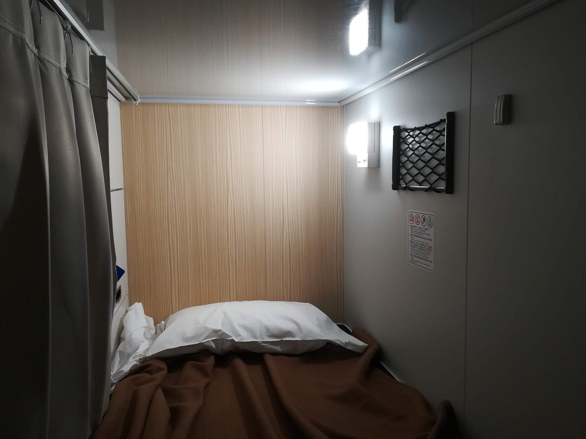
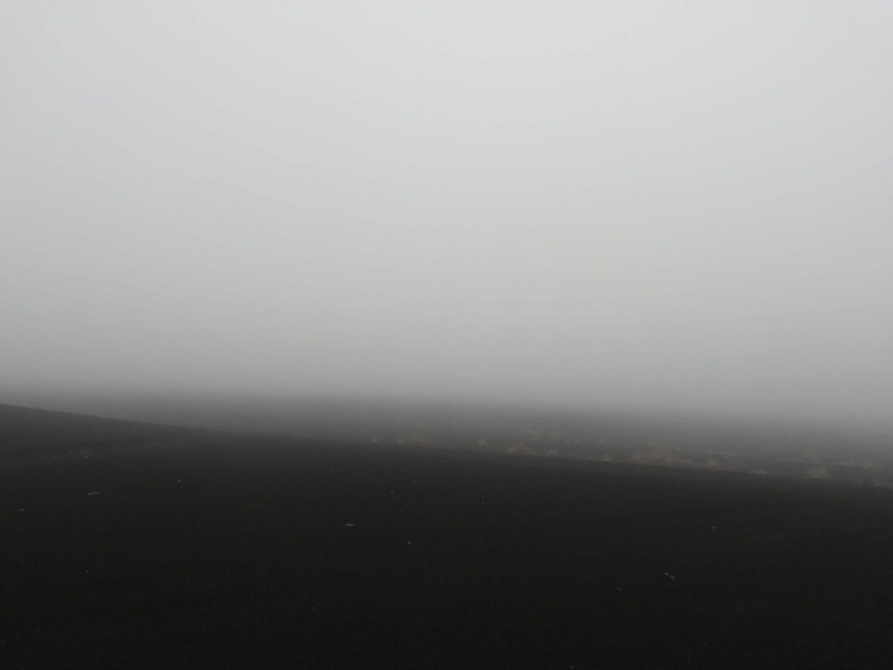
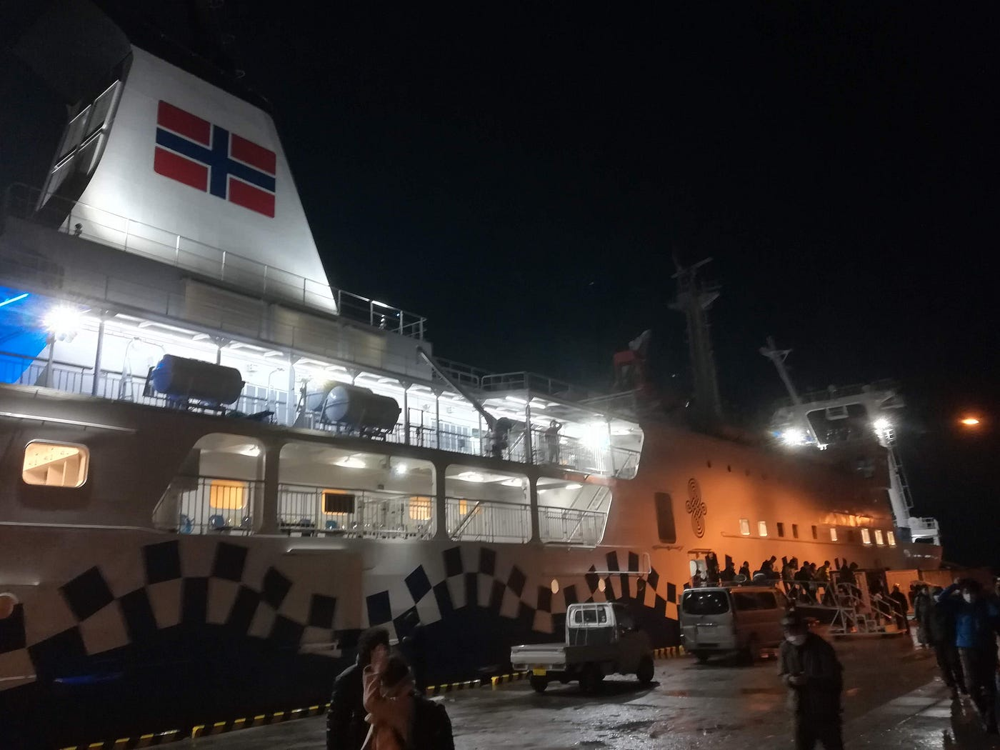
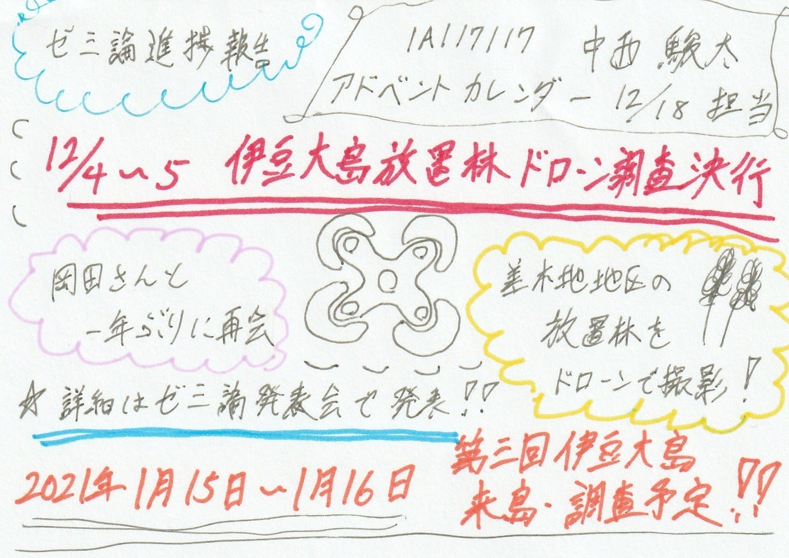

### 伊豆大島ドローン調査を決行

アドベントカレンダー12/18担当
2020年度 ゼミ論進捗状況報告 
1A117117 中西 駿太

### 2020/12/4～5
 第二回伊豆大島放置林ドローン調査を実施

標記の通り、12月4日から5日にかけて伊豆大島にて放置林の分布を確認すべくドローンの飛行を行った。新型コロナウイルスが感染している状況でしたが、GoToトラベルキャンペーンが出発時点で対象となっていたことを受けて、予定通り決行した。

> 調査の目的

・伊豆大島観光協会 岡田雅司さんと一年ぶりにお会いすること。

・伊豆大島でのあらゆる分野での新型コロナウイルスの影響を調べること。

・伊豆大島 差木地地区に分布する放置林の現在の様子を確かめること。

・DJI Mavic Air で差木地地区の放置林を上空から撮影を行うこと。

・大型客船 新型さるびあ丸に乗船すること。（おまけ）

_☆新型コロナウイルス感染拡大のため、感染しない。させない。を徹底し調査を行いました。_

> 調査での成果

・伊豆大島観光協会 岡田雅司さんと一年ぶりにお会いすること。
→変わらずお元気な姿を拝見し、雨だったこともあり、たくさんお話をすることができました。

・伊豆大島でのあらゆる分野での新型コロナウイルスの影響を調べること。
→幸い人的被害はなかった模様。ただ、観光面では打撃を受けた。詳しくは、ゼミ論発表会で。

・伊豆大島 差木地地区に分布する放置林の現在の様子を確かめること。
→去年と少しも変わらず。相変わらずの荒廃状態。

・DJI Mavic Air で差木地地区の放置林を上空から撮影を行うこと。
→撮影は成功。ただ、風が強かったこともあり、ドローンが不時着するトラブルが起きました。

・大型客船 新型さるびあ丸に乗船した。（おまけ）

> 調査の反省点

・天候があまり良くなかったため、広範囲の撮影はできなかった。

・バッテリー不足で長時間の飛行ができなかった。
→バッテリーを多く持っていき、飛行調査を行う。

・風がやや強い中飛行を敢行し、付近の林に不時着させてしまった。
→機体は無事に回収。人的被害はなし。

⇒[前回の週報](https://medium.com/furuhashilab/%E3%83%89%E3%83%AD%E3%83%BC%E3%83%B3%E9%83%A8-%E9%80%B1%E5%A0%B1%E2%91%B3-f7d3dcd57ac3)を参考に二度と同じことを繰り返さぬよう、十分に注意して飛ばします。

[ドローン部 週報⑳
12/30 ドローン部 ミーティング内容medium.com](https://medium.com/furuhashilab/%E3%83%89%E3%83%AD%E3%83%BC%E3%83%B3%E9%83%A8-%E9%80%B1%E5%A0%B1%E2%91%B3-f7d3dcd57ac3)

[風速の目安
小波の大きいものは波頭が砕けはじめる。泡はガラスのように見える。所々に白波が現れることがある。何種類かのディンギーはプレーニングはじめる。weather-gpv.info](http://weather-gpv.info/gw.php)

> 今後の予定

#### 第三回 伊豆大島放置林ドローン調査を実施予定

期間：2021年1月15日～16日（予定）

伊豆大島観光協会 岡田雅司さんには前回調査の時に伝えた。

☆新型コロナウイルスの感染拡大によっては、調査の時期を変更する可能性がある。但し、ゼミ論提出期限の1/30までにはぜひとも来島・調査を行いたい。

参考）[昨年度ゼミ論](https://furuhashilab.github.io/2019gsc_ShuntaNakanishi/)

[【2019年度ゼミ論】伊豆大島の観光目線での伊豆大島の現状レポート
本研究は伊豆諸島最大の島「伊豆大島」をフィールドに、過去の度重なる自然災害、現地の独特な気候や文化を観光目線で把握し、伊豆大島の"今"（現状）を確認し報告をするものである。それと同時に、かつて本研究室が伊豆大島合宿を行いドローンによる空撮を…furuhashilab.github.io](https://furuhashilab.github.io/2019gsc_ShuntaNakanishi/)

> グラレコ

以上
