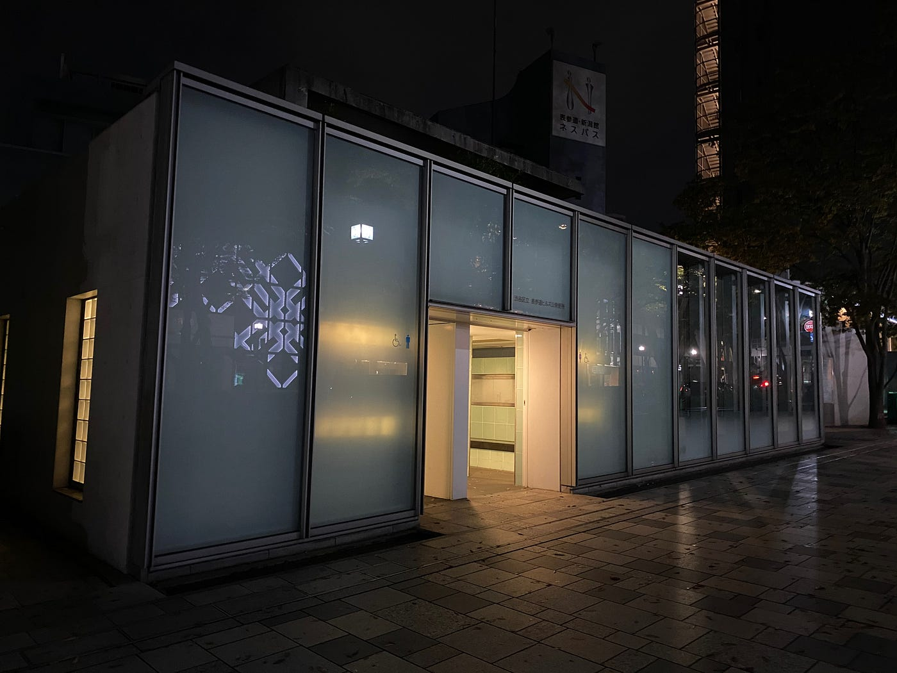
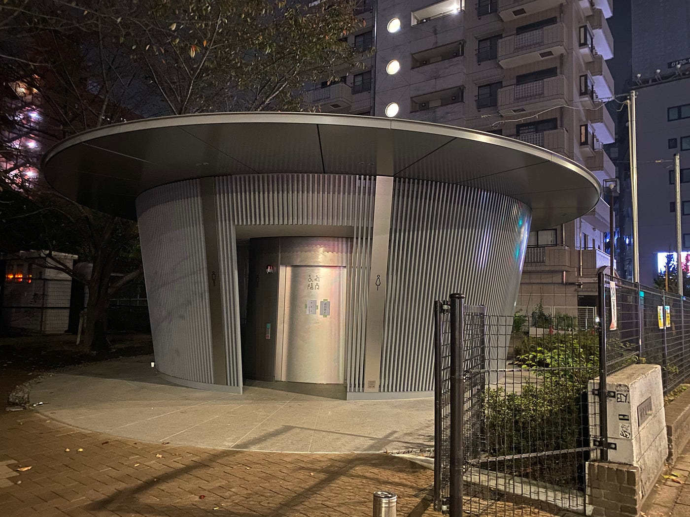
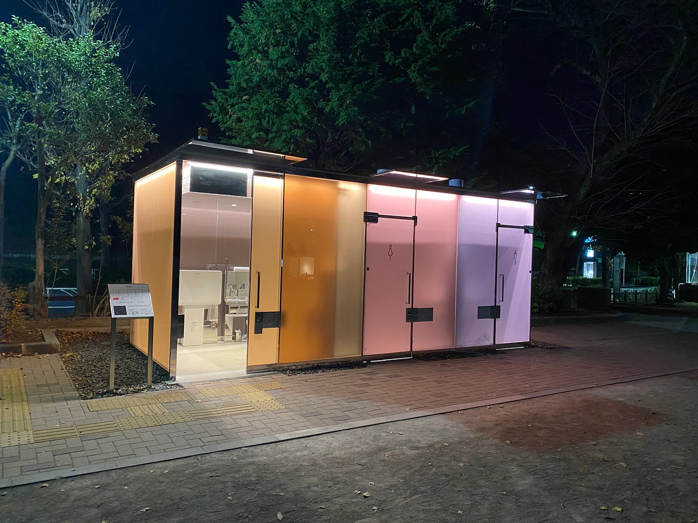
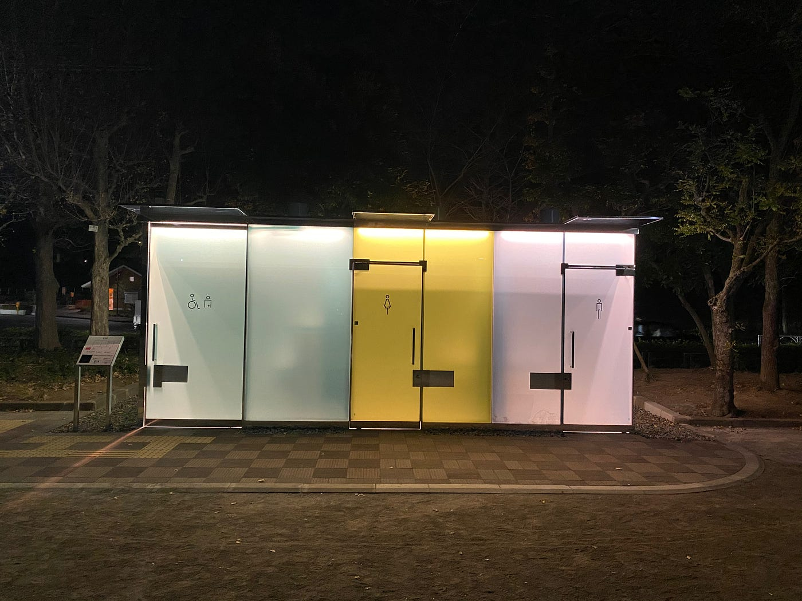
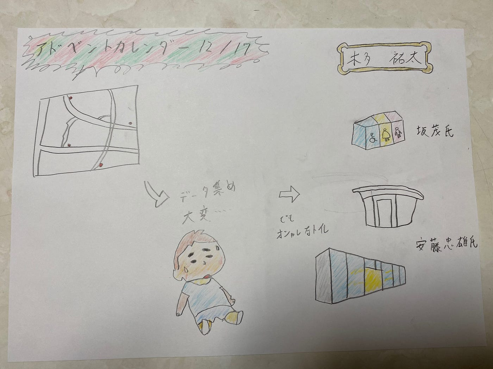

### アドベントカレンダー12月17日

地球社会共生学部 3年 1A118064 木多祐太

### Introduction

今回のアドベントカレンダーでは、現在進行中のゼミ論について話していこうと思います。

前回の中間報告

[渋谷区の公衆トイレマップ化計画
地球社会共生学部 3年 1A118064 木多祐太medium.com](https://medium.com/furuhashilab/%E6%B8%8B%E8%B0%B7%E5%8C%BA%E3%81%AE%E5%85%AC%E8%A1%86%E3%83%88%E3%82%A4%E3%83%AC%E3%83%9E%E3%83%83%E3%83%97%E5%8C%96%E8%A8%88%E7%94%BB-ded6e4458526)

今回このテーマを選んだ理由としては、渋谷区の公衆トイレに関するオープンデータがあまり充実していなかった為、ゼミ論では渋谷区の公衆トイレに関するオープンデータを改良し、「渋谷区の公衆トイレマップ」を作成する事にしました。

### Methods

「渋谷区の公衆トイレマップ」の作成方法は至ってシンプルで、

①渋谷区のオープンデータサイトから、公衆トイレのCSVマップをダウンロードし、データクレンジングをする。

②渋谷区にある82箇所の公衆トイレを周り、不足データを集め、情報量の多いCSVデータを作成する。

この二つの手順で進めており、今は②のデータ集めを渋谷区中を歩き回って進めています。

### Result

めちゃくちゃ大変です。渋谷区には82箇所の公衆トイレがあるのですが、かなり広範囲に散らばって点在しているため、今は必死に公衆トイレを求めて歩き回っています。

しかし、いくつか面白い発見もありました。前回の中間発表で紹介しましたが、現在渋谷区は公衆トイレに力を入れているため、著名な建築家による公衆トイレやおしゃれな公衆トイレがいくつかあったため紹介します。

[渋谷区内17の公共トイレが生まれ変わる「THE TOKYO TOILET」プロジェクト メディア公開 | 日本財団
日本財団は、誰もが快適に使用できる公共トイレを設置するプロジェクト「THE TOKYO TOILET」を実施しています。本プロジェクトは多様性を受け入れる社会の実現を目的とし、東京都渋谷区内の17カ所に新しい公共トイレを [...]www.nippon-foundation.or.jp](https://www.nippon-foundation.or.jp/who/news/pr/2020/20200805-46948.html)

①表参道公衆便所

まず一つ目は表参道ヒルズに併設されているトイレです。このトイレは表参道ヒルズと同じデザインで設計されたため、おしゃれな景観によく溶け込んでいます。

②神宮通公園トイレ

このトイレをデザインしたのは、上で述べた表参道ヒルズなどの設計者である安藤忠雄氏です。渋谷区と日本財団が進めている「THE TOKYO TOILET」というプロジェクトの一つとして作られました。

③代々木深町小公園・はるのおがわコミュニティパーク

最後に紹介するトイレは、プリツカー賞を獲得したこともある坂茂さんのデザインです。坂茂さんは小・中学校の先輩でもあるため、このトイレを渋谷区の公衆トイレデザイン大賞とさせていただきます。

グラレコ

