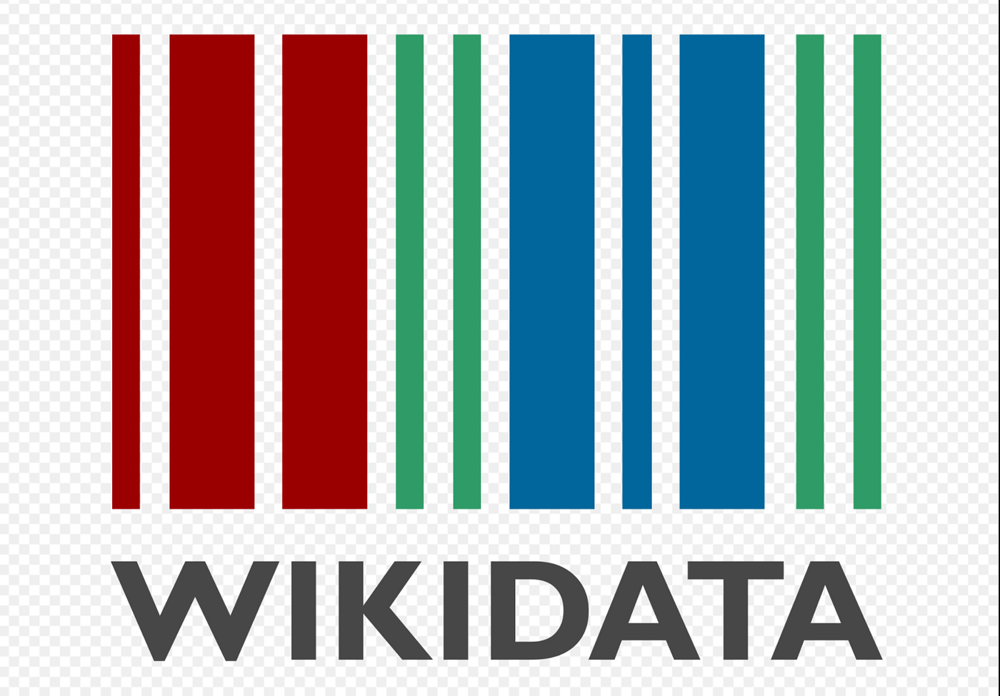
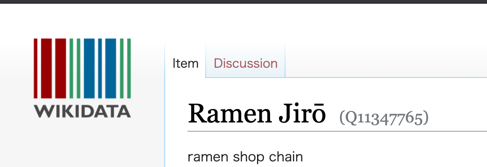
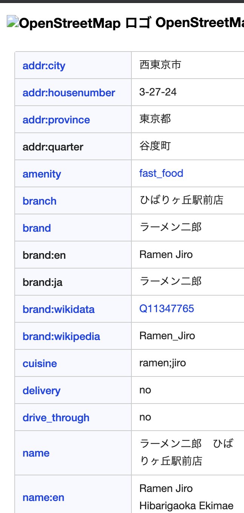

### 12/2 アドベントカレンダー ゼミ論進捗報告

お疲れ様です。

4年の依田峻輔です。ゼミ論では古橋ゼミ一回生である渡辺結南の行っていたOSM上のラーメン二郎データの整備を引き継いで行っています！！

特に私が行っている作業はOSM上のラーメン二郎に追加の情報として「wikidata」の整備を行っているのですが。今回はその「wikidata」とは一体なんなのか、この研究の先にある展望について改めて考察したので、それを持って進捗を報告させていただきます！

### **wikidataとは**

まず初めに「wikidata」とは「この世界のあらゆるものをコンピューターが理解できる方法で表現することを最終的な目標としたプロジェクト」です。

Wikidataの世界では、すべての概念やものが「Q」の文字と数字を組み合わせた「QID」というコードで表現されています。これらのコードをコンピューターが読み込むことで関連性を理解できるようになります。

しかしこのプロジェクトにおいて重要なのは、機械を人に近づけることではなく、コードの目的は、機械が新しい方法で知識を更新したり発見したり、あるいは組み合わせたりすることを手助けすることにあるということです。

Wikidata内の小さな知識が互いに関連づけられることによって、コンピューターはいくつものウェブページやデータベースを探し回らなくても、一瞬で難しい質問に答えることできるようになる。

というのが僕の知る限りのwikidataの概要です！

ちなみにラーメン二郎のQIDは「Q11347765」です。

18年12月にはQIDの数は6,000万にも達しているそうです。

「悲しい」とか「研究」とか形容詞などにもQIDは存在しているので調べてみると意外と楽しいですよ！

### wikidata×OSM

では私が行っているwikidataとOSMの連携をすることでの今後の展望についてです。

wikidataをOSMと連携させることによってOSMに無いデータを使った検索が可能になることから、OSMというツールが世の中においてより一般的なものになり社会において活躍の場の拡大が目的です。

皆さんもOSMにマッピングをする時は「wikidata」のタグも入力してみてください！！

