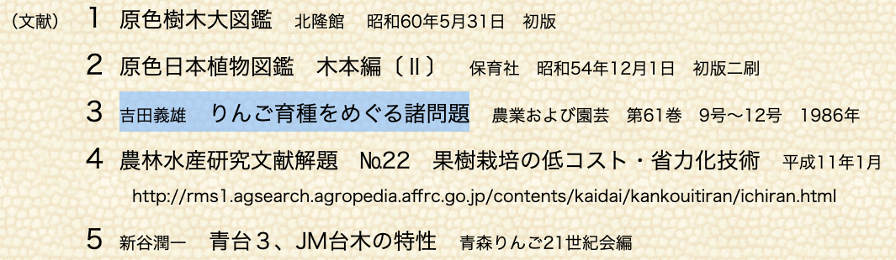
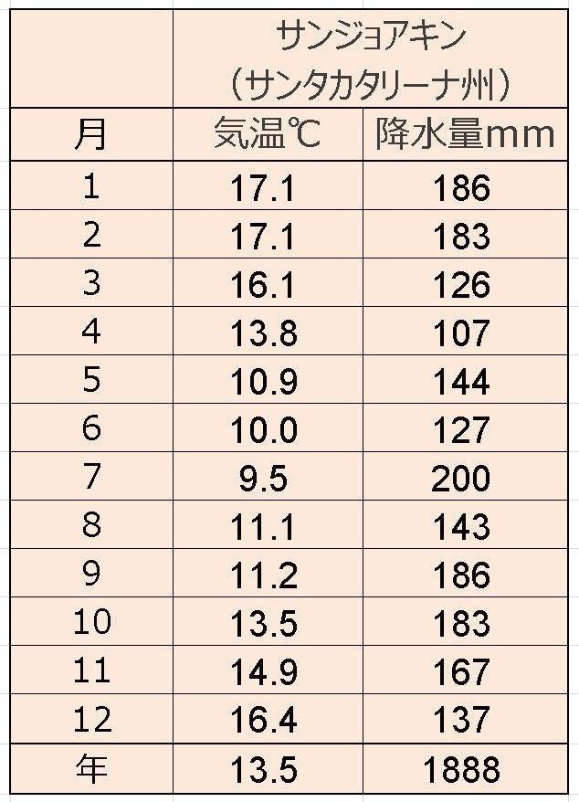
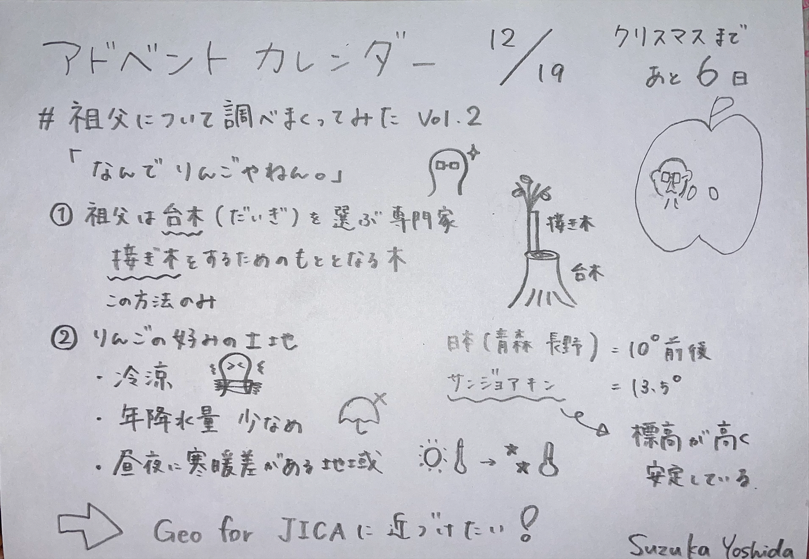
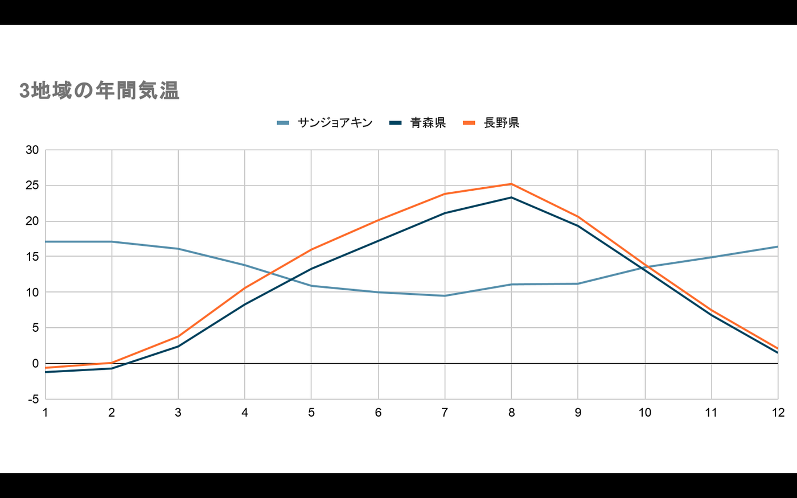
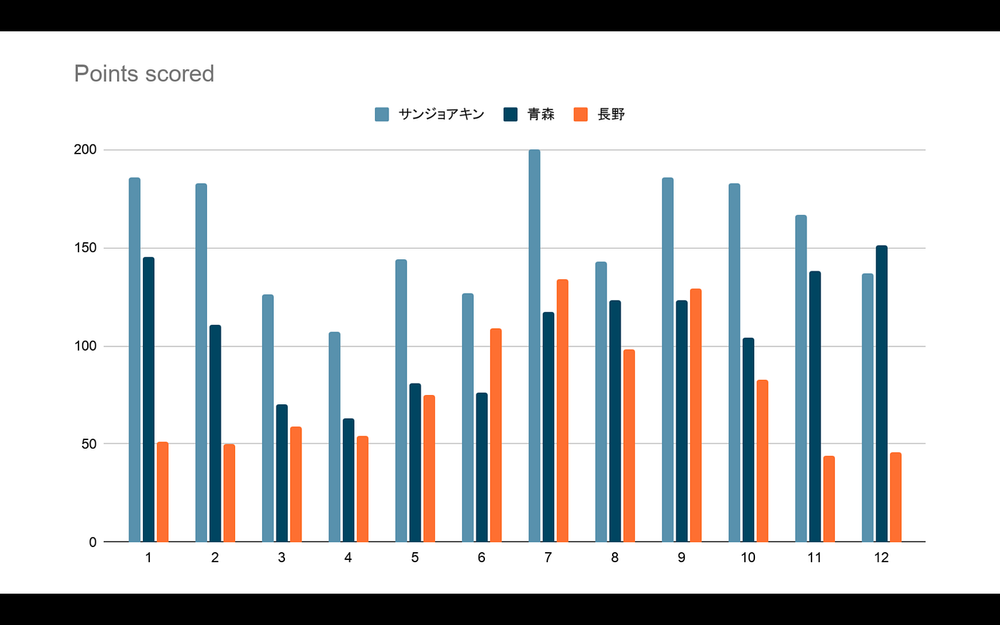

### りんごに適した気候や地域を調べてみた：12/19 アドベントカレンダー

前回、祖父のことについて調べまくった吉田です。

> Introduction

前回、祖父がどんな人だったのかを調べたので今回は、なぜ祖父はりんごをブラジル に伝えようとしたのかを気候や土地から見ていこうと思います。

前回の中間報告

[#祖父について調べまくってみた
会ったことないけどAO入試の志望理由書に登場しまくった祖父について改めて調べてみました。medium.com](https://medium.com/furuhashilab/%E7%A5%96%E7%88%B6%E3%81%AB%E3%81%A4%E3%81%84%E3%81%A6%E8%AA%BF%E3%81%B9%E3%81%BE%E3%81%8F%E3%81%A3%E3%81%A6%E3%81%BF%E3%81%9F-e82a1c0566db)

> Methods

1)祖父の仕事を調べる

[https://libopac.jica.go.jp/images/report/11340338_01.pdf](https://libopac.jica.go.jp/images/report/11340338_01.pdf)

2)りんごについて勉強する

[りんご栽培（知識） | 学ぶ | りんご大学
年平均気温が6～14℃の地域で、世界中で栽培されています。 日本の主産地(青森、長野など)は10℃前後の地域です。 このような冷涼な地域での栽培に適しているのは、以下のような理由があります。…www.ringodaigaku.com](https://www.ringodaigaku.com/study/study02.html)

> Result

1)祖父の仕事を調べる

果樹研究所の果樹試育種部長

りんご台木選定の専門家

台木とは…

“_リンゴの各品種は、体細胞が突然変異して生じた枝変わりや、交配の結果生じた多数の実生から目的に近いただ一個の個体を選択して生じたものですから、種子で増やすことはできません。また、栽培されているリンゴは挿し木や取り木をしても、発根しませんので、いままでは接ぎ木だけで増やしてきた植物_”

**祖父＝接ぎ木を選定する専門家**

[http://malus.my.coocan.jp/mitearuku/daigi/daigi.htm](http://malus.my.coocan.jp/mitearuku/daigi/daigi.htm)

この記事の一番下の文献に祖父の名前がありました！

国立国会図書館にあるみたいなのですが、オンラインでは見ることができませんでした。

2)りんごについて勉強する

[https://www.ringodaigaku.com/study/study02.html](https://www.ringodaigaku.com/study/study02.html)

_**・冷涼な地域_**

_年平均気温が6~14度の地域_

_日本の主産地（青森、長野）は10度前後_

_冷涼な地域を好む理由_

_・収穫を終え落葉したりんごの木は、12月～翌年3月まで休眠期間に入りますが、 休眠から目覚めるには一定期間低温にさらされる必要があります。_

_・りんごが良く色づくには、秋ぐち(9月下旬～10月上旬頃)からの低温が必要であ り、りんごを貯蔵するにも冷涼な方が適しています。_

_**・年降水量が少なめの地域** （_長野の平均降水量：932.7mm）

_その理由_

_・冷涼な気候であることと合わせて、病害の発生が少なくなります。_

_・雨が多いと、[ツル割れ](https://www.ringodaigaku.com/study/study02.html#popup_learn01a)の発生が多くなります。_

_・雨が多いと、肥料の養分が流れてしまいます。_

_**・昼夜に温度差が大きい地域_**

_その理由_

_・昼夜の温度差があると、昼は成長し、夜は寒さから身を守るという過程を繰り返 しながら成長します。すると、実の引き締まった、糖度の高いりんごになりま す。_

ブラジルと比較する

・サンジョアキン（サンカタリーナ州）の気温と降水量

[http://photo-kataru.com/364a_SaoJoaquimClima.htm](http://photo-kataru.com/364a_SaoJoaquimClima.htm)

＝サンジョアキンの方が少し暖かくて降水量が多め

しかし、標高が高く、平均気温の安定さと低さ、冬季の低温期６００－８００時間と言うデータから将来性を見てサンジョアキンが選ばれている。

[https://40anos.nikkeybrasil.com.br/jp/biografia.php?cod=1234](https://40anos.nikkeybrasil.com.br/jp/biografia.php?cod=1234)

> Discussion

先日行った、Geo for JICA 見える化サイト風に作りたい。。。

あとどんな情報が必要か模索中です。

グラレコ

Google スライドでグラフを作成したのですが、携帯からだと見ることができないのでスクリーンショットも合わせて記載しておきます。

さすが南半球、、、気温は綺麗に逆ですね！

降水量も二つの地域に比べてとても多い感じがします。
