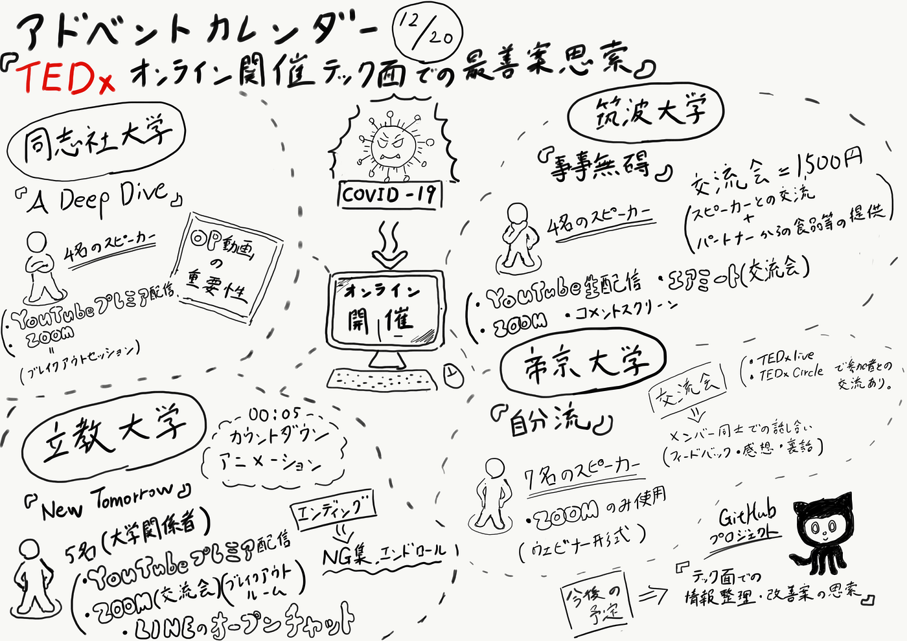

### アドベントカレンダー12月20日 TEDxオンライン開催テック面での最善案思索

ゼミ論としてTEDxのテック関係のまとめを行い、次回のオンライン開催に向けてより良いものにしていきたいなと考えています。

そこでその前段階として、我々TEDxAGU以外にもオンライン開催を行った他TEDxに複数参加し、どのように開催しているのか様子を見て回りました。

今回は、TEDxDoushishaU、TEDxRikkyoU、TEDxTukubaU、TEDxTeikyoUの４団体のオンライン開催に参加してみました。それぞれ内容だけでなく、開催方法も多少なりとも違いがあったので整理したものをあげたいと思います。

#### ＜同志社大学＞

テーマ：A Deep Dive

スピーカー人数：４名（スピーカーの4人中2人が校内生 ）

開催方法：YouTubeプレミア配信、ZOOM

メンバー＝4年生や院生が多い。

＜形式＞

・プレミア公開はYouTubeのチャット機能も使えてスムーズに反応を見れる。YouTube上のコメント機能の方がみんなが使い慣れているので良い。

・オープニング動画のクオリティが高かった。（重要性もかなり高いように思われる。）

・ 最初に携わった人の名前とスポンサーを入れていた。

・ 交流会をZOOMのブレイクアウトセッションで行った。

#### ＜立教大学＞

テーマ：New Tomorrow

スピーカー数：５名（全員大学関係者）

開催方法：YouTube（プレミア配信でトーク動画鑑賞） 、ZOOM（交流会）、LINEのオープンチャット（コメントやリアクション、運営からのイベント情報等も掲示）

＜形式＞

- 始まる直前にカウントダウンアニメーションあり。

- オープニング動画あり（TEDxとは。TEDxRikkyoの紹介。テーマ）

- 休憩＝１０分間 （クリスマスミュージックが流れていて、画面にはクリスマス仕様の立教大学キャンパス）

- エンディング動画あり。（NG集を流しながら、横でエンドロール）

- 交流会はZOOMのブレイクアウトセッションで１時間。

- 2人のスピーカーを招き、各ブレイクアウトルームで雑談・質問等

- 「TEDx居酒屋」ルームでは、運営メンバーを中心に雑談、入りにくい感はあった。

#### ＜筑波大学＞

テーマ：事事無碍
 
スピーカー人数：４名

開催方法：YouTube生配信 (生配信での司会＋前撮りした動画＋生でインタビュー相手はzoomで繋がっている) 、ZOOM（スピーカーの方々がリアルアイムで司会と会話）、コメントスクリーン（ニコ動的な）、_**[エアミート_**](https://www.airmeet.com/)（交流会）

＜形式＞
・パフォーマンス(録画で書道パフォーマンス、2人目の後にTPartyさんのパフォーマンス) 
・代表の挨拶(テーマの説明等) 
・各スピーカーのトーク＋生配信(zoom)インタビュー 
・その後に2分間の休憩が計2回あった(休憩中はスポンサーのCM) 
・zoomでスピーカー全体と繋げて話をする。 
・エンディング動画
（各スピーカーのハイライトやイベント裏側での写真等をBGMを流しながら出す。一番最後にTEDxのテーマと感謝文、QRコードの表示。） 
・交流会(有料 1500円) エアミート使用 
（ 有料コンテンツでスピーカーと交流できる＋パートナーからの食品等の提供 ）

#### ＜帝京大学＞

テーマ：自分流

スピーカー人数：7名

メンバー＝医学部生＋教授

開催方法：ZOOMのみを使用

＜形式＞

・ 一方的なウェビナー形式

・ZOOM一つで完結。

・最初にTEDxとは何かの説明・紹介動画（英語で喋り、日本語字幕）
 
・各スピーカーの紹介を毎回違ったメンバーがTEDxロゴのオブジェクトを背景に紹介している。

・その後、各スピーカー動画の前にスポンサーロゴ表示 → 始まり

・交流会は、参加者の質問や感想等を拾うのではなく、運営メンバー同志での話し合いを見ているような形。

・最後に質問を読み上げいくつか答える。

ここでは、各団体イベントに参加し、気づいたことや思ったこと等を一部まとめてここに記したが、自分のGitHubプロジェクトではより細かくまとめていて、その整理も順調に進んでいる状況である。
 また、各団体の整理が終了したのちには、今後のオンライン開催をする上でのテック面での最善案を書き記したいと考えている。

#### ＜グラレコ＞

#### ＜GitHub＞

[furuhashilab/2020gsc_TatsumiBaba
You can't perform that action at this time. You signed in with another tab or window. You signed out in another tab or…github.com](https://github.com/furuhashilab/2020gsc_TatsumiBaba/projects/1)
