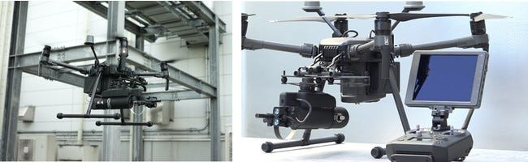
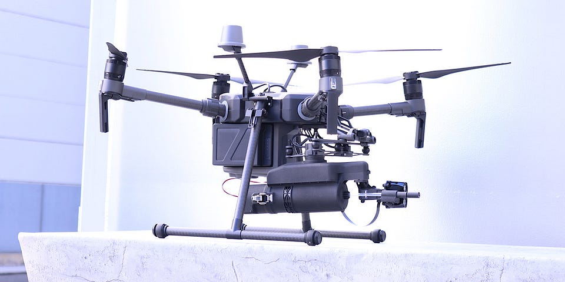
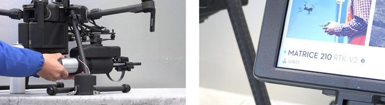
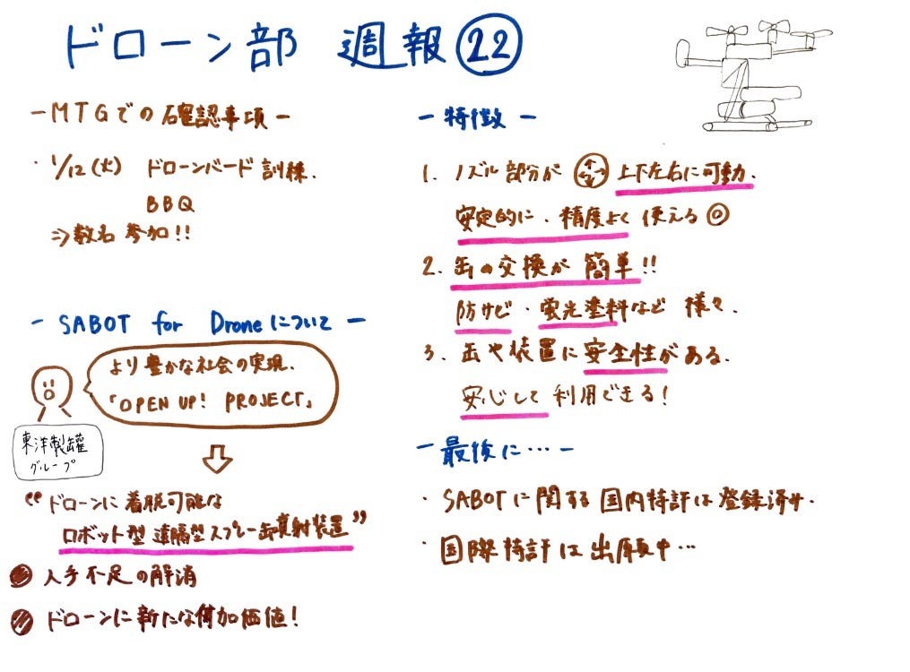

### ドローン部週報㉒

こんにちは、古橋ゼミ4年の森です。

#### **～ミーティングでの確認事項～**

・1/12（火） ドローンバード訓練＆新年会（バーベキュー）

に、ドローン部からは数名（人数は未定）が参加することを確認しました。

バーベキューだけではなく、訓練もあるのでドローン部として頑張りましょう！ということになりました。

#### ～ドローンに着脱可能な遠隔型スプレー缶噴射装置「SABOT for Drone」について～

東洋製罐（とうようせいかん）グループが、より豊かな社会の実現を目指す『OPEN UP! PROJECT』の一環で、ドローンに着脱可能なロボット用遠隔型スプレー缶噴射装置『SABOT for Drone』の実用化モデルを完成させました。世界初です！

☞背景

〇ドローンの活用により、危険で人が立ち入るのが困難な場所でのカメラ利用による点検など、安全で効率的に作業が出来て人手不足解消にもなります。

〇多分野において課題解決に関与するドローンに、「容器」という観点から新たな付加価値を与えるため、開発を進められました。

☞主な特徴

１．ノズル部分が上下左右に可動します。そのため上下左右に安定的に、精度よく散布・噴射が可能です。

２．缶が簡単に交換可能なため、ドローンから防サビ剤を噴射したり蛍光塗料をマーキングすることが出来ます。

３．装着する缶には殺虫剤や室内消臭剤などで使用されるスプレー缶が採用されています。容器を含めた装置全体の安全性があり、安心して使用出来る仕様が提供されています。

～最後に～

現在、SABOTに関する国内特許が登録済みであり国際特許は出願中とのことです。

この「SABOT for Drone」を活用し、農業従事者を始めとする多くの人々の課題解決や、企業での人手不足の解消に繋がれば良いと考えました。

お読みいただきありがとうございました。

グラレコになります。

