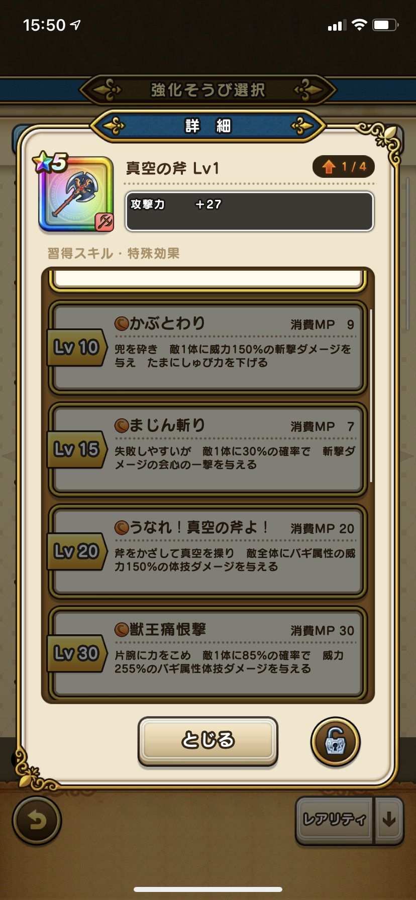
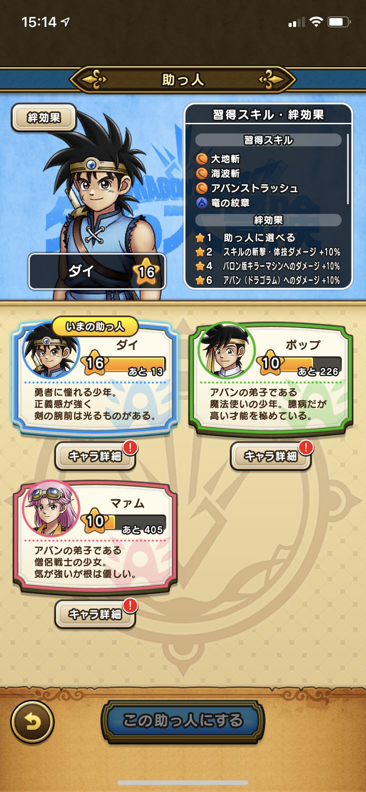
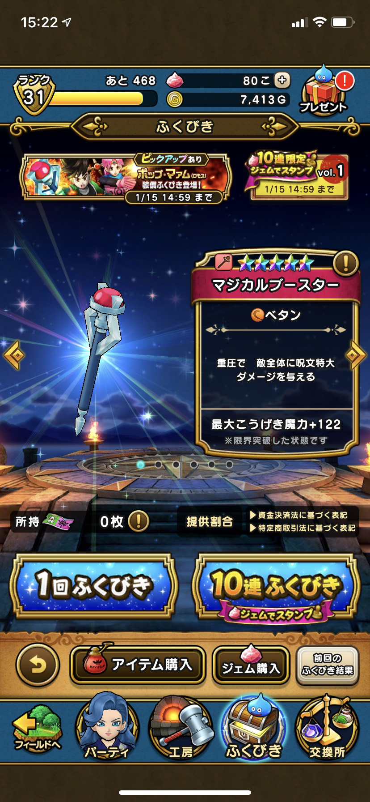
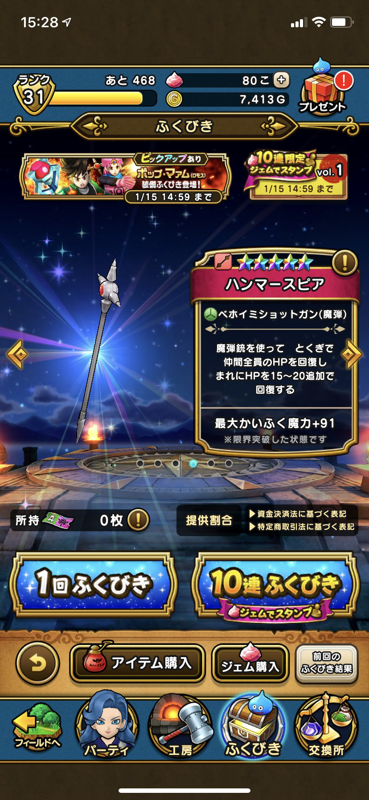
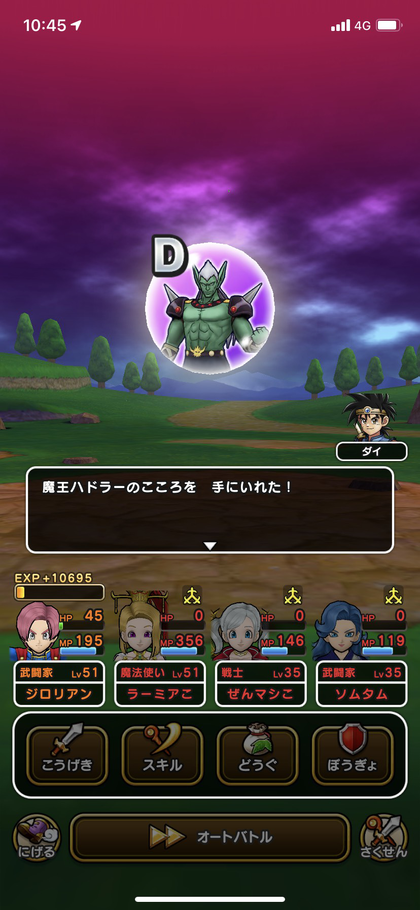
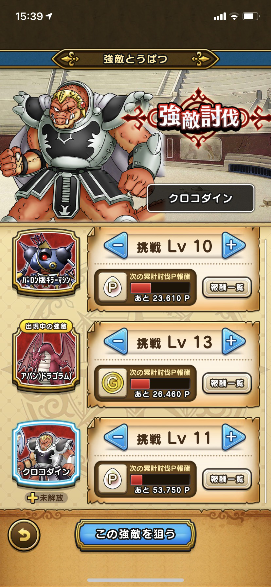
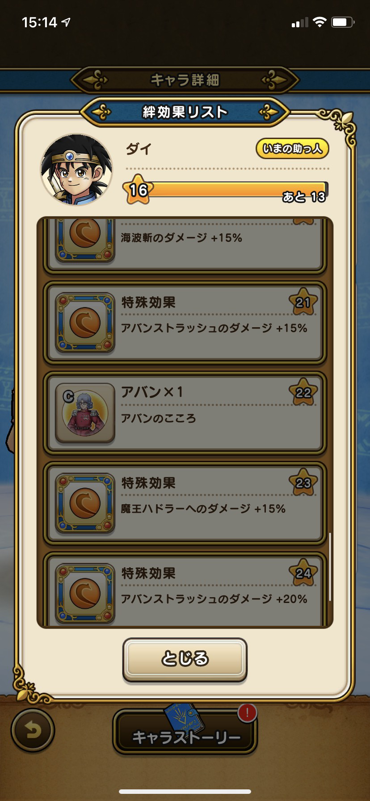
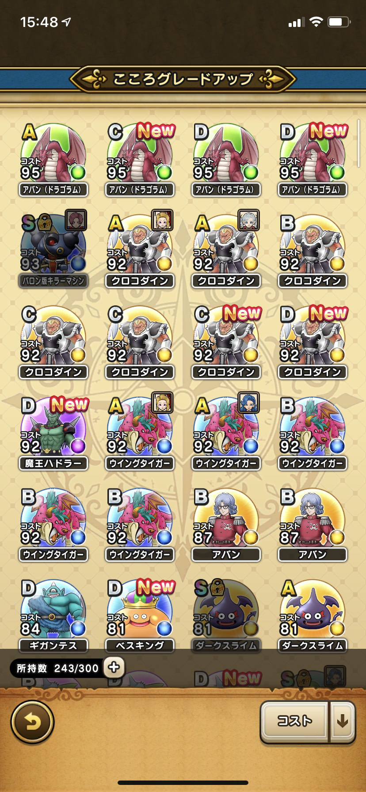
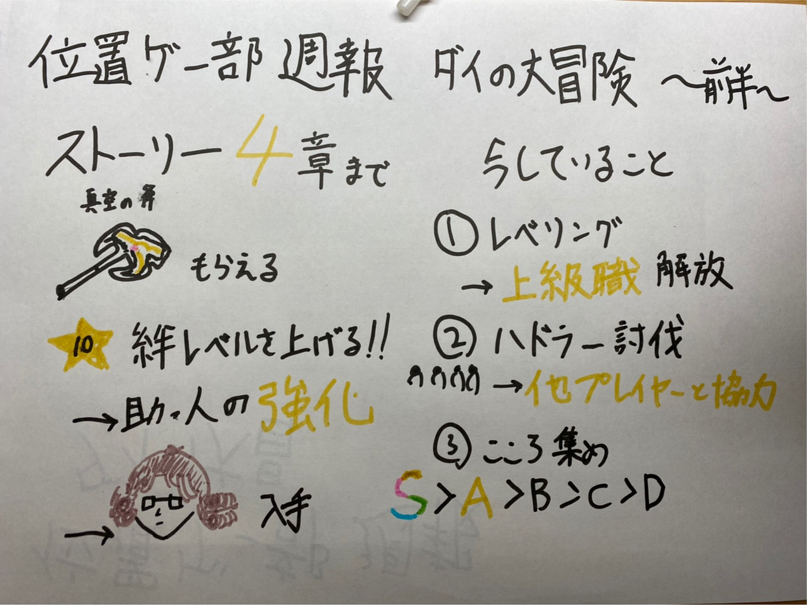

### 位置ゲー部週報コラボをやりこんでみて

前回の週報でダイの大冒険のコラボについて簡単に説明しましたが、今回はコラボの前半が終わったのでまとめます。

＃ストーリー

ストーリーは2020年12月20日現在4章まで追加されています。具体的な内容としてクロコダインと戦うところまでストーリーが進んでいます。ストーリーの進行に合わせて助っ人のキャラがダイ、ポップ、マァムと増えました。無課金でもコラボを進めるとクロコダインの真空の斧を入手することが出来るのでおススメです。

ここで大きな変化の1つとして前回の週報ではダイはあまり強くないと判断しましたが、絆レベルが上昇していくにつれて強化されていくことが分かりました。結果として、ダイは一番火力を出してくれるまで成長しました。

ダイが約3000以上ものダメージを与えています。私の一番育てている魔法使いも600ダメージほどしか攻撃が出ませんでした。

#ふくびきに関して

ふくびきは新たにポップとマァムの武器や衣装が追加されました。ちなみにポップが持っている「マジカルブースター」を当てることが出来たので先ほどの動画でも使っています。威力としてはマジカルブースターのほうが単体メラ属性の呪文「メラゾーマ」や全体無属性呪文「ベタン」を使うことが出来るのでこちらの方が強いです。しかしマァムの武器のハンマースピアも「ベホイミショットガン（魔弾）」で回復をしたり、「ベギラゴンショット（魔弾）」で全体にギラ属性の体技ダメージを出すことができるので汎用性があります。

#今コラボで主にしていること

私が今ドラクエウォークでしていることは大きく分けて3つあります。

1. レベリングをすること。

4年生になるまでには1キャラ上級職を解放させたいです。具体的な方法としては転職させていないキャラでひたすらモンスターを倒して効率よく倒しています。

2. ハドラー（メガモンスター）の討伐

メガモンスターを討伐することによって優秀なこころ（ステータスの強化や特殊効果を付与）を手に入れることが出来ます。そのため人が多くいる場所で討伐をしています。なぜかというと基礎職業では倒すことがほぼ無理だからです。

このようにほとんどのパーティメンバーが死んでしまいます。

3. こころ集め

現在主に5つのこころを集めています。

・バロン版キラーマシン

・アバン（ドラゴラム）

・クロコダイン

・アバン先生

・ハドラー（メガモンスター）

上の3つは選択して町を歩いていると一定の確立で出現します。

アバン先生はストーリーを進行したり、絆レベルを上げることによって入手することが出来ます。

ハドラーは先ほどにも説明したようにメガモンスター討伐で入手をすることが出来ます。

こころを適当に集めればいいというわけではなくランクによって強さが決まっています。

S>A>B>C>D

上のランクになればなるほど強いステータスで特殊効果があります。ぶっちゃけB以下はほとんど使うことはありません。こころを一定個数でアップグレードをすることもできますが、必要個数が莫大なのでB以上が出ることを願って周回をしています。

大変な作業ですがSをドロップ入手することや地道にアップグレードすることはとても楽しいです。

これが今のコラボのこころの入手状況です。かなり時間をかけましたがSを入手できました。

グラレコはこちらです。

