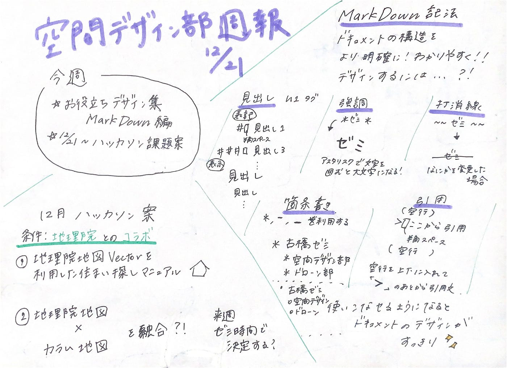

### MARKDOWN記法編

お役立ちデザイン集第２弾！

**今週の空間デザイン部**
* お役立ちデザイン集 MARKDOWN記法編
* ハッカソン課題について

**MARKDOWN記法編**

今週のお役立ちデザイン集はマークダウン記法を取り上げたいと思います。
マークダウン記法はGitHubやメディウムにも利用できる文章構造を明確化するものです。
卒論をGitHubで提出する古橋ゼミの学生にはマストで覚えなければならない、けれどよくわからない、というのが本音なのでは？
文章の構造をスッキリ見せることはデザインにおける先週取り上げた四原則の中での整列や強調、反復など実はつながってる部分が多いと思います！！

空間デザイン部レポジトリから見ることができるので、是非参考にしてください！！簡単かつ基礎的な部分になっていますのでここに書いているものはマスターできると思います！！

▶︎レポジトリ

[https://github.com/furuhashilab/fc_SpatialDesign/issues/1#issuecomment-748878449](https://github.com/furuhashilab/fc_SpatialDesign/issues/1#issuecomment-748878449)

１２月のハッカソン課題案を条件の地理院とのコラボをベースに二つ考えました！

①地理院地図VECTORを利用した住まい探しのマニュアル化

②チリイン地図とカラム地図を融合させた何か

先生にアドバイスをもらいながら決定したいと考えています。

**グラレコ**

