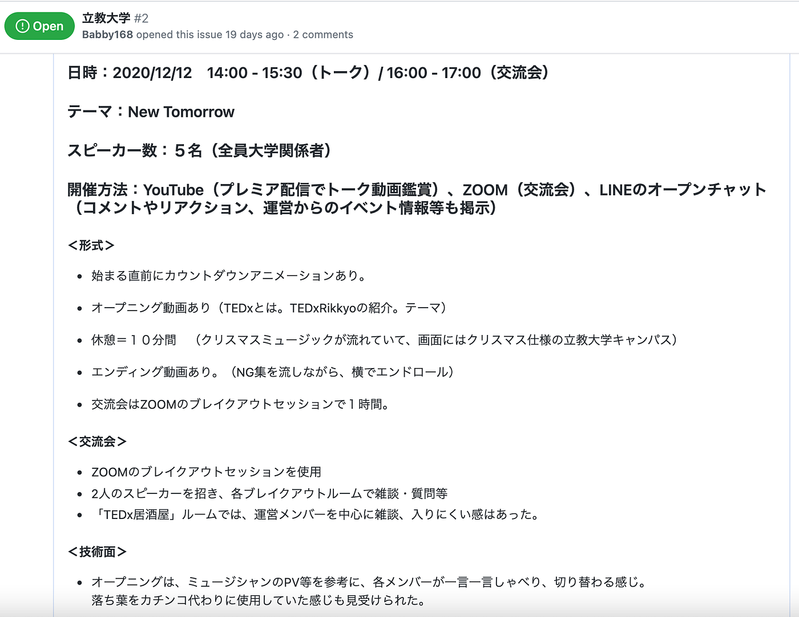
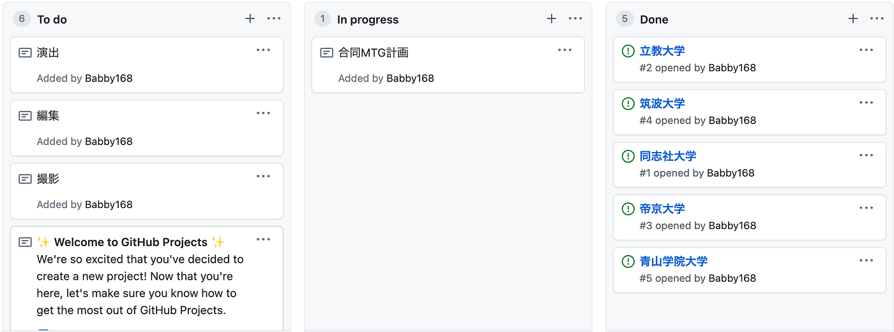
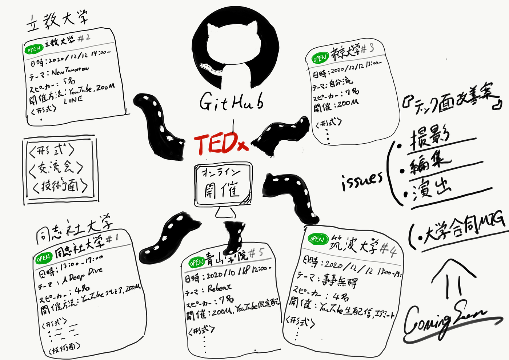

### TEDxオンライン開催の情報をGitHubプロジェクトで整理

前回、他TEDxのオンライン開催にいくつか参加し、ワードにその概要をまとめたのだが、今回は、その情報を整理して自分のGitHubプロジェクトで整理をした。

各団体でissueを立て、「形式」「交流会」「技術面」に区分し必要な情報だけをワードの情報から抽出した。

これを基にオンライン開催を実施する上でどのようなことをすればいのか、何をどのくらい準備すれば良いのか等をブラッシュアップしてければなと思っている。

また、それとは別に今回オンライン開催を実施したTEDx団体との合同MTGをし、情報共有と改善案を絞り出していければなと考えている最中である。

#### ＜グラレコ＞

#### ＜GitHub＞

[furuhashilab/2020gsc_TatsumiBaba
You can't perform that action at this time. You signed in with another tab or window. You signed out in another tab or…github.com](https://github.com/furuhashilab/2020gsc_TatsumiBaba/projects/1)
