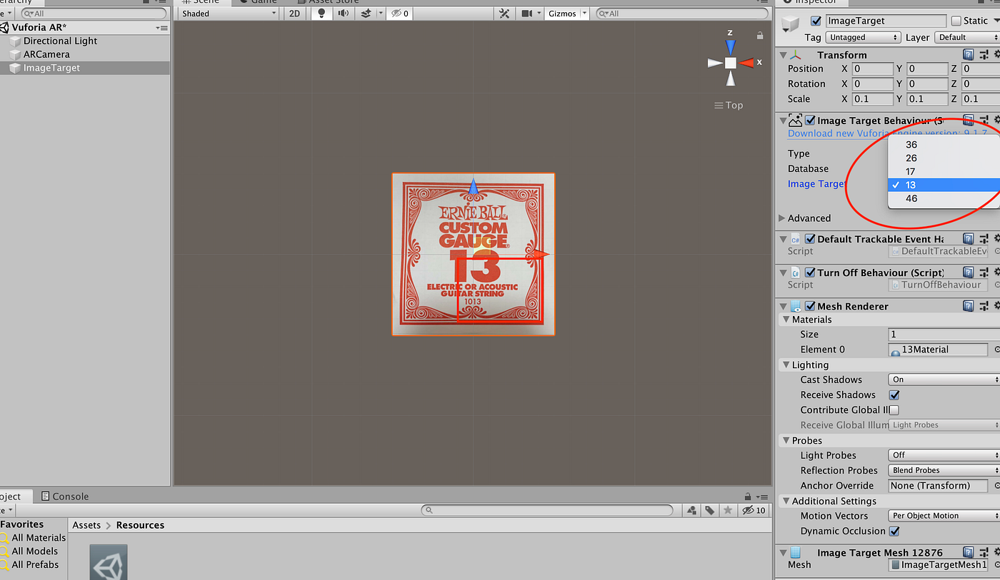
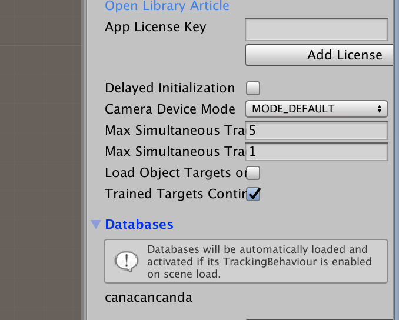
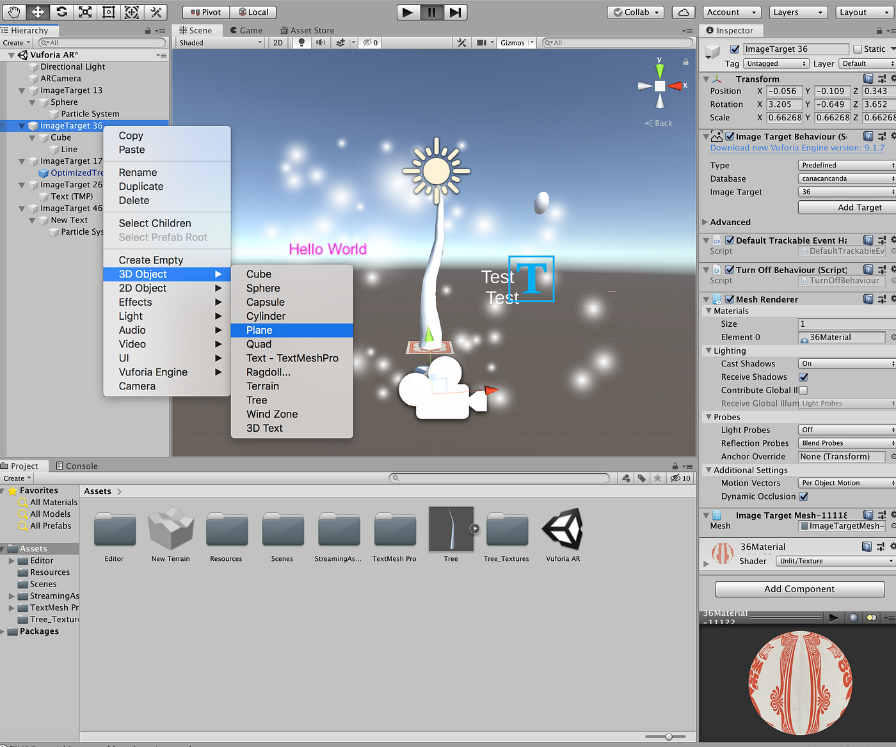
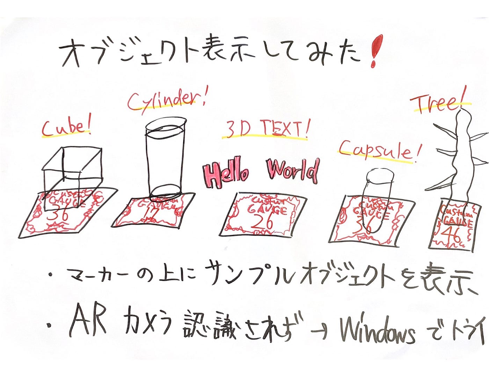

### それなりARへの道のり③

こんにちは！週報が重なってしまい前回はお休み頂いていましたものづくり部です！

前回まではUnityでVuforiaを使えるようにする設定、Image Targetに画像マーカーを設定してオブジェクト表示するための設定まで終わっていました。今週はいよいよマーカーからオブジェクトを表示してみました！

#### 無事マーカーが表示できた

ImageTarget>Inspecter>と進むと全てのマーカーが登録されているのがわかります。ではいよいよオブジェクトの表示に移ります。

VuforiaConfiguration >Max Simultaneous Tracked Image で 同時にマーカー認識出来る最大値を変更することができます。今回マーカーは５枚登録しているので5に変更しておきます。

ImageTargetを５枚表示した後、その上に3Dオブジェクトを表示していきます。ImageTargetで右クリック→3D Object →いくつかのオプションがある

ここで挿入したオブジェクトを選択肢して右クリするとさらにEffectを選択でき数は少ないですがアニメーションをつけることができるようでした。もちろん色もつけることができます。

自作のobj,fbxモデルの挿入の仕方については次回調べてトライしてみようと思います。

そして、肝心のARカメラですが認識してくれませんでした笑

参考にしていたサイトではWindowsでカメラの設定をしているので次回同じように試してみたいと思います。

#### Unityの仕様、操作感に馴染めれば可能性が拡がりそう

今回Unityを初めて操作してみましたがBlenderに比べて操作がしにくい印象がありました。今回は適当なオブジェクトを適当に配置してエフェクトをつけてみましたがUnityについて学びを深めればもっとおもしろいことができるだろうなと思いました。

#### グラレコ

