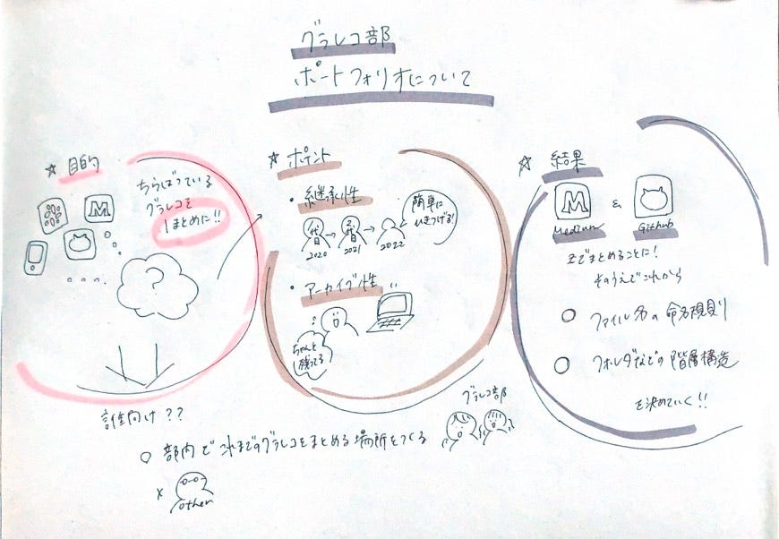

### グラレコポートフォリオについて

こんにちは！3年の佐藤です。
グラレコ部は現在、グラレコ部ポートフォリオの作成について議論中です。
目的や方法について方向性が定まってきたのでまとめたいと思います。

### _**＃ポートフォリオ作成の目的_**

・グラレコ部関連の情報を一つに集約するため

★Websiteを作ることではなく、ポートフォリオ自体を作ることが目的！

> **対誰向けてのコンテンツ？**
研究室内や学部内だけで共有することを目的とする。GitHub に画像貯めてそれをポートフォリオとして使ってもいい。
（グラレコ部として対外的にアピールするなら、デザインまで考えたwebページ作った方がいい。）
YouthMappers４を参考にGitHubでポートフォリオ、外部の広報としてInstagramの二刀流もありかも？

> **Mediumはポートフォリオになっている
**Webサイト作らないとなると、Mediumにあげている時点でポートフォリオにはなっている。それぞれの活動記録（イベントの内容とか）をメディウムで記録していくでいいのではないか。
結論githubとメディウムを活用するのが総合的に良いという方向性になった。

### ＃作成にあたっての条件・ポイント

・継承性(引き継ぎのし易さ)
 研究室としては「きちんと引き継げる」形であることが重要

・アーカイブ性

★デザイン性に拘らず最低限の情報があればよいという方向で意見が一致。難しいことよりも確実に続けていくことが大事。

### ＃作成の方法

> 案１：ランディングページのみ作成、ポートフォリオ自体は外部のコンテンツ使う

> メリット：難しいことをするより、既存のコンテンツを組み合わせてやった方が、楽&クオリティも上がる

★Githubのレポジトリにグラレコ画像をアップロードすることは簡単なので、ファイル名の命名規則やフォルダなどの階層構造をルール作って手を動かす方向で決定。

> Jekyllの難点
markdown で作れる反面、細かいところいじろうとすると大変
入門者だときついかも…

### # ポートフォリオ作成に用いるツール

・Github
・Medium

### **＃ポートフォリオに入れるもの**

・過去の作例

その他
・過去にグラレコを行ったイベント
・デジタルツール（Ipad等）を用いた作例。
・メディウムのリンク
・ツールの紹介
・メンバーの紹介
・連絡先

今回の議論で、目的をしっかり定めることで何を使えばいいか、何を意識すべきかが見えてくることを実感しました！みなさんありがとうございます！
引き続き、詳細を詰めていきたいと思います。

