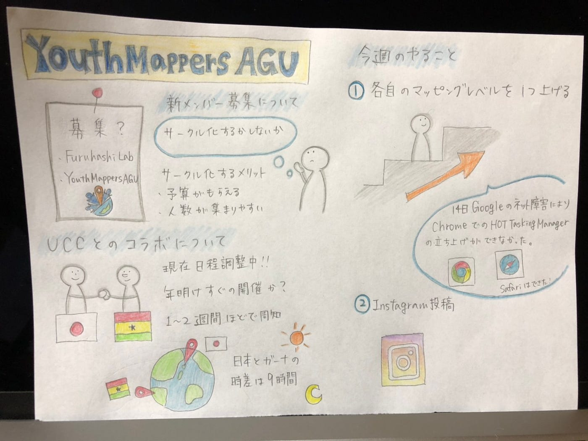

### 久しぶりのマッピング

こんにちは、日向野邦春です。

今回は手短に終わらせようと思います。

先週まではJOSMを使ったマッピングを勉強してきました。JOSMはある程度覚えたのでマッパソンに向けて自分たちのマッピング技術を高めようということになりました。

初心者マッパーは中級マッパーになるように中級マッパーは上級マッパーになるように活動してきました。

マッパソンについてですが1月の最終週に企画しようと思っています。FaceBookやInstagramで告知していこうと思っているので皆さんもシェアをよろしくお願いいたします。

