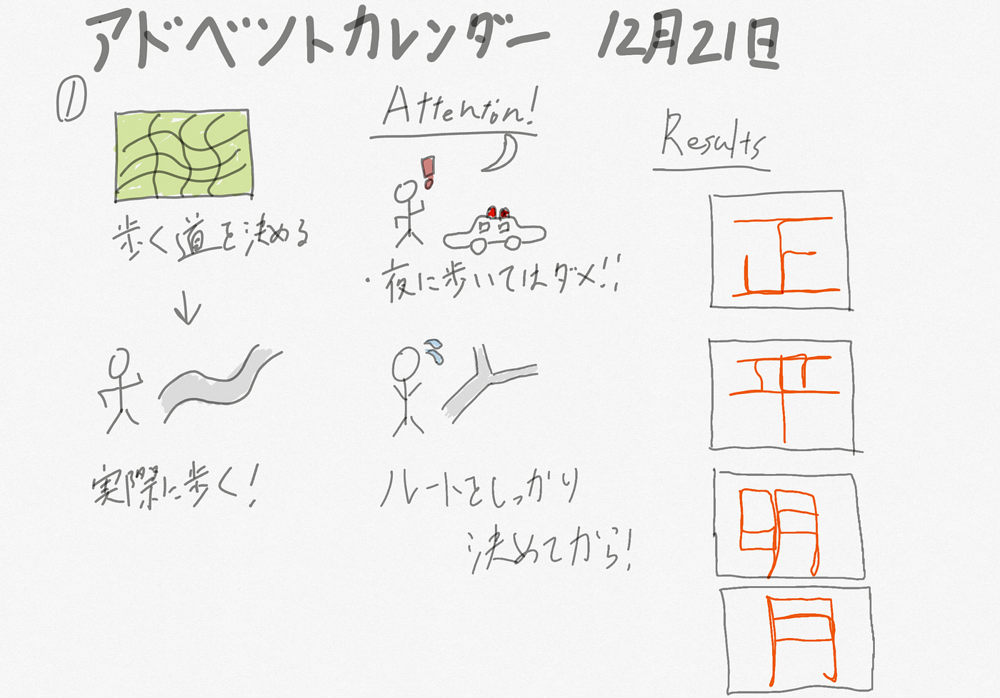

### 歩いて、嘆いて、また歩いて

こんにちは、日向野邦春です。今回は21日のアドベントカレンダーを担当させていただいています。

**Introduction**

私の研究内容はGPS Drawingを利用してサカナクションの「アルクアラウンド」を表現することです。前回は実際に歩いてみて一文字一文字マッピングしていくことを決めました。

**Methods**

今回、行ったことは、とにかく歩くことです！文字を稼ぐためにとにかく歩きました。

作業の工程

・GoogleMapで文字を当てはめながら歩く場所を決める

・Stravaを使って歩く

今回は「正」「明」「平」「月」を表現してみました。

歩かなければならないかもしれませんが自転車使っちゃいました。

**Results**

歩いた結果がこちらになります。

[午後のウォーキング - 日向野 邦春's 0.9 km walk
日向野 邦. completed 0.9 km on Dec 21, 2020.www.strava.com](https://www.strava.com/activities/4499146101?share_sig=D9772ACE1608549049&utm_medium=social&utm_source=ios_share)

[夕方のウォーキング - 日向野 邦春's 0.8 km walk
日向野 邦. completed 0.8 km on Dec 21, 2020.www.strava.com](https://www.strava.com/activities/4499272426)

[夕方のウォーキング - 日向野 邦春's 1.0 km walk
日向野 邦. completed 1.0 km on Dec 21, 2020.www.strava.com](https://www.strava.com/activities/4499235133)

[夕方のウォーキング - 日向野 邦春's 1.1 km walk
日向野 邦. completed 1.1 km on Dec 21, 2020.www.strava.com](https://www.strava.com/activities/4499196887)

GPXファイル置き場

[furuhashilab/2020gsc_KuniharuHigano
2020年度古橋ゼミゼミ論用レポジトリ. Contribute to furuhashilab/2020gsc_KuniharuHigano development by creating an account on GitHub.github.com](https://github.com/furuhashilab/2020gsc_KuniharuHigano)

まぁ形にはなっていますかね。ハライやトメを表現するのはかなり難しいです。これらの漢字は簡単な方ですので「新」「夜」などの難しい漢字をこれからマッピングしていきます。

**Discussion**

今後はこれらの材料をどう活かしていくかも重要になってくると考えています。どの編集ソフトを使っていくかで作品の仕上がりが変わってきます。今のところMapboxを使っていこうと思っています。まずは一番の漢字を終わらせることに集中します。

