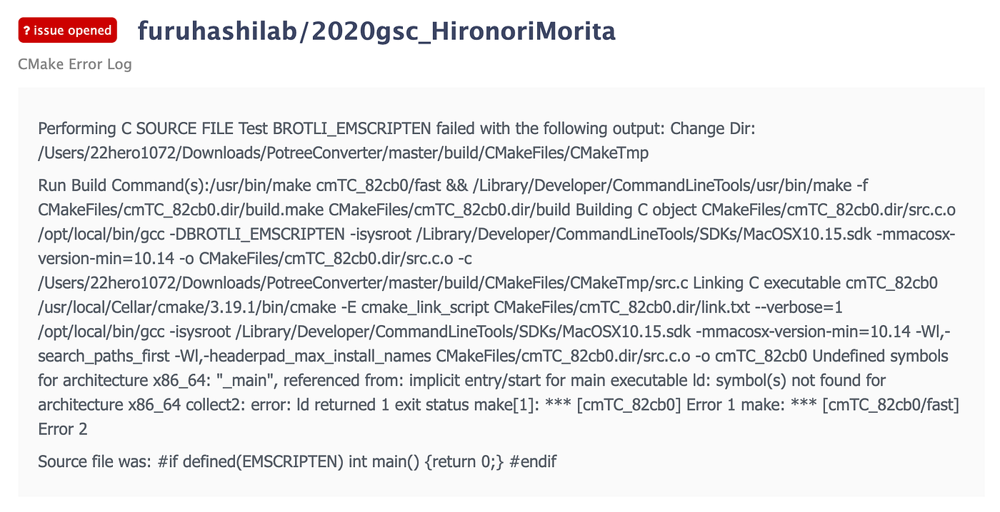

### 【コンバーターファイターⅡ】MacOSでPotreeConverterの使用はできるのか？

#### アドベントカレンダー12月22日 森田浩徳

### 2013年9月8日

皆さんは何の日付かわかりますでしょうか？正確に言えば9月7日（現地時間）ですが、当時中学生だった僕は珍しく早朝からテレビの前でこの瞬間を見てました。そう、それは、「お・も・て・な・し」でお馴染み、第125次IOC総会で**『東京オリンピック』**の開催が決定した日になります。この瞬間にアジアでは初の同一都市複数回の開催が決まりました。日本では1964年が初めての開催となっておりますが、こちらもアジア初のオリンピックになっております。しかしあまり知られていないのですが、**1940年に東京オリンピックの開催は予定されていた**のです。残念ながら、日中戦争によって開催には至りませんでしたが。そう考えると、アジア初の同一都市複数回開催は1964年に決まっていたということになりますね。日本は高度経済成長による発展のイメージがありますが、1940年にはオリンピックが開催されるほどの都市になっていたことも感慨深いですね。

話が少し脱線したのですが、開催が決定した瞬間に、2020年の世界はどのようなものになっているのかということを考えました。僕はオリンピックでボランティアをやっているのか、何かの選手になっているのか、日本はメダルをいくつ獲得するのか、様々なことを考えていました。実際の世界ではコロナウイルスがパンデミックとなり、2020年に開催することができない結果となってしまいました。当時はそんな予想もすることはありませんでしたが、、、当時の都知事が猪瀬さんだったことも、時代の流れを感じますね。

2020年にはオリンピックが開催されると決定してから7年が経ち、7年前に特別な年になるであろうと思っていた2020年も、残り10日を切ってしまいました。2020年は何もすることができませんでしたが、、、唯一できたことといえば、それは「引っ越し」になります。先月中旬から今月初にかけて引っ越しを行い、10日にやっと光回線の工事が終わりました。つまり僕のゼミ論は10日ほどしか活動期間がなかったので、進捗は大目に見ていただけると助かります、、、

本題に入りまして、前回の構想発表で**「ポイントクラウドデータを用いた三人称視点ドローンの検討」**について記載させていただきました。詳しくは以下のリンクをご参照ください。

[ポイントクラウドデータを用いた三人称視点ドローンの検討
ゼミ論中間発表 森田浩徳medium.com](https://medium.com/furuhashilab/%E3%83%9D%E3%82%A4%E3%83%B3%E3%83%88%E3%82%AF%E3%83%A9%E3%82%A6%E3%83%89%E3%83%87%E3%83%BC%E3%82%BF%E3%82%92%E7%94%A8%E3%81%84%E3%81%9F%E4%B8%89%E4%BA%BA%E7%A7%B0%E8%A6%96%E7%82%B9%E3%83%89%E3%83%AD%E3%83%BC%E3%83%B3%E3%81%AE%E6%A4%9C%E8%A8%8E-1b9a0ceff67a)

ポイントクラウドデータを使用する際に、サードパーティアプリケーションが不要である[Potree](https://github.com/potree)を使用することになりました。

Potreeは無事に使用することができましたが、使用されるLASファイルをPotreeで活用できるようにコンバートをかける作業に梃子摺っていました。

Potree用にLASファイルを変換するには、Potree Converterを使用することになるのですが、このPotree Converterに関してはwindows版のみしか公開されていませんでした。そこでwindowsを活用し、コンバートを試みたのですが、以下のエラーが発生してしまいました。

[PotreeConverter_2.0.1_windows_x64 20201103 · Issue #14 · furuhashilab/2020gsc_HironoriMorita
You can't perform that action at this time. You signed in with another tab or window. You signed out in another tab or…github.com](https://github.com/furuhashilab/2020gsc_HironoriMorita/issues/14)

まずこの問題を解決していくために、Potree Converterがどのような仕組みになっているのかを調べることにしました。

### ## Potree Converterとは

> PotreeConverterは、大規模な点群のストリーミングおよびリアルタイムレンダリング用のオクツリーLOD構造を生成します。生成された結果は、Potreeを使ってWebブラウザで表示したり、PotreeDesktopを使ってデスクトップアプリケーションとして表示することができます。

> バージョン2.0は完全に書き換えられており、前バージョン1.7との違いは以下の通りです。

> SSD上でのPotreeConverter 1.7と比較して約10～50倍の高速化。
数千から数千万個のファイルではなく、合計3個のファイルを生成します。ファイル数の削減により、コピー、削除、サーバーへのアップロードなどのファイルシステム操作が数時間から数日から数秒から数分に改善されました。
標準のLAS属性と任意の追加属性のサポートが向上しました。開発中のフルサポート（int64やuint64など）。
オプションの圧縮は、新しいコンバータではまだ利用できませんが、将来のアップデートのためのロードマップ上にあります。
コンバータはバージョン2.0へと大きく進化しましたが、生成されるフォーマットはPotree 1.7でもサポートされています。Potreeビューアは、2021年にWebGPUの書き換えでバージョン2.0への大きなステップを踏む予定です。（原文を翻訳）

Potree Converterを紐解いていくと、最終的に実行する際のコマンドが、

```
PotreeConverter.exe <input> -o <outputDir>
```

とEXEファイル形式になっております。EXEファイルは所謂実行ファイル、つまりコンパイラ言語であるため、テキストエディタでは活用できません。初心者による初心者のためのまとめを公開しておりますので、詳しくはそちらを！

[初心者の初心者による初心者のためのC言語！（）
全くプログラミングをしたこともなく、知識もない人がメモ的要素でまとめておくためのブログになります。今回は基礎的な部分についてまとめていきます。22hero1072.medium.com](https://22hero1072.medium.com/%E5%88%9D%E5%BF%83%E8%80%85%E3%81%AE%E5%88%9D%E5%BF%83%E8%80%85%E3%81%AB%E3%82%88%E3%82%8B%E5%88%9D%E5%BF%83%E8%80%85%E3%81%AE%E3%81%9F%E3%82%81%E3%81%AEc%E8%A8%80%E8%AA%9E-1524eec21471)

[初心者の初心者による初心者のためのC言語！（”Hello World!”編）
全くプログラミングをしたこともなく、知識もない人がメモ的要素でまとめておくためのブログになります。今回は”Hello World!”を表示させる方法についてまとめていきます。22hero1072.medium.com](https://22hero1072.medium.com/%E5%88%9D%E5%BF%83%E8%80%85%E3%81%AE%E5%88%9D%E5%BF%83%E8%80%85%E3%81%AB%E3%82%88%E3%82%8B%E5%88%9D%E5%BF%83%E8%80%85%E3%81%AE%E3%81%9F%E3%82%81%E3%81%AEc%E8%A8%80%E8%AA%9E-hello-world-%E7%B7%A8-114e09c6a049)

勘がいい方はすでにお気づきかもしれませんが、C言語でまとめた理由は、PotreeConverterもC言語系統で作られているからです。実際の言語は、**C++**が使われています。

途中コンパイルを行う際のコマンドキーが、

```
cmake ../
```

となっているため、[CMake](https://cmake.org/)を使用することがわかります。実際のビルドにおいては、C言語の[GNU make](https://www.gnu.org/software/make/)、macOS用の[Xcode](https://developer.apple.com/jp/xcode/)、Microsoftの[Visual Studio](https://visualstudio.microsoft.com/ja/)のようなネイティブのビルド環境が利用されます。CMakeでビルドするにはC++コンパイラのみが利用されます。そのため、CとC++のビルド環境は整える必要があります。

しかし僕はwindowsの方でなぜか動作が途中で停止するという問題から抜け出せないため、他の方法を模索しておりました。

そこで発見したのが、macOSでPotree Converterを起動させる方法です。

[GeospatialPython/MacOS-PotreeConverter
MacOS binary for PotreeConverter which can be tricky to compile. It was compiled on MacOS Mojave 10.14.2 (18C54) using…github.com](https://github.com/GeospatialPython/MacOS-PotreeConverter)

### ## MacOS PotreeConverter

Potreeから提供されているソースは、windowsのみになっておりましたが、[GeospatialPython](https://github.com/GeospatialPython)さんがMacOSでも使えるように公開してくれていますので、そちらを利用していこうと思います。

まずこのMacOS PotreeConverterの流れとして、

- GCCのインストール

- PotreeConverterの実行

の二つに大きく別れてます。

#### ### GCCインストール

1. 対応のOSのXcodeをMacPortsからインストール

[Xcode - インストール可能 対応バージョン macOS 一覧 / Install Support macOS Version Lists 【 2020.06 】 - Qiita
さらに以前のOS情報などについては、下記 関連/参考 - Relation/Reference にあります。 以下は補足説明なので、より詳細について知りたい方はご覧ください。…qiita.com](https://qiita.com/thinkalot/items/1dfdba642906c1bf1fd2)

2. GCC（GNU Compiler Collection）をインストール

3. シンボリックリンクのPortをmp-gcc8に選択

4. [https://github.com/m-schuetz/LAStools](https://github.com/m-schuetz/LAStools)をクローンする

5. CMakeでビルドする

```
sudo port install gcc8
sudo port select — set gcc mp-gcc8
cd ~/Downloads
mkdir lastools
cd lastools
git clone https://github.com/m-schuetz/LAStools.git master
cd master/LASzip
mkdir build
cd build
/opt/local/bin/cmake -DCMAKE_BUILD_TYPE=Release ..
make
```

#### ### PotreeConverterの実行

1. PotreeConverterファイルの作成

1. [https://github.com/potree/PotreeConverter.git](https://github.com/potree/PotreeConverter.git)をクローン

1. CMakeでビルド

```
cd ~/Downloads
mkdir PotreeConverter
cd PotreeConverter
git clone https://github.com/potree/PotreeConverter.git master
cd master
mkdir build
cd build
/opt/local/bin/cmake -DCMAKE_BUILD_TYPE=Release -DLASZIP_INCLUDE_DIRS=/Users/<username>/Downloads/lastools/master/LASzip/dll/ -DLASZIP_LIBRARY=/Users/<username>/Downloads/lastools/master/LASzip/build/src/liblaszip.dylib -DCMAKE_C_COMPILER=/opt/local/bin/gcc -DCMAKE_CXX_COMPILER=/opt/local/bin/g++ ..
make
```

### ## 問題発生？

#### ### GCCインストール

何をどうしたらいいかわからず、色々と調べまくった結果、GCCのインストールまではできました。しかしCMakeでビルドを行う際にCMakeLists.txtが正式な位置に反映されておらず、ビルドができていない状態であります。

まず最初に迎えた問題は、GCCをインストールする際に、以下のように表示がされて、インストールが強制ストップがかかる現象が発生しました。

```
Error: Permission denied @ apply2files — /usr/local/lib/node_modules/gulp/node_modules/extglob/lib/.DS_Store
```

[20201213 · Issue #16 · furuhashilab/2020gsc_HironoriMorita
You can't perform that action at this time. You signed in with another tab or window. You signed out in another tab or…github.com](https://github.com/furuhashilab/2020gsc_HironoriMorita/issues/16)

この場合は、`sudo chown -R $(whoami) $(brew --prefix)/*` を入力すれば、解決ができます。

コマンドでの指定先は`/opt/local/bin/cmake` となっているため、バイナリをチェックするとcmakelists.txtは見つかりませんでした。Lastools内にできているcmakelists.txtをバイナリ内に移動させてみたのですが、それでもビルドはできない状態になっております。

[20201217 · Issue #19 · furuhashilab/2020gsc_HironoriMorita
You can't perform that action at this time. You signed in with another tab or window. You signed out in another tab or…github.com](https://github.com/furuhashilab/2020gsc_HironoriMorita/issues/19)

[CMAKE_BUILD_TYPEのUPPER CASEにご用心 - Qiita
cmakeを用いてビルドするとき、-DCMAKE_BUILD_TYPEを指定すると、（きちんと CMakeLists.txt が書かれているプロジェクトなら）適切なオプションを付けてビルドが行われる。…qiita.com](https://qiita.com/KRiver1/items/4b7ad90168dfb4aedde6)

CMakeでは、`/usr/local/bin/`に実行ファイルを設置するのが標準的であるとされているため、記憶が正しければデフォルトもそうなっていた気が？します。

今回の場合は`/opt/local/bin/` に実行ファイルを設置するため、その辺りでうまく反映されていないのかもしれません。

[/usr/local と /opt の使い分け — Qiita
プログラムのインストール先って /usr/local/ にすべき？ それとも/opt/ のほうにすべき？ と、しばしば悩むので整理しておく。 リポジトリ管理ツール ghq を使うといいよ！ ghq…qiita.com](https://qiita.com/akiakishitai/items/69bb68f4f6fbd6a88016)

#### ### PotreeConverterの実行

そもそもCMakeでのビルドができていないので、実行もできるわけがないのはわかっていたのですが、とりあえず手をつけてみることにしました。

こちらも最終的にCMakeでビルドを行うことになるのですが、GCCの方で実行前に拒絶されるわけではなく、ある程度進めた後にエラーログが発生する形になりました。

```
collect2: error: ld returned 1 exit status
make[1]: *** [cmTC_82cb0] Error 1
make: *** [cmTC_82cb0/fast] Error 2
```

[CMake Error Log · Issue #23 · furuhashilab/2020gsc_HironoriMorita
You can't perform that action at this time. You signed in with another tab or window. You signed out in another tab or…github.com](https://github.com/furuhashilab/2020gsc_HironoriMorita/issues/23)

[CMake Output Log · Issue #22 · furuhashilab/2020gsc_HironoriMorita
You can't perform that action at this time. You signed in with another tab or window. You signed out in another tab or…github.com](https://github.com/furuhashilab/2020gsc_HironoriMorita/issues/22)

[cmTC_82cb0]とはなんなのでしょうか、、、 Googleに検索かけると、古橋研究室OBの武末さんのGitMemoryのみが出てきました。

[kouki-T ( Kouki Takesue )
The system is: Darwin - 18.7.0 - x86_64 Compiling the CXX compiler identification source file "CMakeCXXCompilerId.cpp"…www.gitmemory.com](https://www.gitmemory.com/kouki-T)

なにかヒントもらえるかなと思いのぞいてみたのですが、



、、、僕のやないかーい。

ってことで、いまだに謎に包まれているエラーです。

### ## 今後

1. [Potree Converter](https://github.com/potree/PotreeConverter)でLASファイルをPotree用にコンバートさせる

1. 静岡市のポイントクラウドデータを可視化

1. ドローン操縦画面へのユーザーインターフェース構築

1. TPVドローン完成

前回の構想発表から全く進んでいないことがわかりますね、、
早くPotreeConveter が使えるようにします！

```
グラレコ
```


