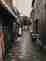
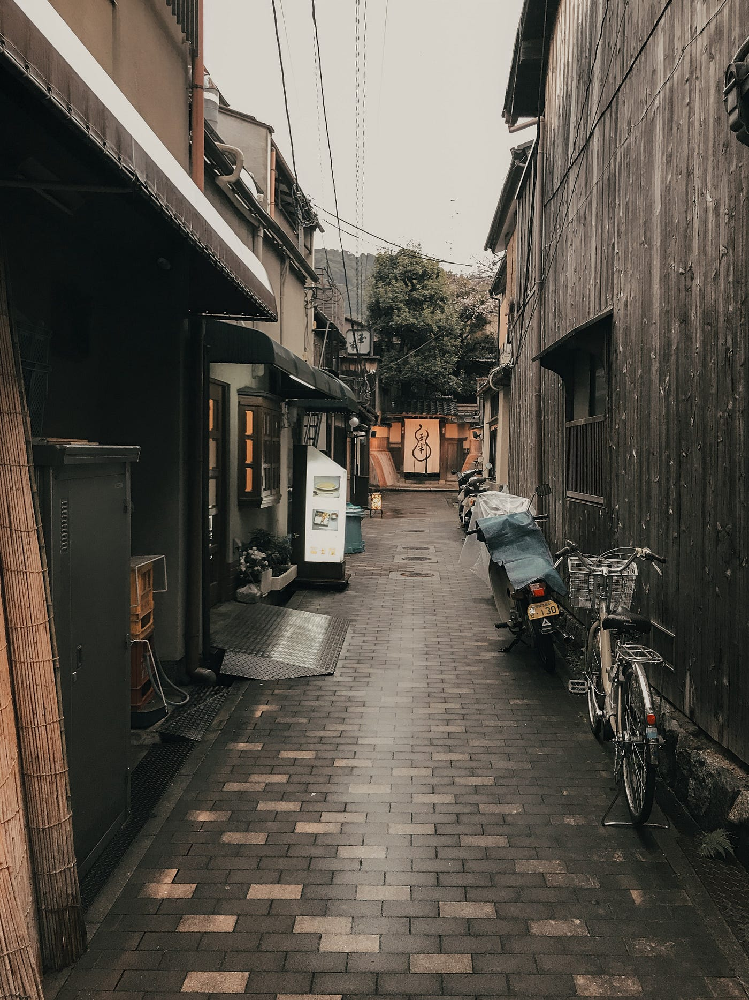

### 「モクミツ」って？リノベーションの可能性

古橋研究室の水谷陽です！

早速ですが、

### 「モクミツ」って知ってますか？

「モクミツ」とは

木造住宅密集地域のことで、

”市街地において木造建築が密集している地域を指します。東京では山手線外周部に多く、地震・火災時に被害が甚大になると予想されることから、[都市計画](https://kotobank.jp/word/%E9%83%BD%E5%B8%82%E8%A8%88%E7%94%BB-105108)の[一環](https://kotobank.jp/word/%E4%B8%80%E7%92%B0-433971)として[整備](https://kotobank.jp/word/%E6%95%B4%E5%82%99-546163)が検討されている。”

出展：[コトバンクより](https://kotobank.jp/word/%E6%9C%A8%E9%80%A0%E4%BD%8F%E5%AE%85%E5%AF%86%E9%9B%86%E5%9C%B0%E5%9F%9F-676214#E3.83.87.E3.82.B8.E3.82.BF.E3.83.AB.E5.A4.A7.E8.BE.9E.E6.B3.89)

高齢化、空き家問題、木造建築の防災対策など様々な課題を抱える現代社会において、この「モクミツ」の不燃化促進を目的としたリノベーション改修の必要性が問われているのです。

[さらに首都直下型地震の切迫性も相まって東京都では「木密地域不燃化10年プロジェクト」も推進されています](https://www.toshiseibi.metro.tokyo.lg.jp/bosai/mokumitu/)。

このような状況の中、**12月19日**、

### モクミツの新たな長屋文化の器となるシェアハウスの提案

をすべく、**東京都京島地域**では**明治大学大学院生**を中心として発表会を開催しました。

#### 京島地域

では戦前の長屋が多く残っており、「モクミツ」がふんだんに入り混じってる地域でもあります。

ただリノベーションや改修を行うのではなく、地域の特徴を生かし、京島地域の魅力を全面的に押し出せる付加価値のついた建物の考案であります。

さらに今回のイベントでは**NPO法人向島学会**や**UR都市機構**などの法人企業が後援としてつき、実際に学生が地権者、事業者、地域住民に提案する場として設けられました。

> _実際の課題 ↓_

> _課題A：棟割長屋のアーティスト向けシェアハウスの改修_

> _課題B：クリエイティヴなリモートワーカー向けのシェアハウス（SOHO）の新築_

> _課題C：C 課題 多様な国籍の学生が混住するシェアハウス（学生寮）の新築_

今回実際に参加してみて、学生のクオリティの高さに驚きを隠せませんでした、、、驚いた点は主に以下の二つ

### ・建物の提案だけではなく利回りなどの収支を考慮した提案であった事

### ・フィールドワークを通じて地域とのつながりをしっかりと考えた作品があった事

東京スカイツリーの登場により、古い建物が取り壊され都市計画が進む中墨田の魅力である「下町」の風景や「ものづくり」の文化をいかに残しながらまちづくりを行っていくのかが重要であるのだと感じました。

さらにこれからの時代、街のバックグラウンドや地域との交流だけではなく、防災やコロナの観点からも建物をデザインする必要性が増えてくるのだと実感し、とても勉強になる機会でした。

### 目的

そして今回このイベントに参加することによって自分の明確な研究目的を見つけました。それは、、、

#### 地域に密着し、地域のニーズにこたえることが出来る人材になるべく研究を進めて行きたい。

大学を卒業し企業に入ったら、街の事情やそこに住む人々の声など知らず知らずに利益のためだけのまちづくりや都市開発を行ってしまうかもしれない。

そうならないためにも、今回「向島」という地域に密着し自分ができる事を最大限に考えていきたいです。

↑↑↑向島の魅力をふんだんに詰め込みました！笑
