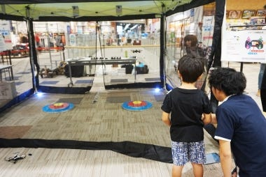
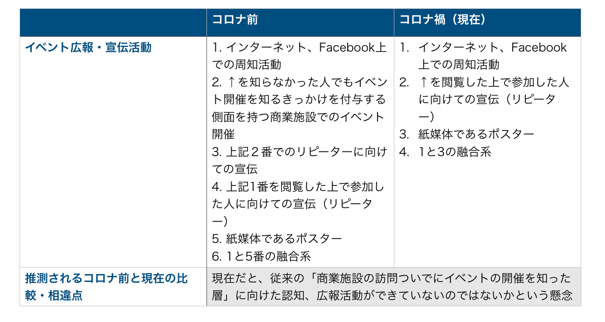
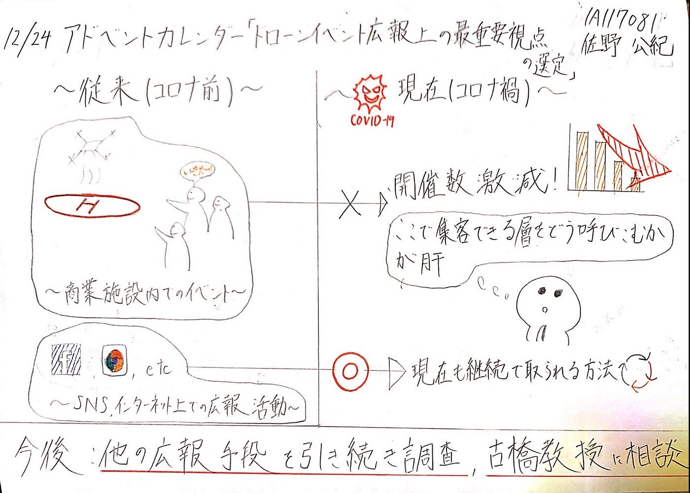

### 12月24日アドベントカレンダー「ドローンイベント広報上の最重要視点の選定」

イブの日のアドベントカレンダーを担当します佐野です。

今回の進捗状況は、以下の構成に沿って記事としてまとめようと思います。

_・ゼミ論のテーマ_

_・現在の状況_

_・今後について_

#### **〜ゼミ論のテーマ〜**

前回の中間発表の際にテーマが全く定まっていない状態で臨んでしまい、自分がゼミ論として何をやるかということを明言できていなかったので、改めて今回何をやるかという話からスタートしようと思います。

今回のゼミ論ではドローンの認知度を上げるべく、今後のイベントの広報上の最重要視点を思索してみようと思います。

そもそもこれに決めた大元の理由はコロナにあります。コロナ前は、大型ショッピングセンター内で子供たちに向けた数々のドローンに関するイベントが行われていましたが、当然今はオフライン形式ではほとんど行われていません。とても残念でなりません。

ただ同時に世の中の動きとして、ドローンが徐々に社会に浸透してきているとは言えると思います。その証拠の一つとして、つい最近の出来事で河野行政改革担当大臣によってドローン飛行に関する規制緩和等が行われると発表されるなど明らかです。

その波に肖り、今後ドローンを更に世に浸透させる一つの提案として、子供達にさらにドローンを認知させることでそれに貢献できるのではとずっと考えていました。加えて、一つのアクションで人に行動、選択肢の提案ができる広報的活動にも興味があったため、この両要素を融合させてゼミ論テーマとして決定したという次第です。

#### 〜現在の状況〜

現在数多くのドローンイベントがどのような発信形態を行なっているかを調べています。(過去に行われたイベントも含む)

・商業施設内でのイベントに関して調査中に浮上したとある仮説

前述の通り、かつてはたくさんのイベントが大型商業施設等で行われてきました。

このような形でイベントが行われると**「子供が家族の買い物などの用事のがてら大型商業施設を訪れている最中、イベントが執り行われていることを見つけて興味を示す」**というようなシーンが想定できます。ましてや大型ショッピングモールでこのような体験会を開くとなると、ある程度の面積を持つ広場で行わなければならないことは容易に考えられますね。言い換えるなら、人の目に止まりやすい位置でもあると言うことですね。

そもそもなぜ子供がこういうものに興味を示すのかは、以下の人間の特性が働くためかと考えられます。

_・ラジコンなどのおもちゃ類、車、電車、虫などの動くものに興味を示す（特に小さい年齢の子供には顕著な要素）_

_・とある空間において、大勢の人が集まる場所には「自分も行ってみよう」という類の興味を示す_

_（小川 鑛一・森 政弘, ものの動きを見たときの感情分析,6,1989年）_

従来のショッピングモール内のドローンイベントは策略的なのか結果的かは不明ですが、前述の人間の特性をうまく突いているものと言えるかもしれません。このことから、イベントの開催を知らなかった人でさえも集客できるという_「開催そのものがドローンの認知度上昇、宣伝につながるのではないか」_という仮説にたどり着きました。

・現在の広報手段の調査

冒頭にも少し記述しましたが現在オフライン型のイベントの開催数は減ってしまい、特に商業施設でのイベントも見かけなくなりました。

現段階での調査では、以下の3つの手段が手段として取られていることが判明しています。

_・インターネット、SNS系での広報活動_

_・紙媒体（ポスター）_

_・上記2つの融合系_

これらはコロナ前でも使われていた広報手段ではありますが、果たして現在この広報手段のみでは従来に比べてどれほどの人数に情報を届けることができているのか気になるところであります。

現段階で調査したのはここまでです。ここに至るまでの話を整理すべく、次の画像をご覧いただければと思います。

#### 〜今後について〜

以下のことを今後取り組んでいこうと考えています。

・ここまでで判明した広報活動以外でどういう作法がとられているかを引き続き調査(意図含め)

・最終的な完成形、過去の広報手段が他にどんなものがあったか等、色々悩みや不明点が絶えないので古橋先生に相談をする

確定で現在予定しているのは上記2点ですが、途中で他に行うべきものとして気づきがあれば、首を突っ込んで中身のあるものとして仕上げていきたいと思っています。

グラレコ

