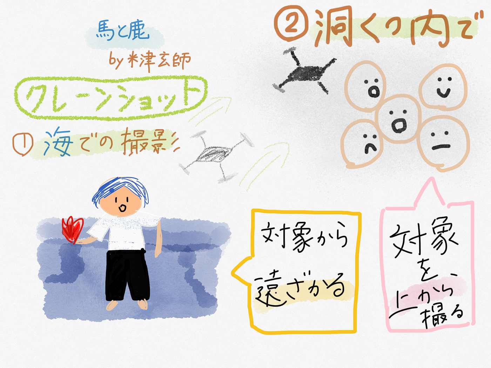
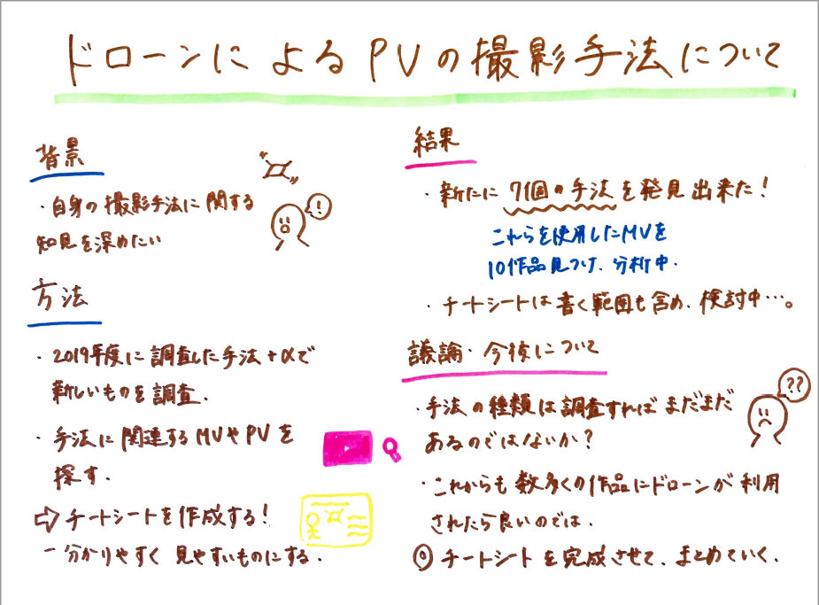

### アドベントカレンダー 12/25

こんにちは。気づいたらクリスマスの担当になっていました。古橋ゼミ4年の森玲子です。

さて、私は昨年度「ドローンによるPVの撮影手法について」というテーマでゼミ論として研究をしました。

今年度はテーマを変えずに昨年度のゼミ論をアップデートさせることにしました。

参考までに、昨年度のゼミ論のリポジトリはこちらになります。

[furuhashilab/2019gsc_ReikoMori
https://docs.google.com/document/d/1byJXRJ5HP0sg6D75-jGFYc0t3cKEgAWMUt96TyHPkj4/edit?usp=sharing…github.com](https://github.com/furuhashilab/2019gsc_ReikoMori)

#### Introduction

昨年度、このテーマとした理由としてはドローン部に所属していたものの映像を撮影する際の具体的な手法については未知であったこと、さらに撮影手法について研究したものをゼミ生の皆様にも見ていただくことで、理解を深めてもらうことが出来ると考えたことです。

**Methods**

今年度は以下の3点を研究のための方法として実行しています。

１．昨年度に調査した6つの手法以外の新たな手法を調査して、その内容（名称・使用用途など）をわかりやすくまとめていく。

２．昨年度同様、調査した新たな手法が使用されているPVやMVをインターネット上で探し、その撮影手法の利点などを考察していく。

３．上記の2点を踏まえたチートシートをグラレコ等を用いて作成する。

**Results**

１．新たな撮影手法の調査

下記の「魅せる写真や映像が撮れるドローン空撮テクニック」を元に、新たに７個ほどの撮影手法があることが判明しました。

[https://viva-drone.com/drone-dronegrapher-photo-2/](https://viva-drone.com/drone-dronegrapher-photo-2/)

〈新たな撮影手法〉

前進・後進、パン、斜め・横移動、上昇・下降、固定、対象移動、チルトダウン・チルトアップ（カメラの角度調整）

２．手法が利用されているPV・MVの調査

古橋ゼミドローン部の数名にお力添えを頂き、新たに10個のMVを発見しました。それぞれのMVにどの手法が利用されているのかも分析し、まとめていきました。

以下、ドローンにより撮影されたPVリストになります。

[ドローンによるPVリスト
シート1 曲名,歌手名,リンク,手法（何個でも可）,追加者 Sights,London Grammar, https://youtu.be/UBxxEyVIdO4 ,バードアイ、クレーンショット,Reiko Mori 馬と鹿,米津玄師…docs.google.com](https://docs.google.com/spreadsheets/d/1TpXwmU7LOI-npdzPSTJDCEhnCLCVTP97CXMpKIOjNvM/edit?usp=sharing)

３．チートシートの作成

一例として作成したものですが、チートシートとして描くものを手法自体のみにするか、MV全体とするか検討中です。

急ぎで書いてしまったので低クオリティです。本番はより丁寧に描きますのでお許しください…。

**Discussion**

今回の研究結果から、以下のことを考察しました。

１．昨年度は調査した撮影手法が少なく、撮影者も限られた手法で撮影しているものと捉えていました。しかし今回新たに数個の手法を知ったことで、その無限性を改めて感じ、私たちも多くの手法で撮影が出来ると思いました。

２．実際に10個のMVを調査したことで、１つのMVに様々な撮影手法による映像が融合されていることが判明しました。さらに、これからも数多くのアーティスト、そしてMVが作成されると予想した上でドローンを利用した作品が増えていくと、その見方や考え方も変化して興味深いものになるのではないかと考えました。

**今後の課題**

今後は、チートシートを完成させることを第一目標としています。そして、今回の研究で調査し分かったことをよりわかりやすく、第三者が見てもすぐ理解出来るようにまとめ上げていきたいと考えます。

グラレコになります。

以上になります、ありがとうございました！

皆さまよいお年をお迎えください。
