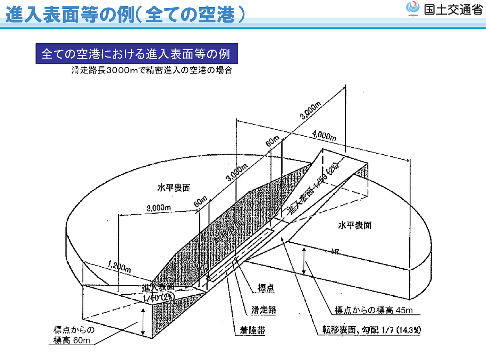
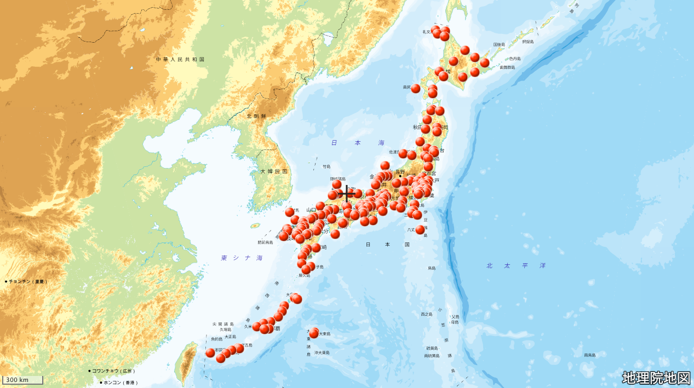
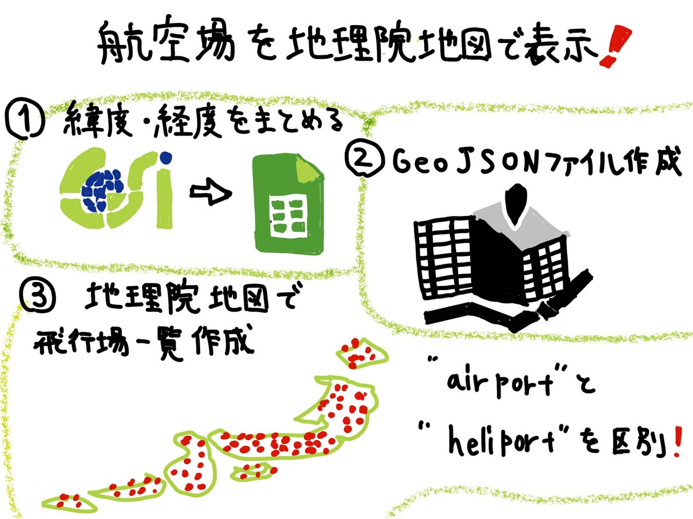

### 航空場を地理院地図で表示させる！？

ドローン部 ハッカソン12月編

早くも2021年を迎え、残す学生期間も3ヶ月となりました。4月から新たな人生が始まるため、初詣に行って厄除開運を祈願しようかと思いましたが、コロナの影響で自粛を余儀なくされました。

例年初詣は地元の神社に加え、そこそこ有名な神社に参拝することが多かったのですが、高校生の時に門前仲町の富岡八幡宮に参拝に行きました。永代通りを歩いていた時、前からこちらに向かってくる女性がなんとなく見覚えがある、長らく会っていない旧友にそっくりな方に遭遇しました。それからさらに近づき、20m先ぐらいでしょうか、その辺りでその女性はハッとした反応に加え、手を振ってきたのです。やっぱり知り合いかと思い手を振り返すと、とんでもない怪訝な顔をされました。一瞬何が起きたのか全くわからなかったのですが、僕の後ろにその女性の彼氏さんっぽい方がいらっしゃって、その方に手を振っていたみたいですね。新年早々とんでもない勘違いで恥ずかしい思いをした2016年でした。

今年も良い一年が過ごせるようにしたいです。

くだらない勘違いエピソードでしたが、ドローンでも勘違いが起きやすい一件がありました。

ドローン部では嫌という程耳にするかもしれません、「人口集中地区」、通称「DID」になります。ドローンの事故が起きた際に被害を少なくするため、航空法において人口が密集している地区（DID）ではドローンの飛行が禁止されています。国土交通省が提供している**[「人口集中地区（DID） 平成27年」**](https://www.gsi.go.jp/chizujoho/h27did.html)で確認することができます。見てわかるように、東京都はほぼ全域でドローンの飛行が禁止されています。

ここだけしか知らないと、DID外ではドローンの飛行が許可されていると思うかもしれません。基本的にはその認識で間違ってはいないです。しかし、航空法においてDID外でもドローンの飛行が禁止されている場所があるのです。

その一例が、**空港周辺**となっております。

国土交通省では[小型無人機等飛行禁止法に基づき小型無人機等の飛行が禁止される空港の指定](https://www.mlit.go.jp/koku/koku_tk2_000023.html)における適用空港として、新千歳空港、成田国際空港、東京国際空港、中部国際空港、大阪国際空港、関西国際空港、福岡空港、那覇空港があげられています。これらの空港の周辺は、航空法関係なく飛行させるには申請が必要となっております。

空港の周辺とは？との疑問が生じるのですが、この適用範囲は空港によって異なります。

全ての空港から6km以内エリアがこの規制範囲に該当します。また、東京国際空港、成田国際空港、中部国際空港、関西国際空港、大阪国際空港、釧路空港、函館空港、仙台空港、松山空港、福岡空港、長崎空港、熊本空港、大分空港、宮崎空港、鹿児島空港、那覇空港の周辺では、24km以内が規制範囲となっています。

飛行機が離着陸を行うコースにあたる空域でも規制が適用されているため、滑走路に向けた正面方向は範囲が大きくなっております。

さらに[進入表面の例](https://www.mlit.go.jp/common/001109751.pdf)を見ると距離によって高さが変わる等、より複雑になっていることがわかります。



つまり適用範囲を作成するのは複雑で非常に困難であるため、第一段階として国土交通省が提供している[空港一覧](https://www.mlit.go.jp/koku/15_bf_000310.html)を元に、全国の空港やヘリポートをGeoJSON形式でまとめることにしました。

そして実際に完成したのが、コチラ。



[furuhashilab/gsi_airportmap
地理院地図ハッカソン ドローン部. Contribute to furuhashilab/gsi_airportmap development by creating an account on GitHub.github.com](https://github.com/furuhashilab/gsi_airportmap)

今回は空港一覧の緯度経度を地理院地図から取得し、それをGeoJSON.ioを用いてGeoJSONファイルを生成すると言ったやり方です。

GeoJSON.ioで”airport”と”heliport”を分けているため、より認識がしやすくなったかなとは思います。

このブログを記載している時に気づいたのですが、実際に地理院地図では、[空港等の周辺空域](http://maps.gsi.go.jp/#11/35.603160/139.781113/&base=std&ls=std&disp=1&vs=c1j0h0k0l0u0t0z0r0s0m0f0&d=m)としてデータを表示することができるみたいですね、、、さすが地理院地図様様って感じです。

てことで、今回は飛行場一覧をまとめ、地図にインポートさせることをしてまいりました。DID外と言って、ドローンをすぐに飛ばすことはしないようにしていきましょう！！

```
スライド
```

```
グラレコ
```


