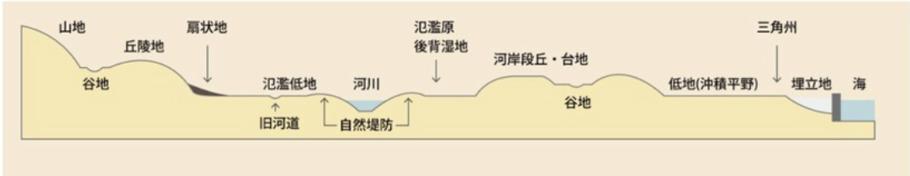
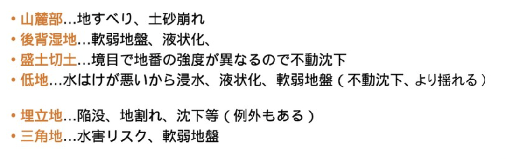
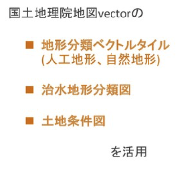
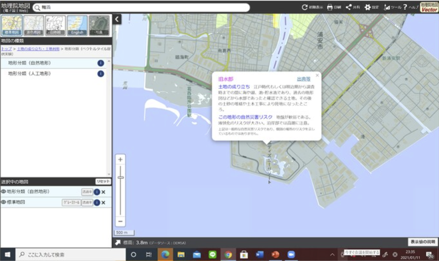
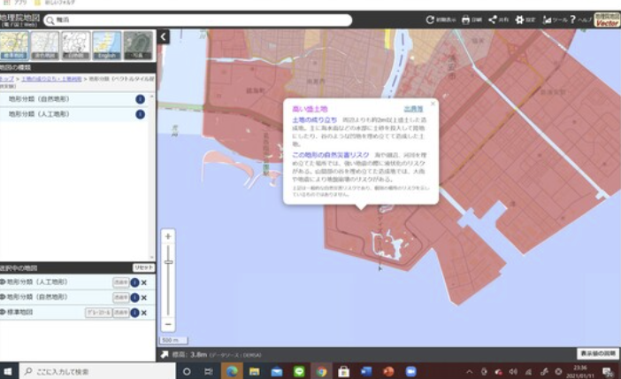
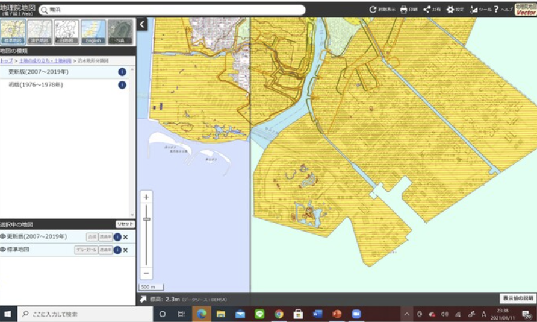
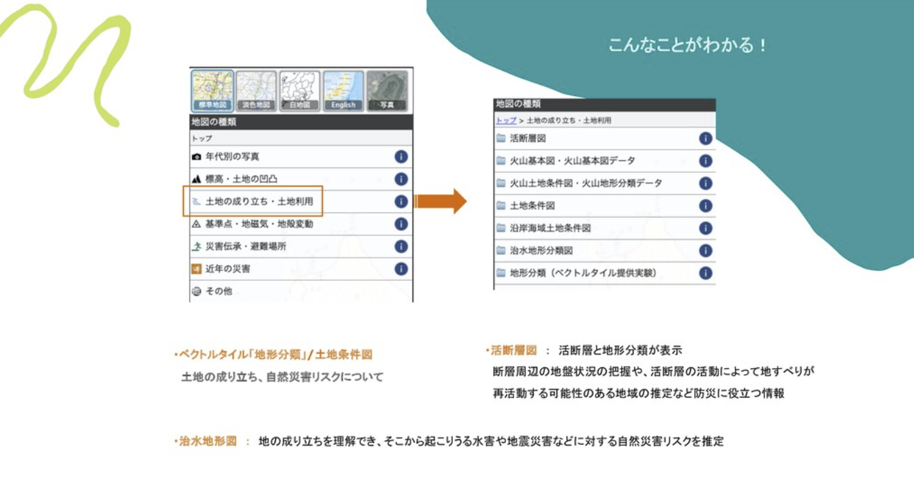
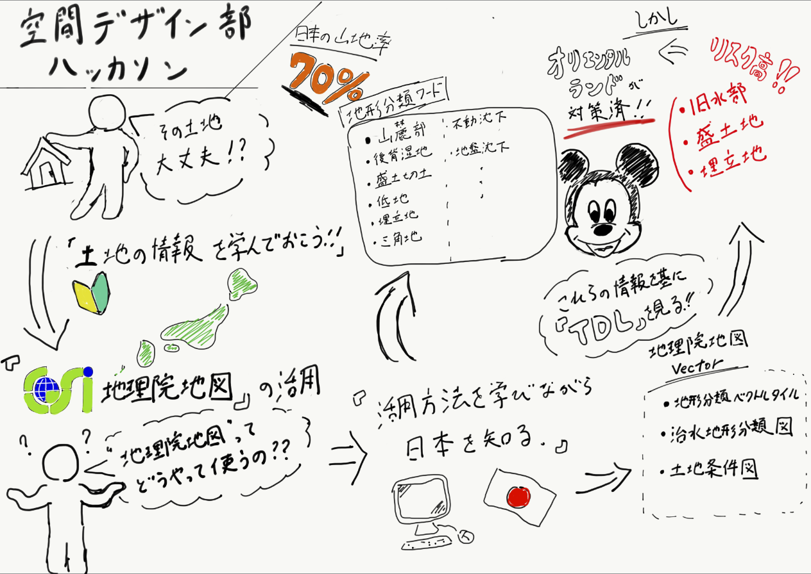

### あなたのいまいる場所、そこって安全？

今回は地理院地図を使ったハッカソンということで、災害などのリスクの低い土地などの情報を地理院地図を活用して得る方法をマニュアル化しました。

#### ＜今回の主な活動＞

住みやすい土地、土地そのものの知識を初心者向けにわかりやすく説明するし、土地選びのきっかけになるように地理院地図を利用した土地に関するマニュアルをスライドで作成する。

#### <背景>

「地理院地図 利用方法」を検索しても出てこなく、あまり認知されていない。また、Google MAPでは表示できない情報を得られる地理院地図をより利用してほしい。

#### <作業の流れ>

・土地に関する基礎知識を共有する。
・地理院地図でどのようなことができるのかを大まかに把握する。
・１つのテーマを設定し、それに関して地理院地図を活用しながら説明するためのスライドを作成する。

### 完成したマニュアル

<日本の土地の基礎知識>

日本の山地の割合は70%であり、世界の中でも山地の割合が多いと言われている。
山地が多い中で日本人は山を切り開いて平にして住居を獲得してきた。

そもそも地盤とは建造物・施設物などの基礎となる土地のことをいう。
・強い地盤は岩盤や砂礫を多く含む皇室な土地のこと
・弱い地盤は柔らかい砂からなる土地のこと

<地形分類について>

#### どのように危険なのか？

<実際に調べてみる>

今回は「東京ディズニーランド」の地盤について地理院地図を使って調べてみる。東京ディズニーランドは人工的に作られた土地(埋立地や盛土など)や近くに海や川があるという沈下の恐れがある条件を満たしているので実際に地理院地図にはどのように表示されているのかを見てみる。

#### ＜地形分類ベクトルタイル＞

ここでは土地の成り立ち、自然災害リスクについて確認できる。

#### 旧水部

#### 高い盛土地

#### 埋立地

このように,

「旧水部」「盛土地」「埋立地」であり、自然災害リスクが高いと言える。

地理院地図では自分の知りたい条件を選べば、その土地についてわかるようになっています。

簡単に調べることができるので是非参考にしてみてください。

#### <グラレコ >

<Github Project>

[furuhashilab/fc_SpatialDesign
You can't perform that action at this time. You signed in with another tab or window. You signed out in another tab or…github.com](https://github.com/furuhashilab/fc_SpatialDesign/projects)
