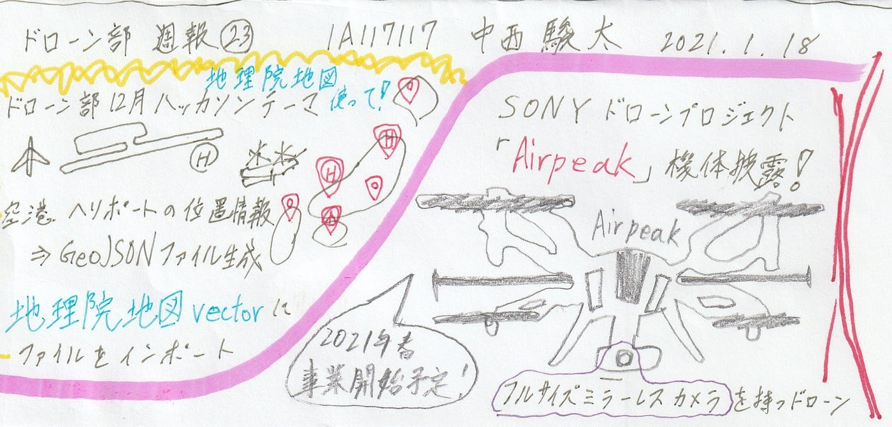

### ドローン部週報㉓

地球社会共生学部4年 中西 駿太 1A117117

こんにちは、古橋ゼミ4年の中西駿太です。

次回の週報が最終号になります！

### ～ミーティングでの確認事項～

・1/18（月）締切の12月ハッカソンのやる内容についての確認。
・ドローンバード訓練及びBBQの中止⇒延期について確認⇒3月に開催する!?

#### ドローン部 ハッカソン内容 決定事項

#### 日本国内の飛行場をスプレッドシートでまとめ、GeoJSON ioを用いてGeoJSONファイルを生成する。

#### ⇒生成されたGeoJSONファイルを地理院地図vectorを用いてインポートし、飛行場一覧を作成する。

#### **背景**

DIDは表示されるが、飛行場範囲は反映されていないため。

#### **レギュレーション**

• 緯度経度は、[地理院地図電子国土WEB](https://maps.gsi.go.jp/#5/36.104611/140.084556/&base=std&ls=std&disp=1&vs=c1j0h0k0l0u0t0z0r0s0m0f1)から参照とする 。
 →緯度経度のズレを防ぐため
 • 対象地は国土交通省が提示している空港とヘリポート全般とする。

#### 参照

h[ttps://medium.com/furuhashilab/%E8%88%AA%E7%A9%BA%E5%A0%B4%E3%82%92%E5%9C%B0%E7%90%86%E9%99%A2%E5%9C%B0%E5%9B%B3%E3%81%A7%E8%A1%A8%E7%A4%BA%E3%81%95%E3%81%9B%E3%82%8B-92a457e53e38](https://medium.com/furuhashilab/%E8%88%AA%E7%A9%BA%E5%A0%B4%E3%82%92%E5%9C%B0%E7%90%86%E9%99%A2%E5%9C%B0%E5%9B%B3%E3%81%A7%E8%A1%A8%E7%A4%BA%E3%81%95%E3%81%9B%E3%82%8B-92a457e53e38)

[Google Sheets - create and edit spreadsheets online, for free.
Create a new spreadsheet and edit with others at the same time -- from your computer, phone or tablet. Get stuff done…docs.google.com](https://docs.google.com/spreadsheets/d/1_FmYhHCpE0Rr_SXBGBOUYrPH_LQg79eK37jVMataZUg/edit#gid=0)

[航空：空港一覧 - 国土交通省
空港法第４条第１項各号に掲げる空港（成田国際空港、東京国際空港、中部国際空港、 関西国際空港、大阪国際空港並びに 国際航空輸送網又は国内航空輸送網の拠点となる空港）をいう。…www.mlit.go.jp](https://www.mlit.go.jp/koku/15_bf_000310.html)

### SONYがドローンプロジェクト「Airpeak」の機体を初披露！

ソニー株式会社は1月12日に「CES 2021」で、2021年春の事業開始に向けて準備を進めている、AIロボティクス領域で推進するドローンプロジェクト「Airpeak」の機体を初公開しました！

フルサイズミラーレスカメラを搭載できるドローンとしては業界最小クラスの機体。また、ダイナミックな撮影や安定した飛行が可能であるようです！

文字でお伝えするより、映像で見たほうが伝わると思います。

[ソニー、ドローンプロジェクト「Airpeak」の機体を初披露 αシリーズカメラ搭載の様子を公開 CES 2021にて
ソニー株式会社は1月12日（米国現地時間11日）、オンラインイベントとして開催されている「CES 2021」にて、同社がAIロボティクス領域で推進するドローンプロジェクト「Airpeak」の機体を初公開した。 ...dc.watch.impress.co.jp](https://dc.watch.impress.co.jp/docs/news/1299454.html)

#### グラレコ

今週のグラレコです。

2021/1/18

以上
