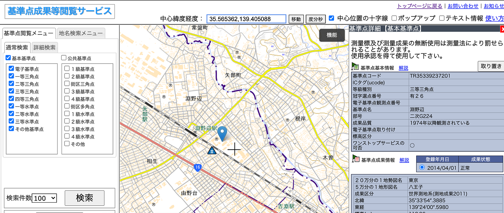
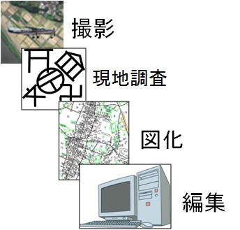
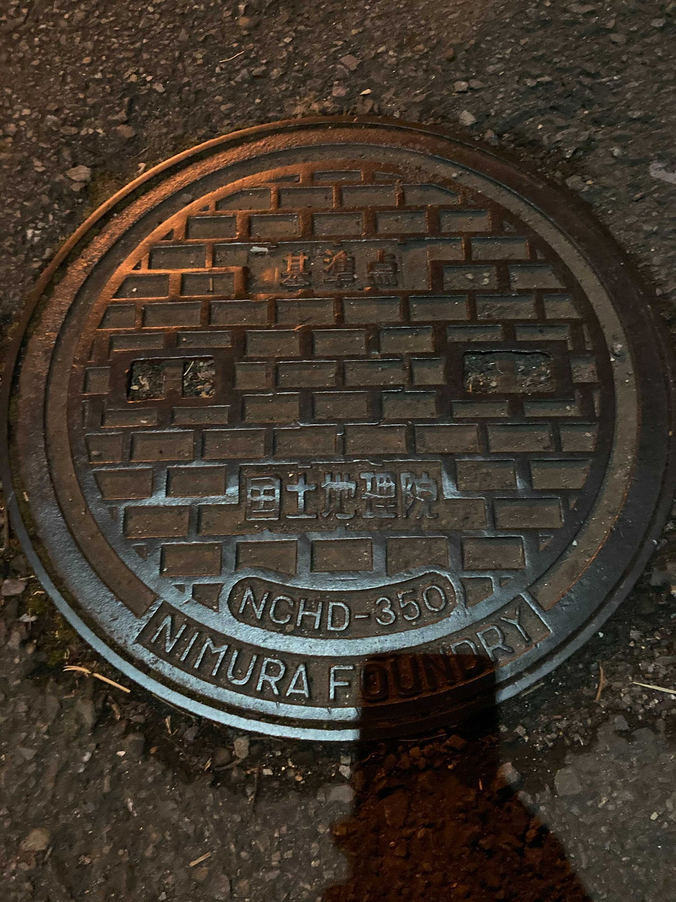
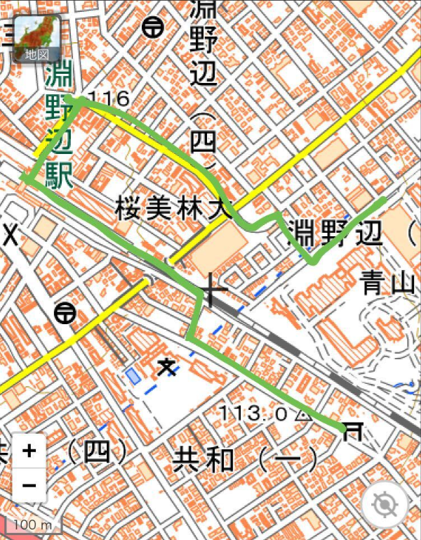
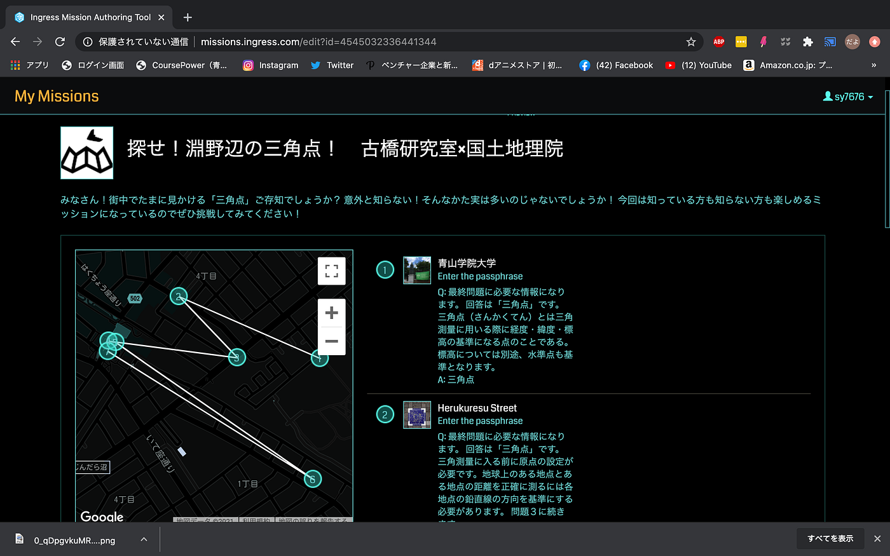
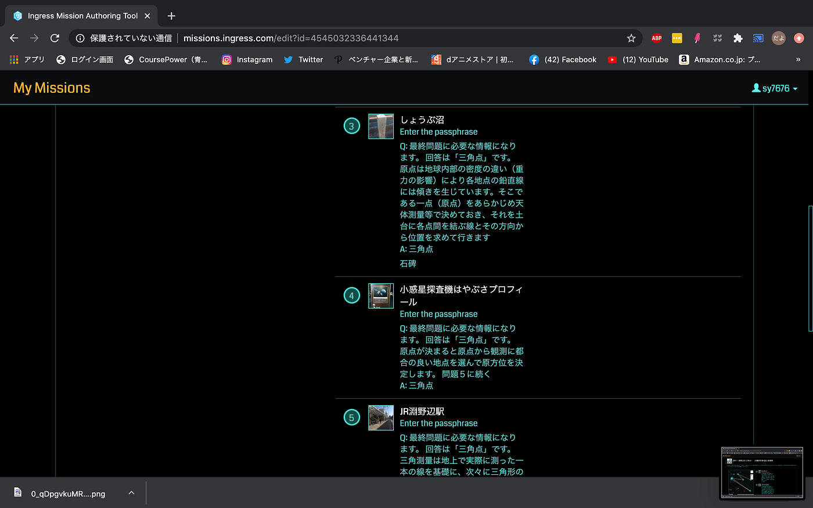
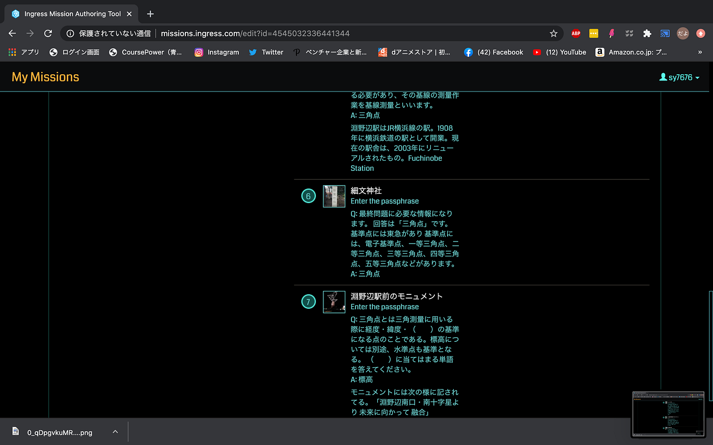
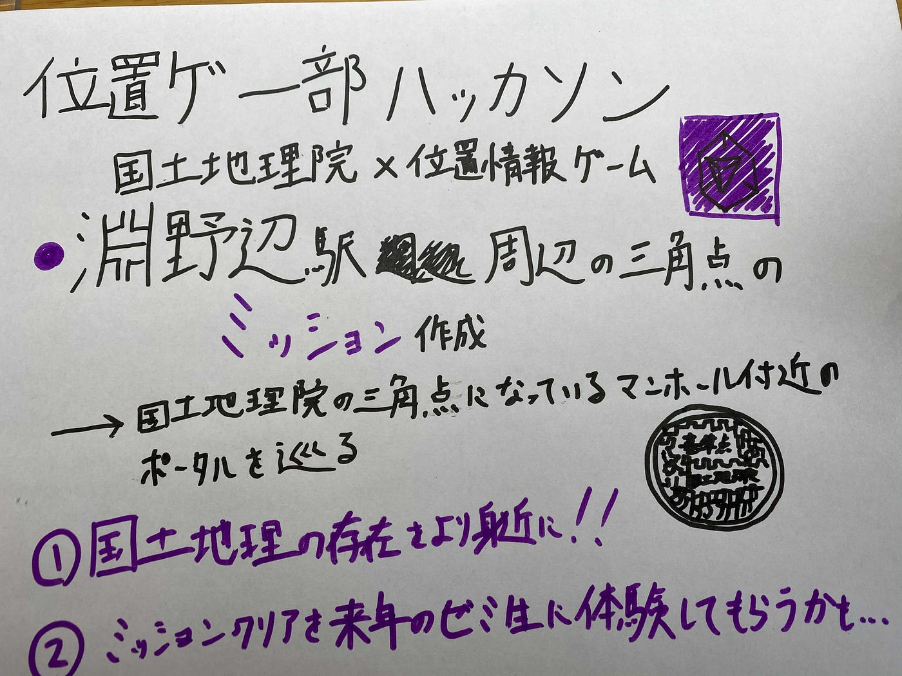

### 位置ゲーハッカソン２０２１

明けましておめでとうございます！

位置ゲー部部長の依田です！

今回のハッカソンは「国土地理院×位置情報ゲーム」ということで！
地理院地図を知らない方にむけて、またより地域の方に新たな発見と楽しさを提供するという意味でingressのミッション機能を用いて

「淵野辺×国土地理院」というミッションを作成しました！
ミッションの内容は「淵野辺駅周辺の三角点」についての調査です。
国土地理院の三角点になっているマンホール付近のポータル を巡るミッションです！

このミッションの目的としては「国土地理院の存在をより身近に感じてもらうため、三角点について学んでもらう為」です。

### 三角点の役割

三角点は、地図の作成や国土の保全、各種測量等、様々な活動で活用されています。

#### 地図作成

地図を作成する場合には、空から写真を撮り、写真から地図を描きます。また、地上で巻き尺などを使用して距離を測り地図を描くこともあるでしょう。しかし、この時地図には必ずゆがみが発生してしまいます。三角点と地図の位置を結びつけることによって、ゆがみが解消され、正確な地図を作成することができます。

[三角点の役割
国土地理院ホームページではJavaScriptを使用しています。すべての機能をご利用いただくにはJavascriptを有効にしてください。 三角点は、地図の作成や国土の保全、各種測量等、様々な活動で活用されています。 …www.gsi.go.jp](https://www.gsi.go.jp/sokuchikijun/sankaku-role.html)

引用：国土地理院

ということで実際に淵野辺にある三角点の付近を散策してきました！

また、このミッションクリアを来年以降の位置情報ゲームの最低基準に儲けようと考えています！

細かいことは来年の新部長の人に引き継いでいこうと思いますが！

