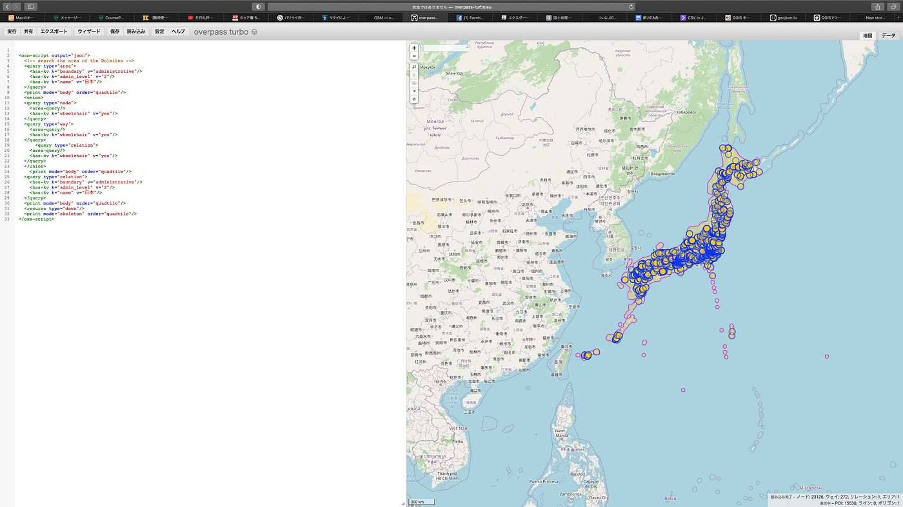
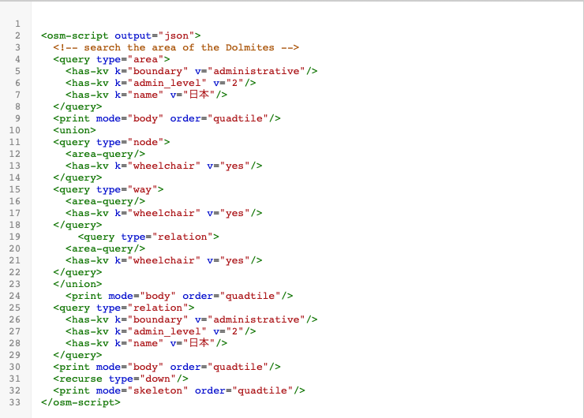
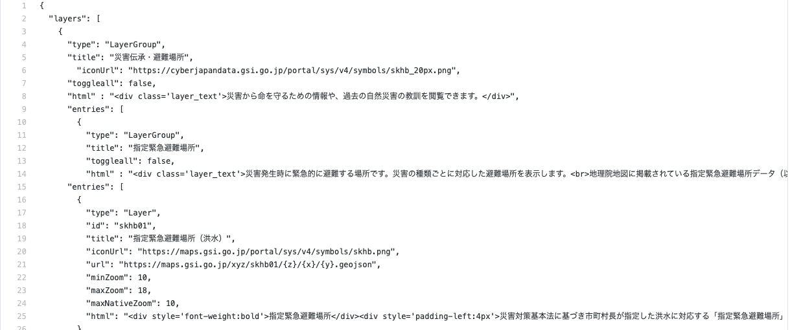
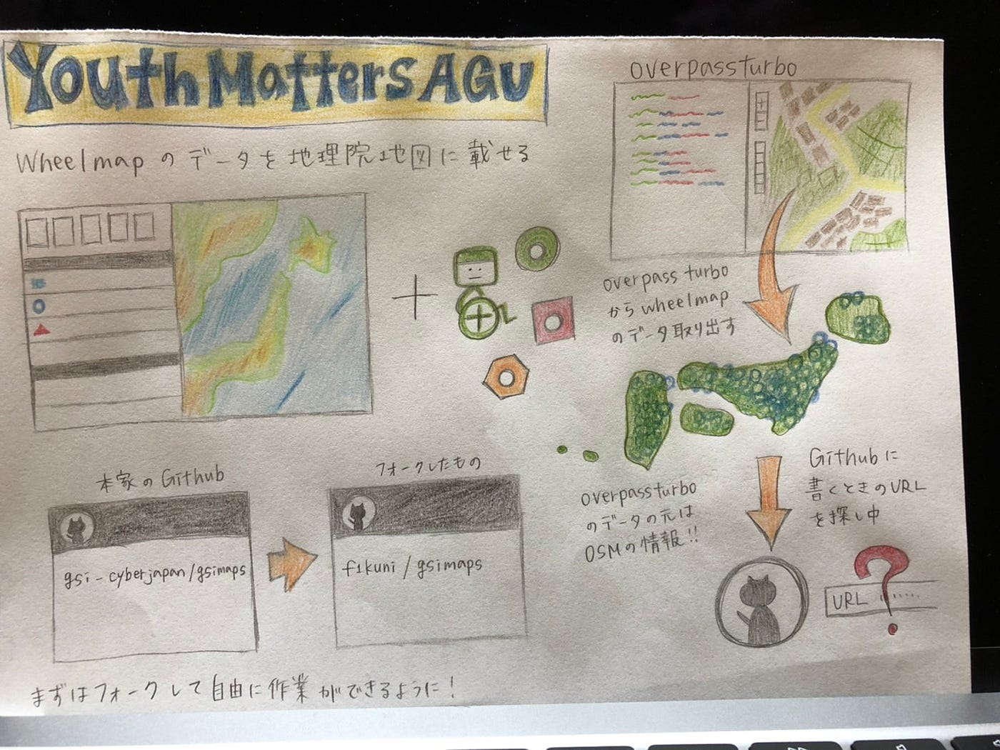

### 最後のハッカソンにして一番の学び

3年の日向野邦春です。

今回、ユースは地理院地図にOSMのタイルデータを埋め込むという題材でハッカソンに挑みました。具体的にはOSMにあるWheelmapのデータを地理院地図に埋め込むことにしました。

①overpass-turboからデータを取り出す

これでOSMに車椅子利用不可の欄にyesと書かれているポイントが一気に抽出できました。

②地理院地図のlayers_txtファイルの書き換え

今回はこの段階で手こずってしまいました。

このURLというところを書き換えるのですが、このタイルURLの発行の仕方がわからずに立ち止まってしまいました。

[koukita/gsimaps
The source of GSI Maps (http://maps.gsi.go.jp/). Contribute to koukita/gsimaps development by creating an account on…github.com](https://github.com/koukita/gsimaps/blob/gh-pages/layers_txt/layers0.txt)

[イントラネットで地図サービスを使いたい３-サーバー設置・レイヤー追加編- - Qiita
前の記事 通常、インターネットであれば、WebサーバーにGithubからダウンロードしたレポジトリ一式をアップすれば、各種タイル、検索機能など使用可能だ。…qiita.com](https://qiita.com/notmushroom/items/67dd8f27d86880c51d1e)

この方が既にOSMを地理院地図に表示させるという作業を行なっていました。

今回のハッカソンから学んだこと

・まだまだGithubでの情報共有が出来ていない

[furuhashilab/OSM-GSI
Permalink Failed to load latest commit information. 地理院地図に車椅子の情報を追加 地理院地図のGithubを確認する →layers_txt 1から7までの数字は地図の種類と一緒！！！…github.com](https://github.com/furuhashilab/OSM-GSI)

[f1kuni/gsimaps
Tentative English translation for this README is also available since 2015-03-12. このレポジトリのハッシュタグは #gsimaps です。 Twitter…github.com](https://github.com/f1kuni/gsimaps)
