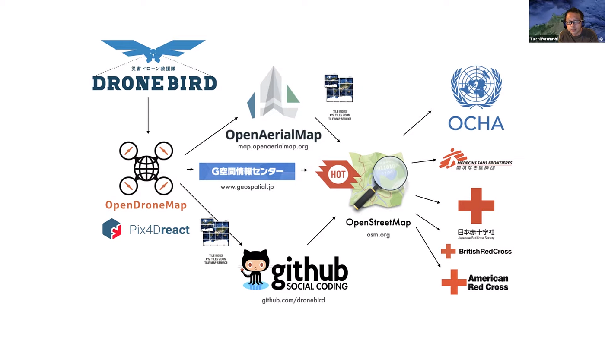
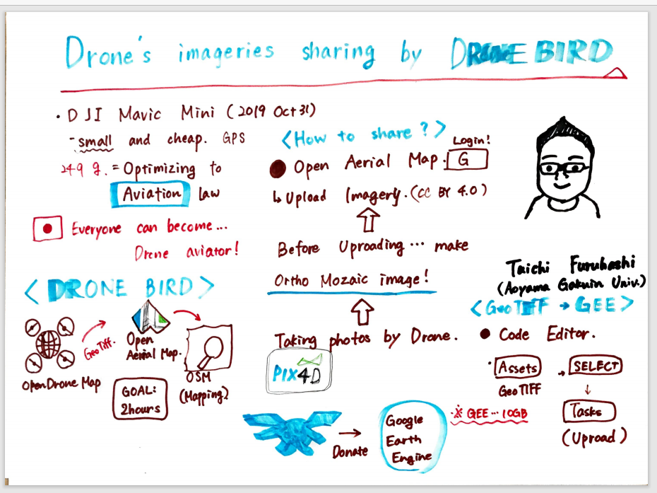

### Virtual Meetup at Geo For Good Summit 2020

こんにちは、古橋ゼミ4年の森玲子です。

本年度国際会議に参加することが出来ていなかったため、駆け込みで「Virtual Meetup at Geo For Good Summit 2020」における、古橋大地教授の講演を拝聴しました。

この国際会議では、Google Earth Engineを始めとするマッピングツールが題材の一つとして扱われていました。

講演の内容の概要をレポートさせて頂きます。

〈はじめに〉

DJI Mavic Miniの説明がありました。価格が安いことやGPS、カメラが搭載されていることに加え、重さが249gです。飛行に最適な重さであります。

〈DRONEBIRD〉

次に、DRONEBIRDの活動の説明がありました。

Open Drone Mapを使用した後、Open Aerial Mapにてアップロードを行い、最後にOSMでマッピングするという流れであり、目標は二時間としています。

〈シェアの仕方〉

ドローンで写真を撮ります。そしてオルソモザイクを生成し、OAMにてアップロードを行います。

最後に、GeoTIFFをGEEに適応させる方法について解説されました。

この講演を拝聴し、自分自身がこれまでに行っていた活動について改めて振り返り、理解することができたので貴重な機会となりました。古橋教授の英語の説明が非常に聞き取りやすく明瞭でした…！

短くなりましたが、スクリーンショットです。

グラレコです。

