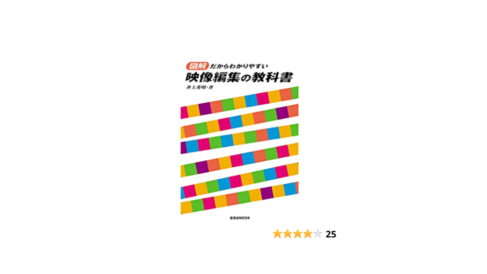

### 映像撮影手法に関する本を読んでみた

古橋ゼミ4年の森です。

私のゼミ論文のテーマは「ドローンによるPVの撮影手法を学ぶ上で必要な参考文献リスト作り」になりました。

そこで今回私は、ゼミ論文の最終的な仕上げとしましてある書籍のレビューを行いました。

与えられた一週間の中で参考文献リスト作りに注力し、その中で発見した1冊について詳しくレビューしていきたいと思います。

**☞書籍の名前は？**

「図解だからわかりやすい映像編集の教科書」（井上秀明、玄光社、2017年）

という書籍です。

この書籍では映像編集の基礎知識や編集のテクニック・映像表現に関することが記されています。

この中から私がとりわけ関心を持ったものが、第一章の「人を引きつけるつなぎのためのカメラワーク」という部分（p36–43）と第二章の「音楽にのせて映像編集する方法」（p102–109）という部分です。

**☞２つの部分で述べられていたことの概要**

１．映像には主観（被写体の見た目線につながれた画）と客観（誰の見た目にもなっていない、説明的につながれた画）がある。

２．曲自体のイメージに合わせ映像編集を行うこと。ロックなどのアップテンポなものから、バラードなどのスローテンポなものまで様々である。

という２点が述べられています。

☞**では、自身が研究した「ドローンの撮影手法」と比較すると？**

①概要１に関して

まず従来の映像の撮影手法に着目します。カメラを使用した映像撮影では、主観映像に「パンニング、チルティング、トラッキング」が、客観映像に「クレーン、ズーム」といった手法が使用されていると分かりました。

そしてドローンによる撮影手法では、「パン、チルト、クレーンショット、ドリーズーム」など従来の撮影手法と似通ったもの、そして全く異なるものが使用されています。

しかし「パン」を一例とすると、カメラのみではそれを右に振ることや左に振ることのみが可能である一方、ドローンを使用した場合それを中心に周囲を360度見渡すことが出来ます。

さらに「ズーム（カメラ）とドリーズーム（ドローン）」を比較すると、前者は画の中の一部に向かってフレームを縮めたり、一部から全体へ広がっていく手法。後者はドローンの機体を「後退」させ「ズームイン」することで、対象物のサイズを変えずに、背景の遠近感だけを変化させるという手法です。

②概要２に関して

音楽に合わせて映像編集するには、曲調や系統にテンポを合わせることが大切であると判明しました。特にスローなテンポにはオーバーラップといい、ゆるく場面を切り替えるということが効果的です。

ドローンを使用して映像を撮影し、それをミュージックビデオなどとして編集する際には、既に曲調や系統に沿ってドローンの速度や角度を調整しているという前例はあると捉えています。

一方で一般の人々が親しみやすいカメラと比較すると、ドローンは飛行速度や角度・風速との兼ね合いもあり操縦しにくいものであると考えているため、常日頃から場面や環境に合った飛行速度を意識するということが大切なのではないでしょうか。

**☞まとめとして**

従来のビデオカメラ等を利用した映像撮影の注意点や工夫方法は、ドローンを使用した撮影においても充分活かすことが出来ると分かりました。

一方でビデオカメラとドローンは大きさや形・飛行させるか否か・利用者の技術の有無などが根本的に大きく異なっています。

いずれを利用するにしても、撮影目的や環境に合う技術を有することや撮影手法を工夫させることは非常に重要であると思います。

今回この書籍から得たことを忘れずに、これからの映像撮影に役立てていきたいです。

☞最後に

一週間前、私はウェブサイト２つで研究を完成させようとしていました。

古橋教授からご指摘をいただき、一週間様々な書籍に触れたことで多くのことを得ることが出来ました。

これからも、何かを研究にあたりしっかりした文献調査を行うようにしたいと思います。

古橋教授、ゼミ生と関係者の皆様2年間ありがとうございました！

古橋ゼミ 4年

森 玲子

**2020年度ゼミ論文レポジトリ**

[https://github.com/furuhashilab/2020gsc_ReikoMori](https://github.com/furuhashilab/2020gsc_ReikoMori)

**参考文献**

「図解だからわかりやすい映像編集の教科書」（井上秀明、玄光社、2017年）

「[声に出して使ってみたくなるドローンの撮影テクニック6選](https://www.monosus.co.jp/posts/2018/12/142714.html)」（河原崎平、2018年）
