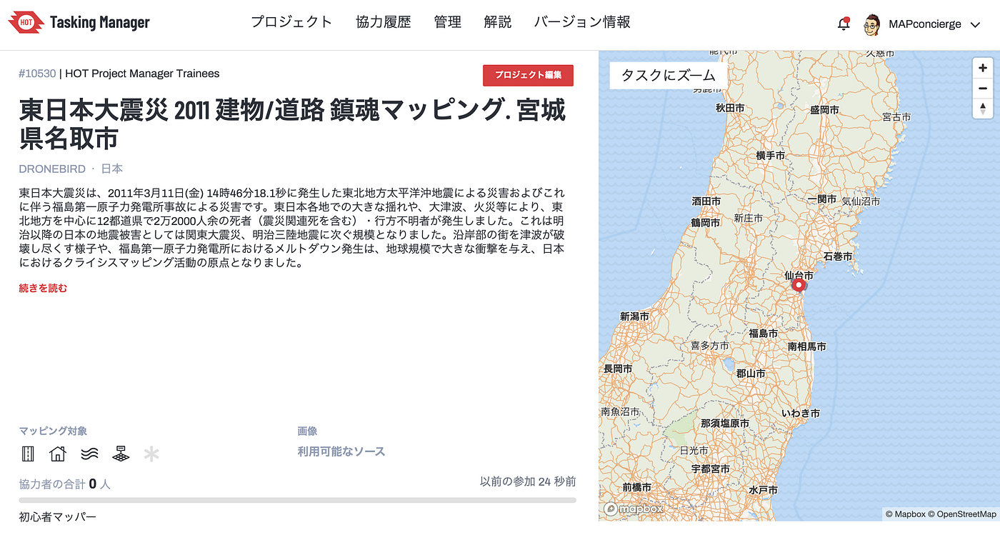

### 東日本大震災から10年

本日(3/11) 14:46に東日本大震災から10年を迎えます。

正直なところ、やっと10年。

しんどいことだらけで、何度も挫けそうになったそんな10年でした。うまくいったことが１だとすると、うまくいかなかったこと９くらいです。多くの方々に迷惑もかけてしまいました。それでもこの10年の取り組みを後悔はしていないのが救いです(チャレンジしていなかったらきっと後悔していたと思います)。 3.11のあの時 市ヶ谷で住居表示住所の仕様検討会中に地震に遭遇し、ビルとビルがぶつかる音と揺れで死を覚悟し、その後の sinsai.info や[クライシスマッピング活動](http://crisismappers.jp/)から[災害ドローン救援隊DRONEBIRD](http://dronebird.org/)プロジェクトの立ち上げまで、地図がすべての人達に役に立つという信念を変えずにここまでやってこれました。

ですので、今日、東日本大震災から10年目を迎えるにあたり、愚直に地図を描くことに注力しようと思い[「被災地の鎮魂マッピング」タスクプロジェクトを複数公開](https://tasks.hotosm.org/explore?text=%E6%9D%B1%E6%97%A5%E6%9C%AC%E5%A4%A7%E9%9C%87%E7%81%BD)いたします。

東日本大震災で被災されたすべての方々と救急救命・復興支援に関わられた方々、心半ばに亡くなられた方々、怪我をされたかた、心に傷を負った方々、その他すべての方々に哀悼の意を表すとともに、その想いをすべて地図にぶつけながら次の10年と未来を考えるそんな祈念の日にしたいと思います。

[以下のURL](https://tasks.hotosm.org/explore?text=%E6%9D%B1%E6%97%A5%E6%9C%AC%E5%A4%A7%E9%9C%87%E7%81%BD)ですべての「被災地の鎮魂マッピング」プロジェクトを絞り込むことができます。 現時点では閖上も含めた名取市を公開いたしました。 もしよろしければ、建物１軒でも、今の被災地の地図を更新していただければ、その記録はすべて記録され未来に引き継がれます。多くの方々がマッピングに参加いただけるきっかけになれば幸いです。

[HOT Tasking Manager
Tasking Manager is a the tool for coordination of volunteers and organization of groups to map on OpenStreetMap.tasks.hotosm.org](https://tasks.hotosm.org/explore?text=%E6%9D%B1%E6%97%A5%E6%9C%AC%E5%A4%A7%E9%9C%87%E7%81%BD)

最後になりますが、クライシスマッピング活動に関わったすべての方々と、それを支えてくれた家族に感謝いたします。

Just keep walking, persistence paid off.

Happy Mapping :-)

#CrisisMapping #DRONEBIRD #古橋研究室 #YouthMappersAGU #HOTOSM #JapanFlyingLabs #AoyamaGSC #OpenStreetMap
