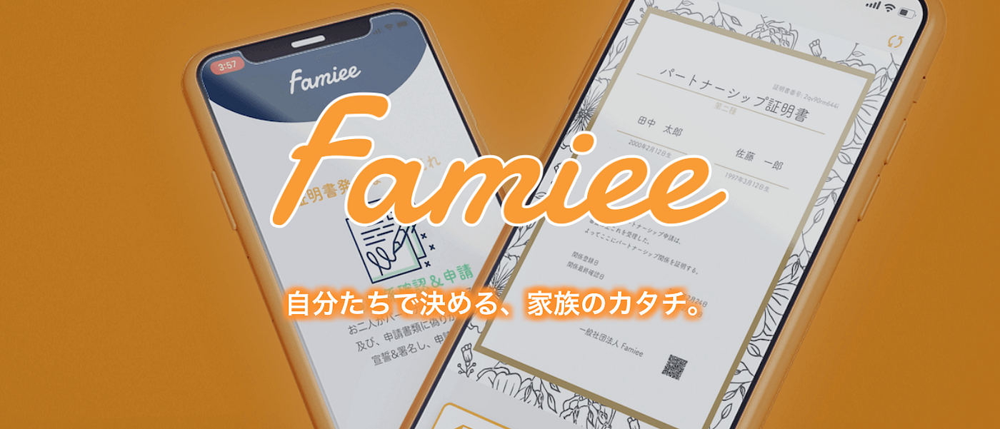
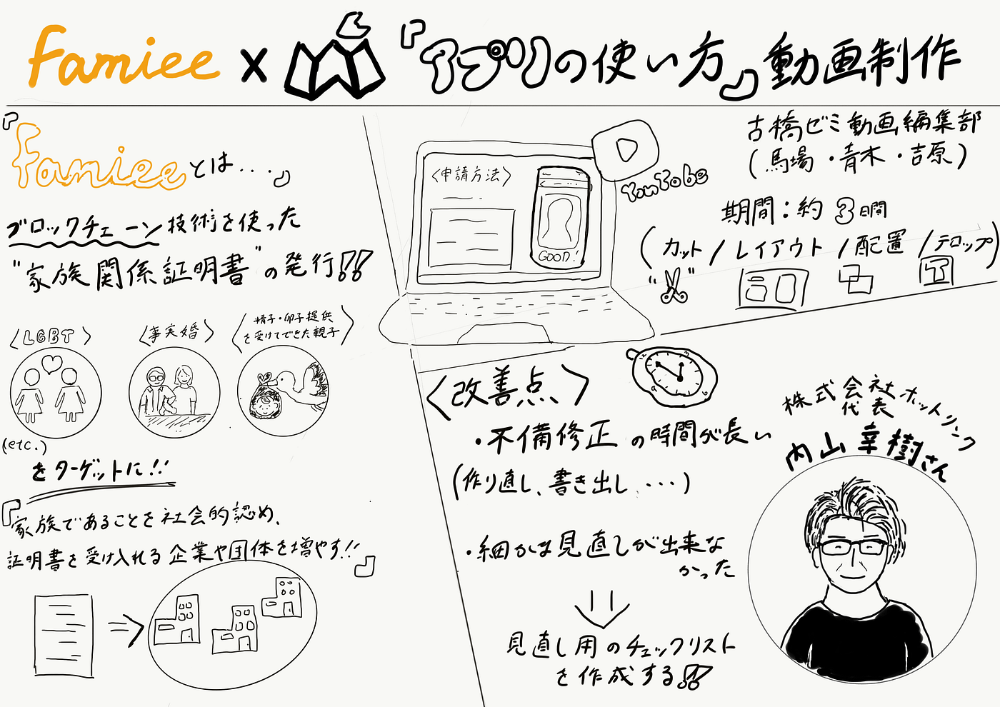

### Famieeで家族に。

今回、内山幸樹さんが代表を務められている「Famiee」という新サービスのリリースにおいて、「アプリの使い方」の動画制作を担当させていただきました。

#### <Famiee プロジェクトとは>

Famiee(ファミー)は、ブロックチェーン技術を使った家族関係証明書の発行を可能にしたサービスです。現状、法律によって夫婦などの関係が認められないパートナーが家族であることを社会的に認め、その証明書を受け入れる様々な企業や団体を増やし、民間発で家族向けのサービスや権利を提供ができるようになる社会を作るのが目的になっています。

2021年2月25日のリリースでは、「家族関係証明書」の第１弾として、同性パートナーのための「パートナーシップ証明書」の発行ができるようになりました。

詳しい内容はPRTIMESさんのプレスリリースをご覧ください。

[ブロックチェーンの技術を活用した「家族関係証明書」の第1弾、スマホのアプリで完結する、【同性パートナーのための「パートナーシップ証明書」】、民間発行がスタート
■プロジェクトの概要 ...prtimes.jp](https://prtimes.jp/main/html/rd/p/000000009.000047881.html)

#### <制作することになった経緯>

本プロジェクトに関わっている地球社会共生学部4年の大滝理紗さんの紹介で「アプリ使い方ガイド」の動画制作を古橋研究室の動画編集チームで受けることになりました。TEDxAoyamaGakuinU以来のプロジェクトであり、短期間のプロジェクトなので気合が入りました。

#### <制作動画>

アプリの使い方、５つの機能の使い方動画を制作させていただきました。ぜひ、ご覧ください。

①申請方法

②証明書のダウンロード＆印刷

③証明書の検証方法

④関係解消方法

⑤関係確認日の更新

#### <チームでの制作について>

今回の動画制作は青木、馬場、吉原の３人で担当しました。

チームでの動画制作は素材の受け渡しのトラブルやデザイン性、センスの問題などクリアしなければならない問題が山積みであり、TEDxの時からの悩みですが、今回は思っていたよりも上手くいった印象です。

制作期間はミーティングも含めて約３日ほどで完成し、その後不備修正を主に行う流れでした。

素材のやり取りやデザインの統一という部分の問題をクリアするために、リーダーを一人（今回は青木）決めて「基準」を決めました。短期間での制作ということもあり、「ここまでできていれば引き継げる」というギリギリのラインをTEDxの経験から仮説を立ててメンバーに共有しました。

#### <決めた基準>

◎カット/使うシーン等
zoomで内山さんとのミーティングで解説していただいたものを参考にして基本的にまずは独自判断で作業しました。

◎レイアウト/配置/テロップ等
背景に使う画像や色（カラーコード等）、使用するフォントの統一をしました。

詳しい内容は今回実際に使ったドキュメントをご覧ください。

[Famiee動画制作.pdf
Edit descriptiondrive.google.com](https://drive.google.com/file/d/1i-js5ePEz48obfDyZwDXzqn2F5UUnAyV/view?usp=sharing)

#### <改善点>

動画制作の作業はスムーズに行えましたが、大まかな点から細かい点まで不備修正を行うことの時間的コストがかなりかかることに気が付きました。特に動画制作には、素材の作り直しや動画の書き出しにかなりの時間がかかってしまうので、細かな見直しをする必要がありました。見直しを少し怠った部分が反省点であり、不備修正をできるだけ無くすように見直し用のチェックリストを作成しようと思っています。

#### <デザイン>

動画チームとしても個人としても、今回のような被写体が登場しないデザイン性が問われるような動画制作は初めてでした。今回参考にした動画は[こちら](https://www.youtube.com/watch?v=X8c_dOKZ65g)です。

このような動画を参考にしながら、極力シンプルに、「デザインの４原則」のみを意識して制作しました。「ノンデザイナーズ・デザインブック」を読めばデザインの基本を学べます。デザイン初心者でもキレイなデザインを作ることができるのでおすすめです。

[デザインのキホン！4原則を活用して伝わるデザインに。｜ドコドア
お客様のWebサイトが「より分かりやすく」「より魅力的に」ユーザーへ伝わるように。…docodoor.co.jp](https://docodoor.co.jp/staffblog/design-4general-rule/)

[ノンデザイナーズ・デザインブック [第4版]
AmazonでRobin Williams, 米谷 テツヤ, 小原 司, 吉川 典秀, 米谷 テツヤ, 小原 司のノンデザイナーズ・デザインブック [第4版]。アマゾンならポイント還元本が多数。Robin Williams, 米谷…amzn.to](https://amzn.to/3fagIuY)

#### <最後に>

Famieeプロジェクトという社会問題の解決になるような企画に参加させていただき、地球社会共生学部らしい取り組みができたと思います。

動画制作は総合的にこれまでで最もうまくいったと思っています。まだ経験として足りない部分は、制作する上での基準や設計をどうすれば効率がよいのかを考えるということです。データ管理やデザインを統一して一貫性のある作品をつくるためにも、データやデザインや構成などをチームでやり取りするための規範やルールを構築していく必要があると思っています。まずは、メンバーそれぞれがプロジェクトごとにリーダーを経験して改善を繰り返すところからですね。

#### <グラレコ>

