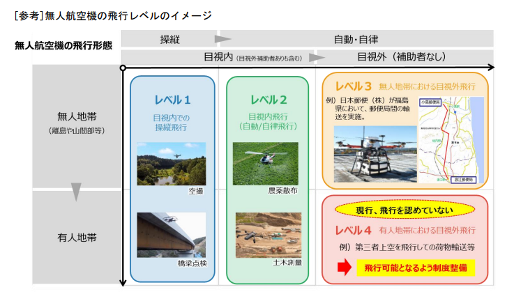
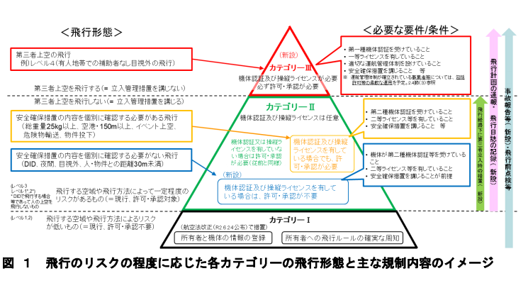
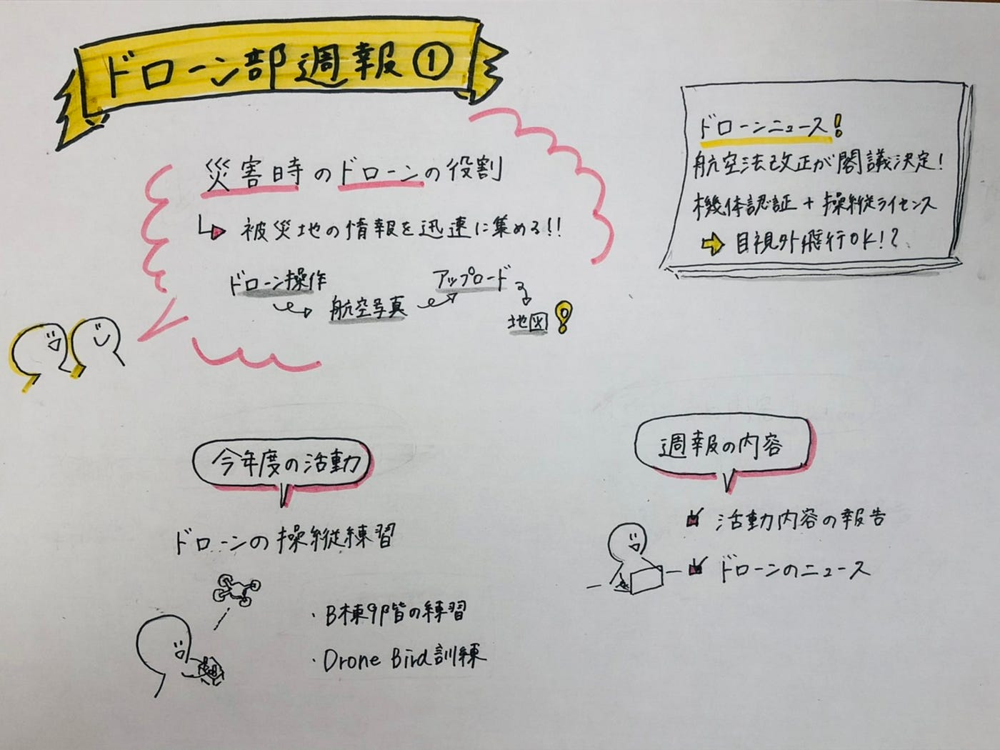

### ドローン部週報①

先週から今年度のゼミがスタートしました！
今後も週報でドローン部の活動をお伝えしていきますので、これからもよろしくお願いします！

### #新3年生に向けて

現在ドローンは災害時に被災地の状況を迅速に把握するために使用されています。ドローン部では主に航空写真の撮影からパソコンにアップロードする一連の作業等、ドローンに関する勉強をしています。興味のある方はぜひドローン部に入ってもらえたら嬉しいです。

### #議論内容

ドローン部の今後の活動について以下のことを話し合いました。

#### ##活動について

昨年度はコロナの影響によりドローンを飛ばす機会が少なかったことから、今年度は相模原キャンパスのB棟9階でのドローンの練習を再開していきたいと考えています。具体的な練習時間帯についてはまだ未定です。
また、高田橋のDroneBirdの練習にも積極的に参加していく方針です。

#### ##週報の内容について

昨年度のドローン部の週報は、主に活動内容の報告とドローンのニュースや豆知識について掲載してきました。今年度もその形式で週報を続けていこうと思います。今後もより良い週報を届けられるようにしていきたいです。

### #ドローンニュース

#### ##航空法改正

令和3年3月9日に航空法の一部が改正する法律案が閣議決定され、無人航空機（ドローン）の飛行に関する内容に関する「[中間とりまとめ](https://www.mlit.go.jp/policy/shingikai/content/001389494.pdf)」が政府から公表されていました。

簡単にまとめると、

現在ドローンは空 撮、農薬散布、測量、インフラの点検等の場で広く活用されており、今後都市部での物流等、 さらに幅広い用途に利用されるためには、有人地帯における補助者なし目視外飛行（レベル４） の実現が必要になってきます。 このような背景から、レベル４の飛行を解禁するために機体認証や国家資格である操縦ライセンスの証明制度を導入し、また飛行リスクを3段階に区分けする等の整備がなされることが決定されています。

ドローンに関する規制が変化し続けています。ドローンが当たり前に私たちの頭上を飛ぶ日も近いと感じました。

グラレコ

