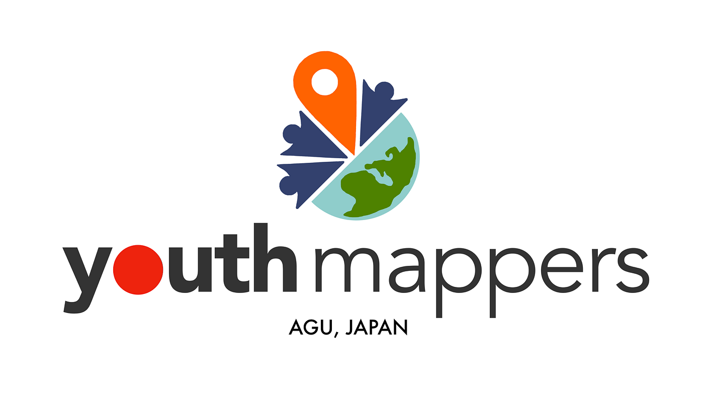
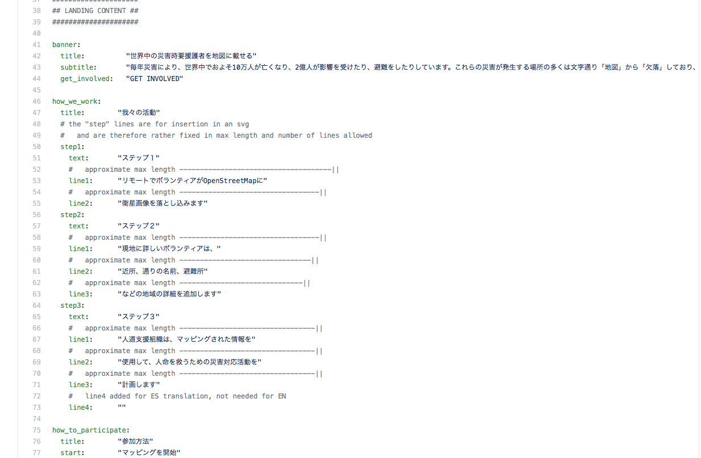
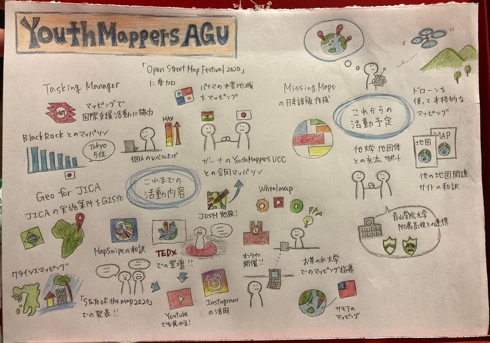

### 今年度も頑張ります

こんにちは、4年の日向野邦春です。

今年度も引き続きYouthMappersAGUのリーダーを努めさせていただきます。

まず最初に新しい古橋ゼミ生や今年度から新たに始まったアドグルの皆さんに向けてYouthMappersAGUはどんな組織なのか紹介させていただきます。

私たちYouthMappersAGUは世界各国の大学などの教育機関に設置されているYouthMappersの日本代表的な役割を果たしてます。青学以外にも2大学申請はしているのですが実質活動しているのは私たちだけです。

#### 活動目的

私たちの活動目的は「日本中にマッピングの重要性と方法を広める事」です。地図を作ると聞いて皆さん最初は難しいと思われるのですが、本当に簡単です。ビックリするくらい、、、そして、私たちが作った地図は確実に世界の助けになっています。

#### 去年のYouth

昨年一年間はかなり成長した一年でした。具体的には

・オンラインマッピングイベントの開催

・State of the MapやHOT Tasking Manager Asia conference への登壇

・MapSwipeのアプリ日本語版を開発

[https://mapswipe.org/jp/index.html](https://mapswipe.org/jp/index.html)

これらのことを行ってきて本当に嬉しい忙しさに包まれた一年でした。

#### 今年のYouth

今年の目標は**去年をステップとしてさらにジャンプすること**です。まずは

**・MissingMapsの日本語版完成**

昨年のハッカソンで取り組んでいたのですが途中で終わってしまっていました。まずはこれを完成させてさらにはリーダーボードまで作ってしまいたいと考えています。

**・ホームページのリニューアル**

[https://furuhashilab.github.io/youthmappers4agu/](https://furuhashilab.github.io/youthmappers4agu/)

ユルさんが作ってくれた土台を使ってきましたが、もう少し自分たちで手を加えていきたいと考えています。

**・ドローンを使ったマッピング**

先日、ユースにDJIのドローンが3台舞い降りて来まして、若干テンションが上がっておりますwこれらを使ってYouth単独で飛ばしてマッピングまでしていけたらと考えています。

こんな感じで今年もやることたくさんありますがメンバー全員で頑張っていきます。

