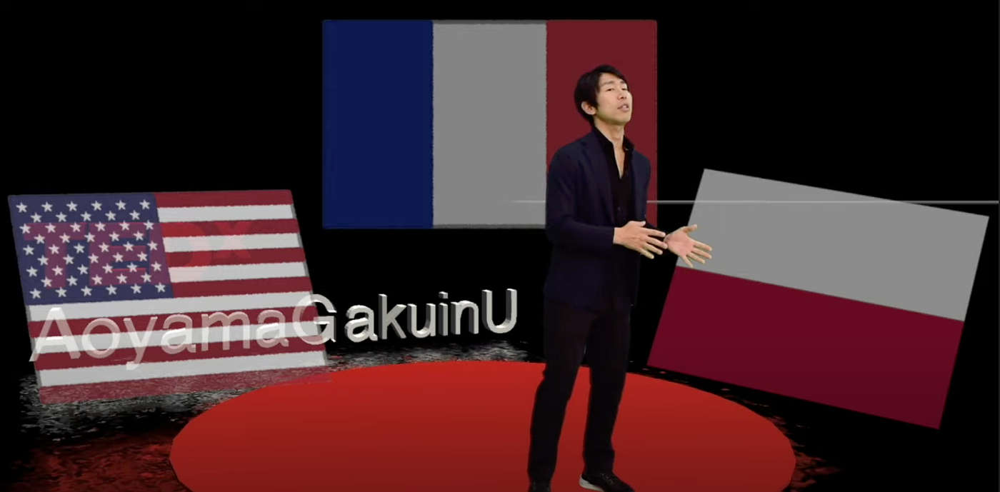
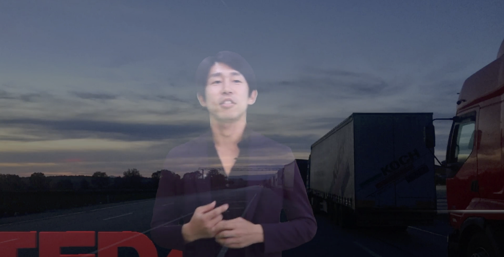
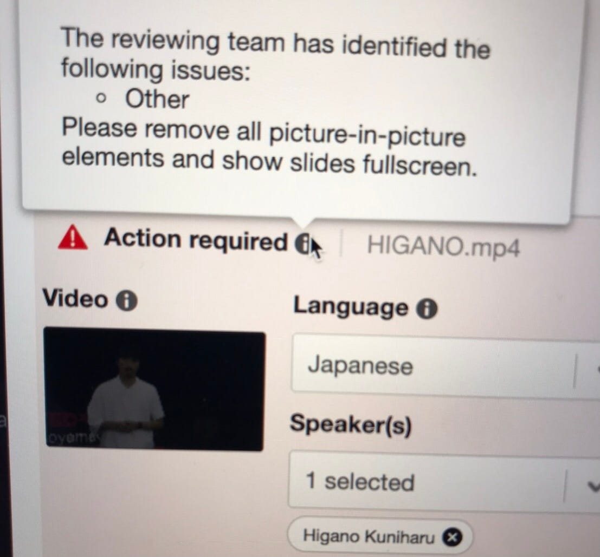
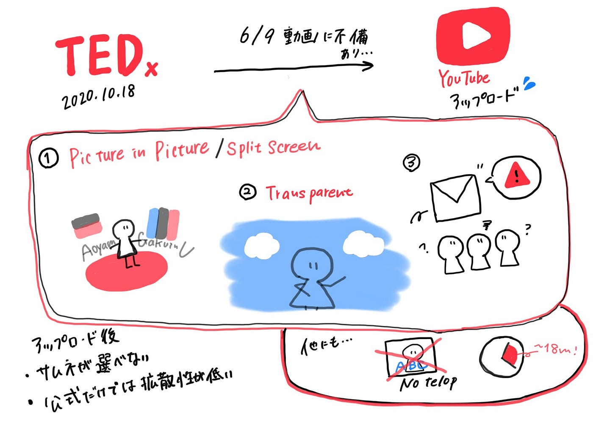

### やっとTEDx終了。。。

2020年10月18日にオンライン開催されたTEDxAoyamaGakuinUは、裏ではまだ終わってませんでした。

本番開催後、TEDx公式YouTubeで配信してもらうため、動画をアップロードする作業がありました。アップロードはすぐに終わるはずでしたが、TEDxのルールにおいてほとんどの動画で不備がありました。

そして、その不備修正と全動画のアップロードがやっと終わったので報告します。

### 修正完了

#### アップロード完了した動画

川崎晶平さん

田中美咲さん

iYuta (石川勇太)さん

松永エリック・匡史さん

森 裕美さん

片岡千之助さん

矢島愛子さん

日向野邦春さん

Sheila Cliffe(シーラ・クリフ)さん

このように無事完成し、アップロードできましたが、実は全９動画のうち6つの動画が不備になっていました。不備修正しているなかで具体的にどのような点が問題なのかが分かりました。

ちなみにTEDxのルールでは、「18分以内の動画であること」「テキストやテロップを入れないこと」「ピクチャーインピクチャやスプリットスクリーンを使わないこと」などがあります。詳しくは下のリンクからご覧ください。

[TEDx Rules
Editing TEDx Talks: Talks should not exceed 18 minutes. Any talk exceeding 18 minutes submitted is subject to review by…www.ted.com](https://www.ted.com/participate/organize-a-local-tedx-event/before-you-start/tedx-rules)

### 不備の条件

#### ピクチャーインピクチャ/スプリットスクリーン

ピクチャーインピクチャとスプリットスクリーンはルール上ではダメとなっていますが、演出として使っていました。結果、不備となり修正することになってしまいました。ですが、例外もあります。

例えば、iYutaさんの場合では３つの国旗をピクチャインピクチャで並べました。ルール上ではだめですが、アップロードできました。TED Media Uploaderでシステムが判断してるのでものによっては背景として判断される場合もあります。

#### 透けさせる演出

下の画像のように演出として画像を透けさていたものは検出され、不備となってました。この透けさせる演出に関してはかなりシビアに検出されました。例えば、画面切り替え時のトランジションのエフェクトの一瞬でも検出されることがあるので気をつけるべきポイントです。
また、画像をスピーカー本人に重なっていると不備になったりします。

### その他特徴

#### 修正時

動画の不備通知は定型文で送られてくるので、修正時は自分で必要な修正部分を推測して直す必要があります。

#### アップロード後

**<サムネが選べない>**
すべての不備が解消してアップロードできた動画は自動でYouTubeに公開されますが、YouTube上で公開されるサムネイルの画像は選べないので、予定外の画像になっていたりします。この仕様に対する解決策はまだ見つけられてません。

**<動画が流れてしまう>
**TEDxのYouTubeチャンネルは１日にかなりの数の講演がアップロードされているので、すぐに流れてしまいます。アップロードしても人の目につきにくいのとサムネイルが選べないという点で公式にアップロードだけでは、拡散性が低いと思います。

<TEDxのGithubリポジトリ>

[furuhashilab/2020_TEDxdesign
TEDxAoyamaGakuinUの会場設計 TEDxメンバー Risa Otaki (Organizer) Sachi Takahashi Suzuka Yoshida Yui Nakamura Youko Yagi Yousuke…github.com](https://github.com/furuhashilab/2020_TEDxdesign)

<グラレコ>

