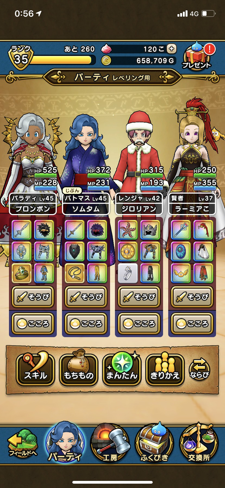

### 位置ゲー部：これからの活動について

#3年生に向けて

位置情報ゲームの伊藤です。

これまで位置情報ゲーム部ではイングレスとPokémon Goの基準設定の見直しと新たに基準となる「ドラゴンクエストウォーク」・「Minecraft Earth」を追加しました。（残念なことにMinecraft Earthは6月30日にサービスが終了します。）

新たに古橋ゼミに所属する3年生に説明をすると

Ingress lv6以上はマスト

＋Pokémon Go lv25以上 ・ドラゴンクエストウォーク 平均パーティlv40以上・Minecraft Earth lv10以上 のどれかを選択

を行う必要があります。

多くの4年生がIngressとPokémon Goをしていました。しかしドラゴンクエストウォークも楽しい位置情報ゲームなので挑戦してみてください。

ちなみにドラゴンクエストウォークは基礎職をlv40にすればよいのでイベントと重なるとすぐに達成できます！

1年間ほどやりこんだ結果、上級職の平均lvを約40に出来ました。

話がそれてしまいましたが、どのように経験値を上げるか分からないなど疑問点があればいつでも位置情報ゲームに相談してくださればいつでも答えます。

＃今後の目標として

1．これからも新作の位置情報ゲームをとにかくチャレンジしてみたいと思います。例：ピクミン、Catan等

2．今後新型コロナウイルスの状況を見て、実際にゼミの人たちと位置情報ゲームを用いてイベント開催など行いたいです。

3．今年も新たな基準や基準の見直しを行いたいと考えています。特にPokémonGoは経験値がポケモンの増加によって安易になったので、見直したいと思います。

来週の週報から本格的に始動していきたいと思います。
