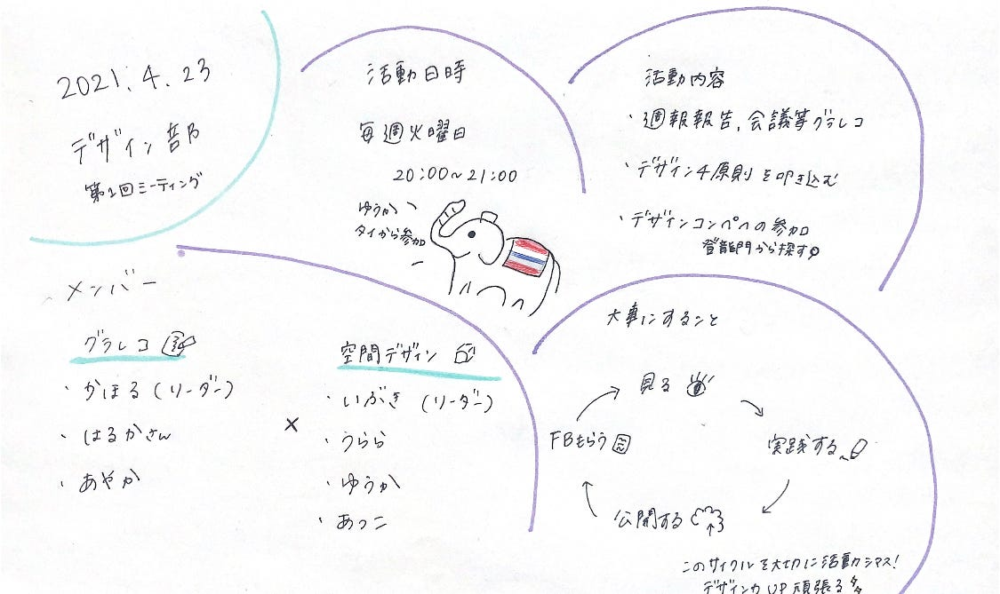

### デザイン部2021！！

[furuhashilab/fc_Design
Contribute to furuhashilab/fc_Design development by creating an account on GitHub.github.com](https://github.com/furuhashilab/fc_Design/blob/main/README.md)

こんにちは。デザイン部です。
今年度より、グラレコ部と空間デザイン部合同でデザイン部として活動をすることになりました。
正直、空間デザイン部つぶれると予想していた（）ので３年生が新たに入ってくれたことそして4年生と共に「デザイン部」を新たに続けられることに感謝してます！

> _１メンバー
２活動内容
３活動目標
４今週のデザイン部_

**メンバーについて**
メンバーは新たに３年生が3名、4年生名5名（アドグル含む）の７人で活動していきます。グラレコ部からかほる、空間デザイン部からは３年生のいぶきをリーダーに活動していきます。

**活動内容について
**活動方法としましては、グラレコ、空間デザインと完全な分離はせず週に１度の活動を通じて「デザイン」を共に学んでいきたいと考えています。
グラレコ部は以前と同様週報報告のグラレコや会議、授業などのグラレコを通じてスキルの向上を目指します。
空間デザイン部は様々なデザインに触れながら、実践を繰り返してデザイン力UPに向けた活動をします。
活動日：毎週火曜日 20:00~21:00 JST に決定しました。

**活動目標について**
今週のMTGではオンラインでの顔合わせと今後の方針をざっくり決定しました。多くのデザインを

**「みる→実践する→公開する→フィードバックをもらう→学ぶ（実践）」**

この繰り返しをすることを重要視します。
デザインを体系的に学び、身につけていくことができたらいいなと考えています。具体的には[登竜門](https://compe.japandesign.ne.jp/category/graphic/)のサイトから適当なコンペに参加することを通じて学んでいこうと思います。

**今週のデザイン部
**オンラインMTGにて顔合わせ、来週からの活動方法、内容等を話し合いました。
新たに三年生のメンバーを迎え、昨年空間デザイン部で学んだデザインの四原則を学ぶことを今週の課題として設けました。
過去に作成した４原則をまとめたもの、古橋書籍にあると思われる「[ノンデザイナーズデザインブック](https://www.amazon.co.jp/%E3%83%8E%E3%83%B3%E3%83%87%E3%82%B6%E3%82%A4%E3%83%8A%E3%83%BC%E3%82%BA%E3%83%BB%E3%83%87%E3%82%B6%E3%82%A4%E3%83%B3%E3%83%96%E3%83%83%E3%82%AF-%E7%AC%AC4%E7%89%88-Robin-Williams/dp/4839955557)」を参考に４原則をしっかり叩きこんでいきたいと思います。

4原則まとめ▼

[デザイン四原則 · Issue #5 · furuhashilab/fc_SpatialDesign
Edit descriptiongithub.com](https://github.com/furuhashilab/fc_SpatialDesign/issues/5#issuecomment-748880763)

**グラレコ**

