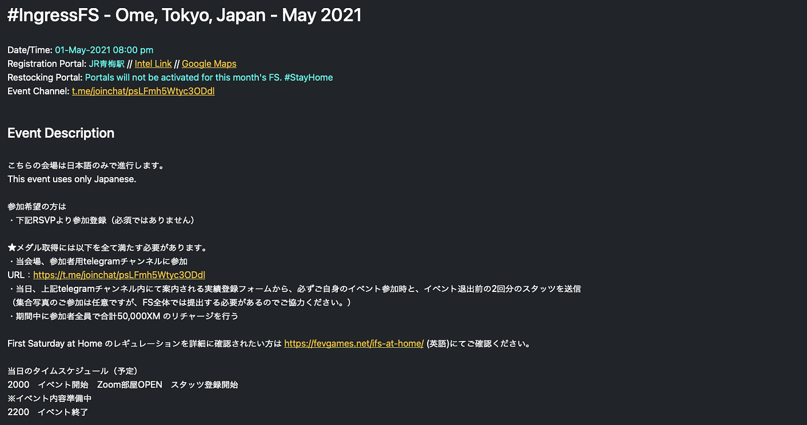
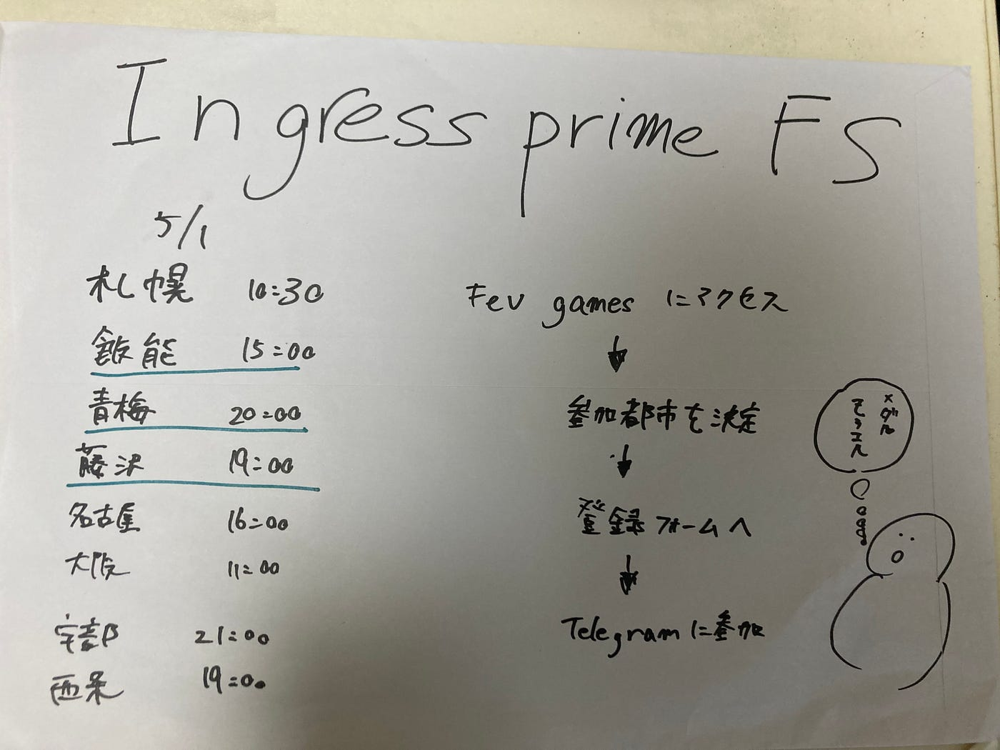

### イングレスFSのお知らせ！

位置ゲーからです。５月1日にファーストサタデーが行われるよ！

> FSとは

FSとは、毎月第1土曜日に開催される定例イベントです。プレイヤー同士の交流を目的としたもので、レジスタンスやエンライテンドの陣営関係なくワイワイ楽しもうぜっ！というクロスファクションイベントとなっています。参加して、指定されたミッションをクリアすると経験値やメダルをゲットすることができます。2020年5月からヴァーチャルファーストサタデーを実施していて、zoomやtelegramを用いたオンラインイベントとなっております。

> FSの実態

初心者用イベントとして開催されているFS。昨年参加した江ノ島FSの際は、初心者はいないのではないかレベルで猛者がゴリゴリにミッションを行ってました。ミッション自体は、暗号解読でした。今年はどうでしょうか、、、

> 参加方法

１. [IngressFS Event Registrations](https://fevgames.net/ifs-reg/)にアクセス

2. 参加する地域を選択 今回の関東では、青梅 藤沢 飯能

3. telegramに参加

経験値も貰えるし、ある程度の知識を得ることができるのでまだ始めてない方やメダル欲しい人は参加しましょう！

