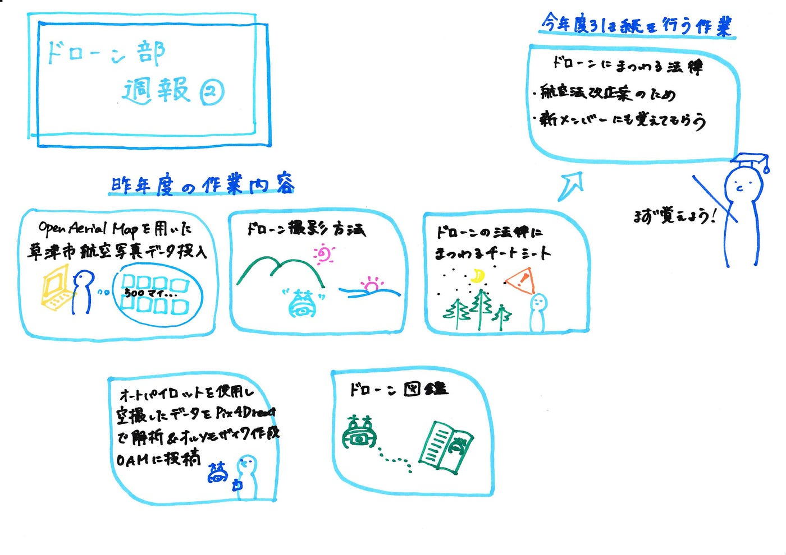

### ドローン部週報②

今週は、昨年度（2020）行ったドローン部の作業内容の振り返りと今後何をしていくのかを話し合いました。

今年度からアドバイザーグループの学生が何人かドローン部に参加するとのことで、新メンバーに活動内容を紹介するためにもまとめました！

#昨年度の作業内容

##Open Aerial Mapを用いた草津市航空写真データの投入

草津市から航空画像を提供していただき、総計500枚のデータを GeoTIFFファイルの作成後（**位置情報などを追加した画像）**、OAMにアップロードする作業を行いました。

[OpenAerialMapの活用（草津市編）](https://medium.com/furuhashilab/openaerialmap%E3%81%AE%E6%B4%BB%E7%94%A8-%E8%8D%89%E6%B4%A5%E5%B8%82%E7%B7%A8-a42476a6f891)

##オートパイロットで空撮した空撮データをPix4Dreactで解析＆オルソモザイク作成し、OAMに投稿

[ドローン週報⑱](https://medium.com/furuhashilab/%E3%83%89%E3%83%AD%E3%83%BC%E3%83%B3%E9%80%B1%E5%A0%B1%E2%91%B1-d09bbfb4ffe8)

##ドローン図鑑

１０社のドローン（DJI、G-FORCEなど）、８つのスペック（サイズ、飛行時間など）をイラストと共に記載した図鑑を作成しました。

[ドローン部 図鑑組 ハッカソン](https://medium.com/furuhashilab/%E3%83%89%E3%83%AD%E3%83%BC%E3%83%B3%E9%83%A8-%E5%9B%B3%E9%91%91%E7%B5%84-%E3%83%8F%E3%83%83%E3%82%AB%E3%82%BD%E3%83%B3-de0e9f340683)

##ドローン撮影方法

６つの撮影方法（Bird eye、Low flying shotなど）の説明及び、実際使われているMVをピックアップしました。

##ドローンの法律にまつわるチートシート

航空法・小型無人機等飛行禁止法・電波法・道路交通法・民法・飛行申請が必要な場所の法律をまとめました。

[ドローンにまつわる法律](https://medium.com/furuhashilab/%E3%83%89%E3%83%AD%E3%83%BC%E3%83%B3%E3%81%AB%E3%81%BE%E3%81%A4%E3%82%8F%E3%82%8B%E6%B3%95%E5%BE%8B-bdd855e0a9c7)

#今年度引き続き行う作業

##ドローンの法律にまつわるチートシート

2021年３月９日に航空法改正案が出たことから、改正後には今後法律チートシートの訂正をする予定です。

また、新しくドローン部に参加する学生にもしっかり確認してほしい部分であるためです。

グラレコ

