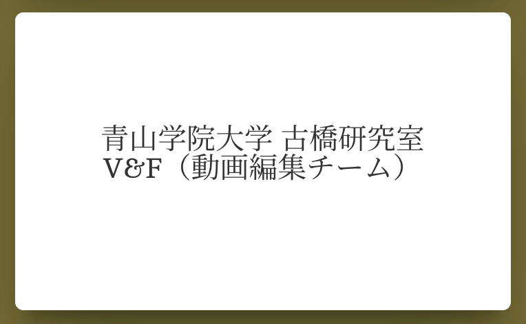
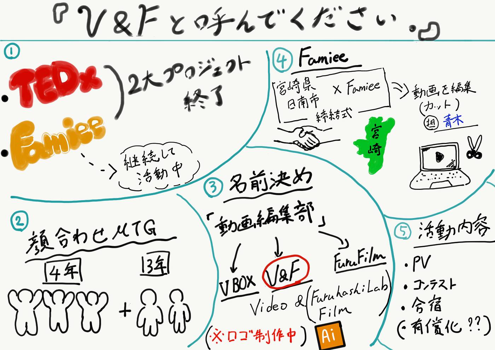

### V&Fと呼んでください。

TEDxとFamieeという２つの大きなプロジェクトが終わってから、落ち着いて3年生の２人と揃ってmtgをした動画編集部です。

#### 顔合わせミーティング

正式にゼミ内サークル動画編集部は活動開始し、３年生は２人加入してくれました！これでひとまずメンバー決定です。

- Tatsumi Baba

- Ren Aoki

- Saho Yoshihara

- Natsumi Haga

- Shiori Ono

この５人で活動していくことになったので、みなさん動画を作って欲しいときは誰かに言ってください。

#### 活動内容

ゼミ内サークルの説明やルールの説明と活動内容をざっくり決めましたので少し紹介します。

- 合宿でPVのようなものを撮影

- 目標としてコンテストのようなものに参加

基本的に、案件をもらえたらそれをこなす形で考えていますが、その他にゼミのイベントや合宿で動画を作ることになりました。ツリーハウス合宿で、早速動けたらなと思っています。そして、動画のコンテストに参加してある程度目標を明確にできたらと考えています。

以上がこれからの活動内容となっています。これからより面白い企画やゼミを盛り上げる活動を詰めて行きます。

#### 名前を決めた！？

実は今回の本題はここからです。

前々から「動画編集部」という名前は部活感がありすぎて、世に出す上ではクリエイティブさが欠けているなと話していました。動画部にも「YouthMappers」や「DRONEBIRD」のような名前がほしい。。。

ということで、名前をつけました。

### V&F

簡単に由来としては「Video」and「Furuhashi Lab(又はFilm)」という感じです。シンプルですが結構気に入ってます。考案したのはNatsumi Hagaです！早速活躍中です。

この名前ですが、**実は前回アプリの動画制作させて頂いた「Famiee」の公式ホームページに乗せてもらうことになりました！**

[Famiee
株式会社メディカルネット代表取締役会長CEO ...www.famiee.com](https://www.famiee.com/top/)

ちなみに、今回はロゴがありませんが、現在馬場が考えているところです。

また、Famieeの方々には引き続き動画の案件を頂いたりしております。先日は宮崎県日南市とFamieeの締結式(自治体で初めて民間発行のパートナーシップ証明書の受け入れ開始)の動画をカット編集させていただきました。これからも引き続き信頼して案件をいただけるようスキルを向上させていきたいと思っています。

[ファウンディングスポンサーとして活動支援中のFamieeが発行するパートナーシップ証明書を、自治体で初めて日南市が行政サービスでの受け入れを開始
【背景】 ...prtimes.jp](https://prtimes.jp/main/html/rd/p/000000253.000002235.html)

#### 改めまして、これからは「V&F」と呼んでください。

#### ＜グラレコ＞

