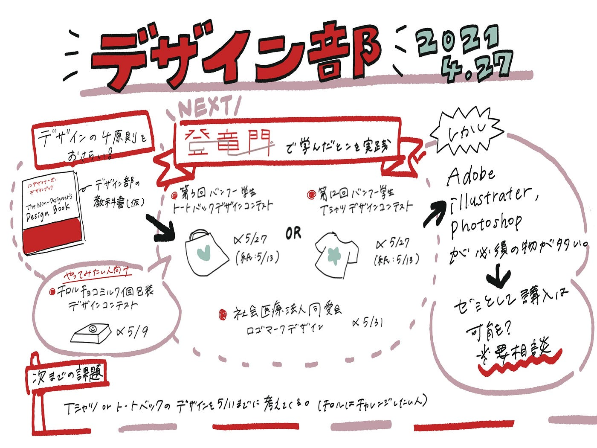

### デザイン部コンペ再び

新たな仲間を迎え始動したデザイン部では、前回の宿題として学んだ「**デザインの４原則**」のおさらいと**コンペティションの選定**を行いました！

### ＃デザインの４原則おさらい

部員全員、我らが**古橋先生**が開講する「**空間情報デザイン基礎**」を受講済・受講中なため、すんなりとおさらい。

デザイン部では、若松が作成した**Github**や「**ノンデザイナーズ・デザインブック**」を教科書とすることにしました。

↓Github記事、Amazonへのリンク

[デザイン四原則 · Issue #5 · furuhashilab/fc_SpatialDesign
Edit descriptiongithub.com](https://github.com/furuhashilab/fc_SpatialDesign/issues/5#issuecomment-748880763)

[ノンデザイナーズ・デザインブック [第4版]
AmazonでRobin Williams, 米谷 テツヤ, 小原 司, 吉川 典秀, 米谷 テツヤ, 小原 司のノンデザイナーズ・デザインブック [第4版]。アマゾンならポイント還元本が多数。Robin Williams, 米谷…www.amazon.co.jp](https://www.amazon.co.jp/%E3%83%8E%E3%83%B3%E3%83%87%E3%82%B6%E3%82%A4%E3%83%8A%E3%83%BC%E3%82%BA%E3%83%BB%E3%83%87%E3%82%B6%E3%82%A4%E3%83%B3%E3%83%96%E3%83%83%E3%82%AF-%E7%AC%AC4%E7%89%88-Robin-Williams/dp/4839955557/ref=asc_df_4839955557/?tag=jpgo-22&linkCode=df0&hvadid=295699908233&hvpos=&hvnetw=g&hvrand=930942598046621997&hvpone=&hvptwo=&hvqmt=&hvdev=c&hvdvcmdl=&hvlocint=&hvlocphy=1009340&hvtargid=pla-526068303039&psc=1&th=1&psc=1)

### ＃コンペティションの選定

デザインの基礎を学んだところで、次は実践するコンペを探しました。

#### **①チロルチョコ ミルク個包装デザインコンテスト**

> _締切：2021年05月09日 (日)
募集内容：ミルク〈袋〉の個包装デザイン
結果発表：2021年6月上旬頃までに大賞受賞者へ通知。
8月末、公式ホームページにて受賞作品を公開予定_

[チロルチョコ ミルク個包装デザインコンテスト！ | コンテスト 公募 コンペ の[登竜門]
一言コメント みんなで作るミルク♪ あなたの作品がチロルチョコに！ 締切 2021年05月09日 (日) 作品提出・応募締切、消印有効 賞 ●チロル大賞（12名）…compe.japandesign.ne.jp](https://compe.japandesign.ne.jp/tirolchoco-milk-design-2021/)

#### **②第3回 バンフー 学生トートバッグデザインコンテスト《学生限定》**

> _締切：2021年05月27日 (木)、紙原稿は2021年05月13日 (木)必着
募集内容：「FUTURE」をテーマにしたトートバッグデザイン
結果発表：2021年7月下旬～8月上旬、受賞者に通知するほか、公式ホームページ・SNSにて発表_

[第3回 バンフー 学生トートバッグデザインコンテスト
第3回 バンフー 学生トートバッグデザインコンテスト - 募集要項 -｜株式会社 帆風(Vanfu) コンテスト名 第3回 バンフー 学生トートバッグデザインコンテスト 募集要項DMをダウンロード 募集内容 トートバッグデザイン テーマ…www.vanfu.co.jp](https://www.vanfu.co.jp/design/tote/)

#### **③第12回 バンフー 学生Tシャツデザインコンテスト《学生限定》**

> _締切：2021年05月27日 (木)、紙原稿は2021年05月13日 (木)必着
募集内容：「つながる」をテーマにしたTシャツデザイン
結果発表：2021年7月下旬～8月上旬、受賞者に通知するほか、公式ホームページ・SNSにて発表_

[第12回 バンフー 学生Tシャツデザインコンテスト
つながるwww.vanfu.co.jp](https://www.vanfu.co.jp/design/t-shirt/)

#### **④社会医療法人 同愛会ロゴマークデザイン**

> _締切：2021年05月31日 (月)
募集内容：社会医療法人 同愛会のロゴマークデザイン
結果発表：2021年6月中旬ごろ、受賞者に通知するとともに、公式ホームページにて_

[社会医療法人 同愛会ロゴマークデザイン募集 | コンテスト 公募 コンペ の[登竜門]
締切 2021年05月31日 (月) 作品提出・応募締切、必着 賞 ●最優秀賞（1点） 賞金10万円●佳作（若干） 募集内容 社会医療法人 ...compe.japandesign.ne.jp](https://compe.japandesign.ne.jp/hakuai-hp-doaikai-logo-2021/)

### ＃問題が…

以上に４つのコンペを選定したのですが、条件として、**Adobe illustraterやPhotoshopの使用が必須**のものが多い…！

この件に関しては、古橋研究室として購入はできるのでしょうか…？要相談です。

### ＃次回までの宿題

締切が近い**①チロルチョコ ミルク個包装デザインコンテスト**に関しては、各自で自由にチャレンジすることにしました。

そのため直近としては、

> _**②第3回 バンフー 学生トートバッグデザインコンテスト《学生限定》
③第12回 バンフー 学生Tシャツデザインコンテスト《学生限定》_**

のどちらかを選び、次回の**5月11日（火）**にフィードバックを行える状態に仕上げることを宿題とします。

グラレコ

