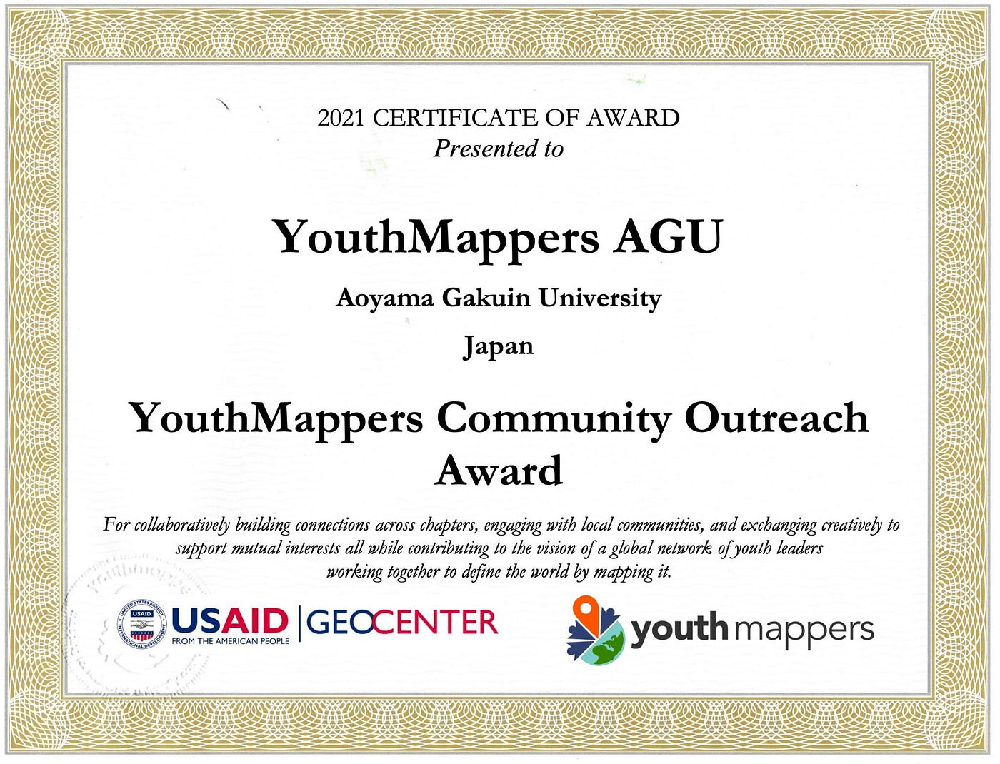
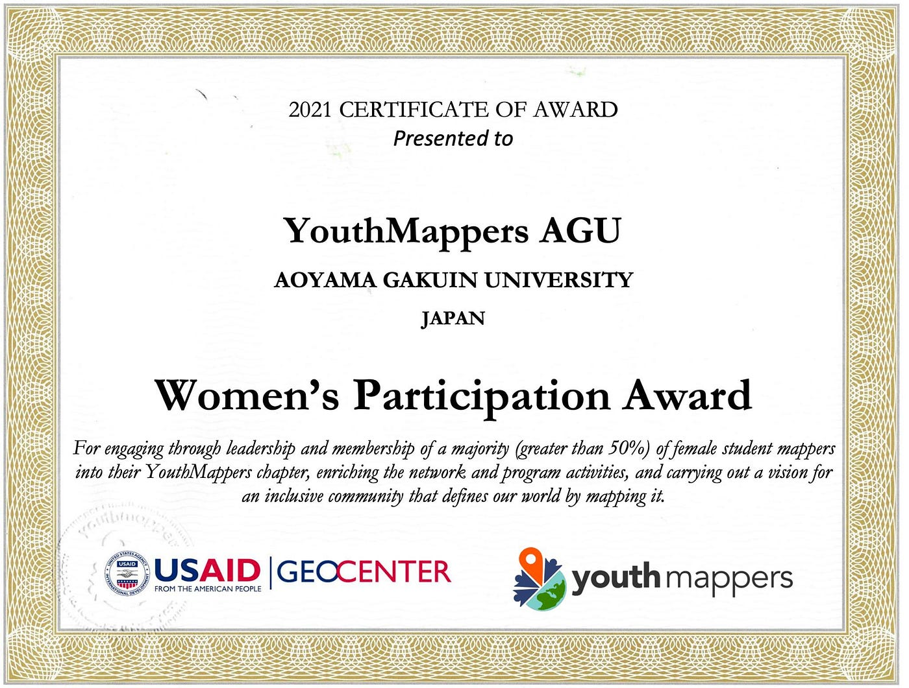
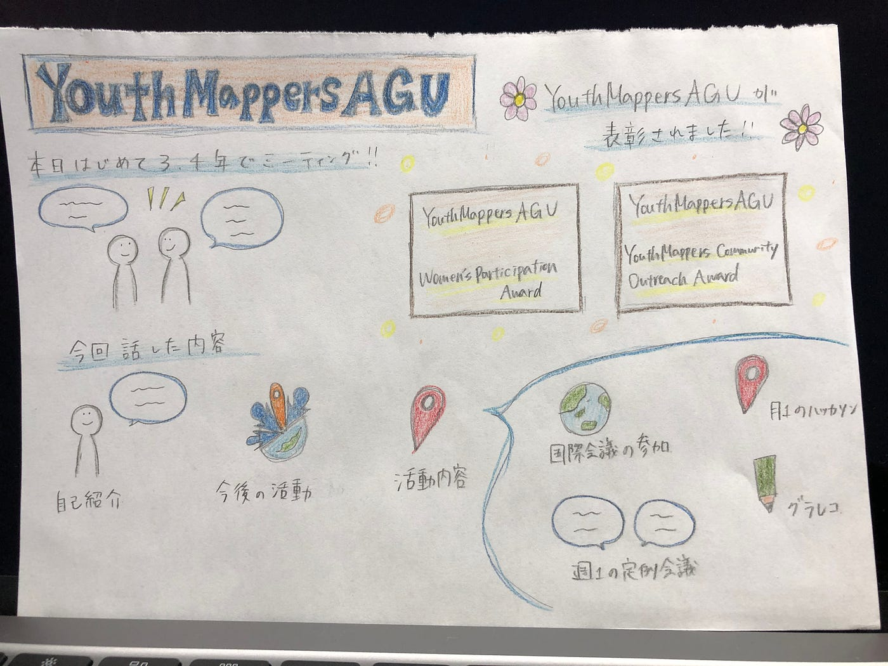

### ２つの賞を受賞しました。

こんにちは4年の日向野邦春です。

先週大きなニュースが入りました。

**YouthMappers Community Outreach Award**

**YouthMappers Women's Paticipations Award**

この2つの賞を受賞しました。

特に1年間賞を狙って活動していた訳では無いのですが、気づいたら受賞してました。

こんな感じで気づいたら結果がついて来るのがYouthMappersAGUです。

今週は3年生が入って来て初めてのMTGでした。自己紹介や活動内容の紹介を行いました。

**今後の予定**

本日の4限からゼミ室でOSMとHOT Tasking Managerの使い方講習会を行います。今まで使った事がある方もそうでない方もYouthの基本的な活動となりますのでぜひ参加してください。

**月一ハッカソン**

月に一回ハッカソンを行っていますが、複数サークルに参加している方はどれか一つに参加していただければと思います。

**直近の目標**

まずはみなさんのMappers levelを中級にまであげてもらえればと思います。そのためにスキルを4限にお伝えするのでぜひ来てくださいね。

