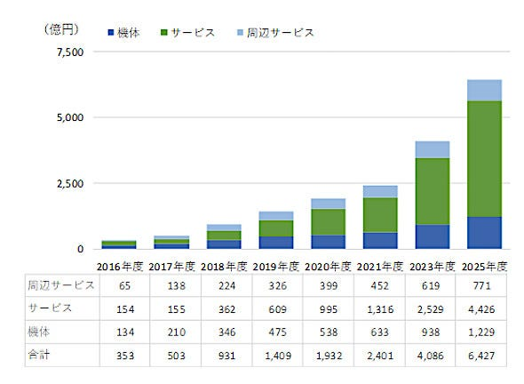

### ドローン部週報③

今週はドローン部リーダーに就任しました神田が担当いたします。

#### **今週の活動内容**

今週は、2021年３月９日に発表された「航空法等の一部を改正する法律案」の閣議決定内容に従って、ドローンの法律にまつわるチートシートの改訂に盛り込む内容を決めました。

まだ改正が決まったわけではないので（仮）版として、

> １.無人航空機の機体認証制度と操縦者の技能証明制度の創設

> 2.事故（人の死傷、物件の損壊、航空機との衝突・接触等）発生時の国への報告を義務付けられること

について今後グラレコで作成し以下に追加していく予定です。

**ドローンの法律にまつわるチートシート**

[https://github.com/furuhashilab/drone/issues/40](https://github.com/furuhashilab/drone/issues/40)

#### 今週のドローンニュース

**中国製ドローンの排除進む。**

アメリカ政府では人権保護や安全保障の観点からDJIに対して禁輸措置を発動していましたが、日本でも解除保安庁がすでに使用を止めるなど政府機関に続いてインフラ企業でも国産ドローンへの切り替えに動いています。

例としてNTT傘下の事業会社では橋梁の通信ケーブルの点検において一部中国製ドローンを使用していますが、次回の機体の更新時期までに自社グループでの製造品を含めた日本製に切り替えるとしています。他にも九州電力なども同様の切り替えを検討しているとのことです。

この背景には情報漏洩などサイバーセキュリティ上のリスクの問題があります。一方で、国産品となると価格面でDJI製品に比べて2倍以上の差が出ること、性能面でも十分な製品が少ないという現状の課題があります。

需要増が期待される中でヤマハ発動機やソニーグループなど、今後の国産メーカーのドローン開発強化にも注目していきたいと思います。

