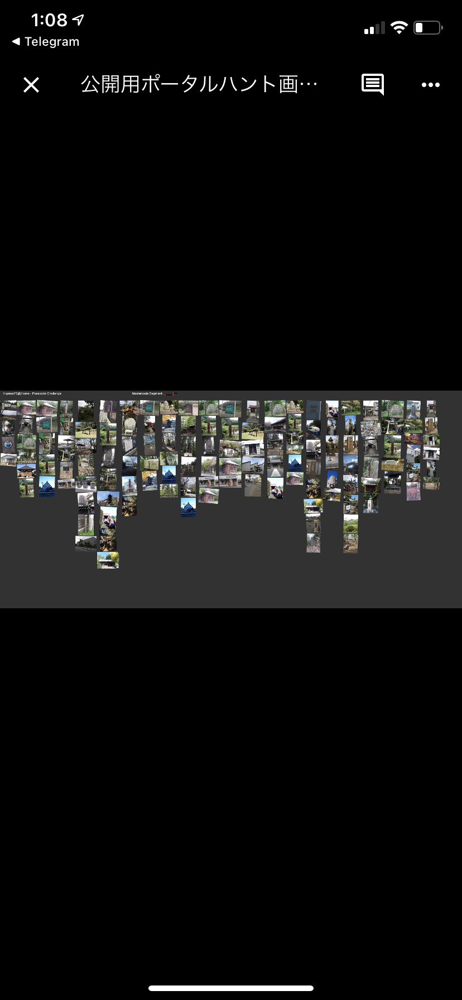
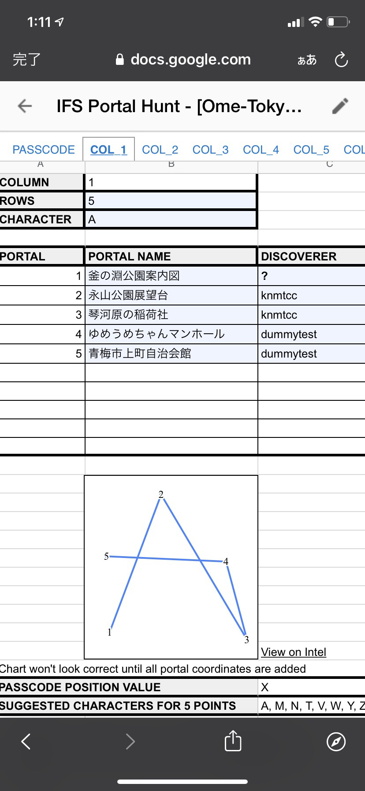
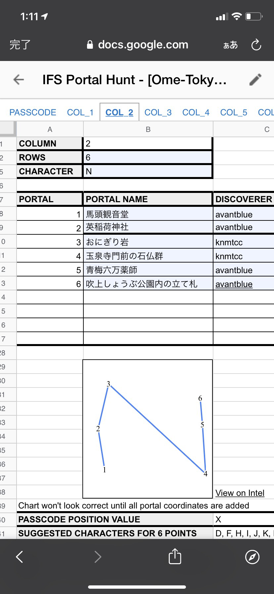
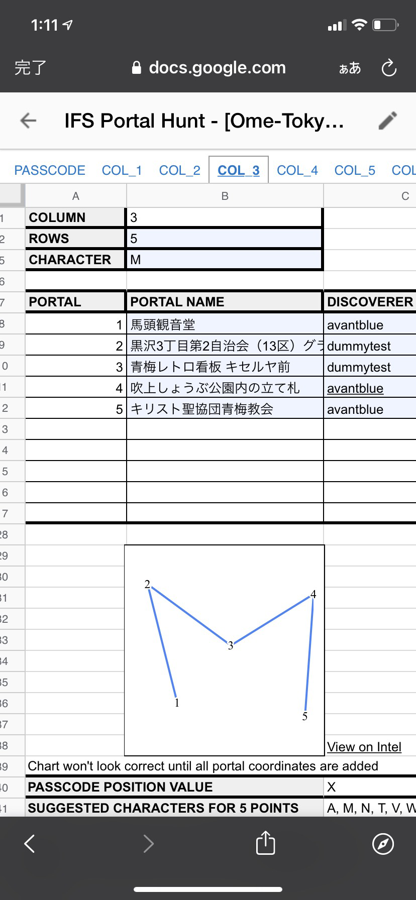
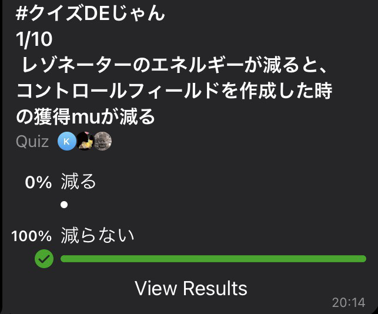
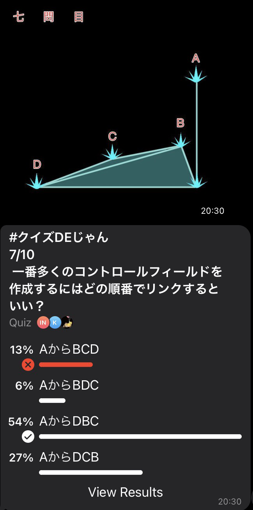
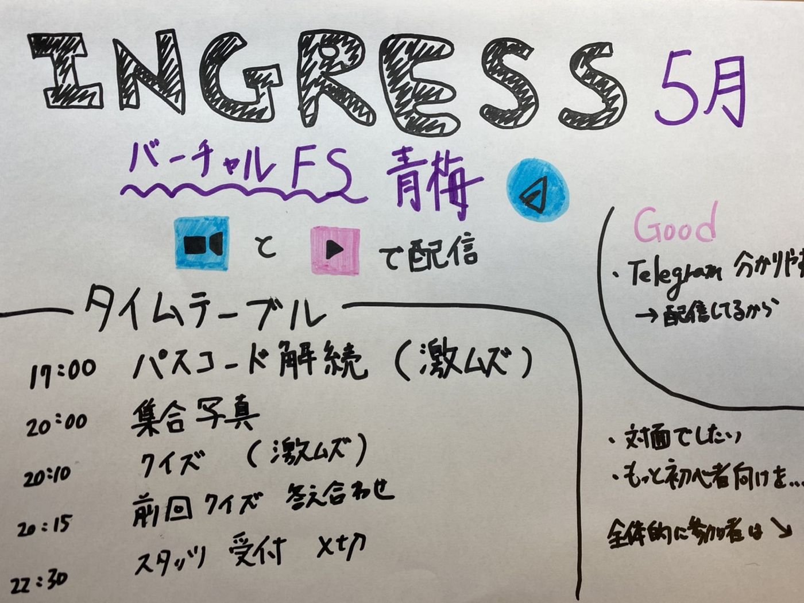

バーチャルFS 青梅に参加してみた。

5月1日に開催されたバーチャル青梅に参加しました。

今回の青梅のFSではTeregramのチャットで意思疎通をしながら、ZoomとYoutube Liveで進行していたので比較的分かりやすかったです。

##タイムテーブルから振り返ってみる。

17時にパスコードの解読が始まりました。

お題の画像はこちらです。

このポータルの画像から暗号を探すというのがミッションでした。

前回参加したFSでもクロスワードをした後に、ポータルの画像から解読するイベントがありました。

難易度が高く、みんなで解析せずに解いていたので、私は何も分かりませんでした。（答えはTeregramに記載されます）

次に20時からZoomとYoutube Liveで配信が始まり、集合写真の撮影や雑談が始まりました。話を聞いていると参加人数は徐々に減少しているとのことでした。

参加している人たちを見てみても、猛者の方たちばかりで集合写真の際にIngressに関わるものを手に持っていました。

FS青梅の面白い点として、マスコットキャラクターの「おうめちゃん」が司会進行をしています。そのため猛者が多くいる中でも、多少入りやすさというのはありました。（聞き専も大丈夫です）

20時10分からクイズが始まりました。

難易度はかなり高いです。最初の問題は割と簡単でしたが、途中からのコントロールフィールドに関しては良くわかりませんでした。位置情報ゲーム部として理解できるよう精進します。

しかし初心者の人向けの問題が1問もなかったので初心者の人には楽しむことが難しいコンテンツではあります。

いきなり難しい解説になるので、最初の5問程度初心者の人向けの問題があればいいと思いました。しかしそのくらい上級者の方しかFSに参加しないから仕方がないのかもしれません。

20時15分から前回のクイズの解説が始まり、Ingressを深く知ることが出来ました。

そして雑談が再開し、22時30分に終了のスタッツを入力し終わりました。

＃＃参加してみての感想

COVID-19の状況にもよりますがいち早く、対面式で実施したほうが良いと思いました。話している内容も初心者の人向けではなく、実際にやることもそこまでないと感じたからです。

しかしTeregramは前回のFSよりも分かりやすく、見たい内容が簡潔にまとめられたものがピン留めされていました。

グラレコはこちら

