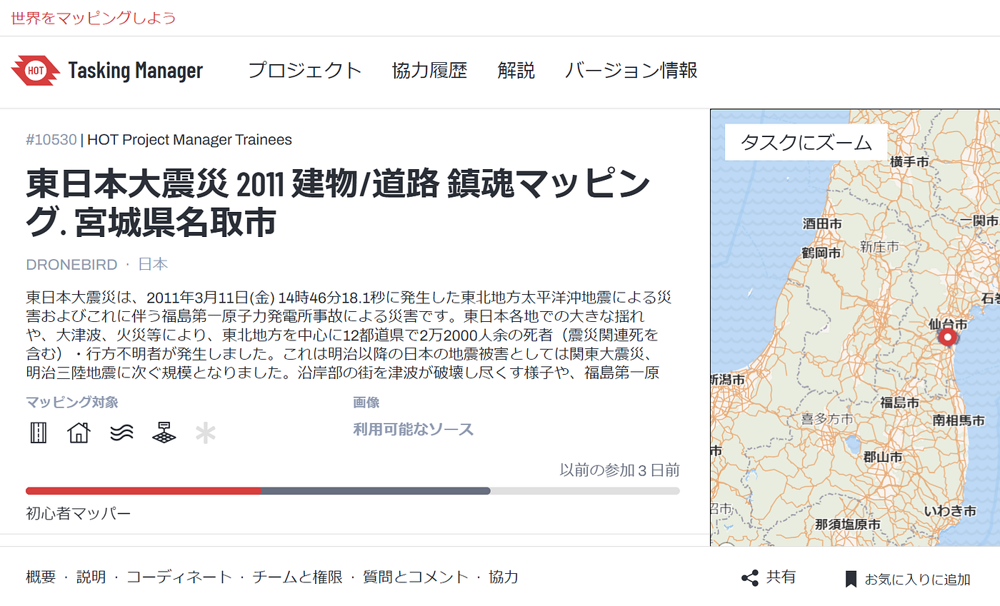
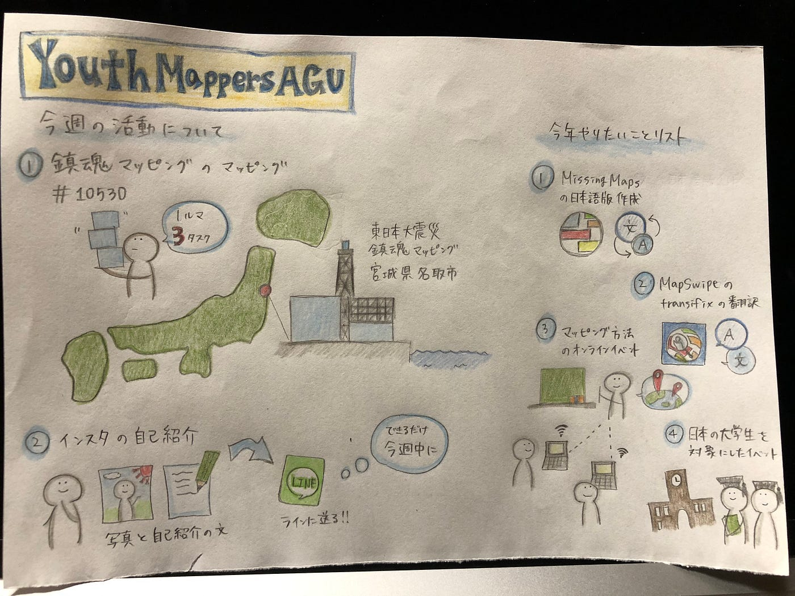

### 新メンバーでの活動開始

5月10日、定例会議を行いました

今回は初めて新しいメンバーが全員そろい、今年度の活動を始めることができました

### 今週の活動

新メンバーもいるので、今週の活動はYouthMappersAGUの一番力を入れているマッピング作業になりました

HOT Tasking Managerの「東日本大震災2011建物/道路鎮魂マッピング.宮城県名取市」というプロジェクトのマッピングを進めます

すでにマッピングされている部分も多いのですが、建物のマッピングもれや、直角化忘れも多く、修正していくことでただマッピングするよりもマッピングに早く慣れられるのではないかと思います

### 今年度の活動

また、今回の定例会では今年度やりたいと思っていることの案を出し合いました

特に、マッピングという作業を広めることに関して複数の意見が出ています

例えば、大学生を対象にしたオンラインのマッピングイベントや有名な人や組織とのコラボによる知名度向上などです

これらの案を具体化していくとともに、人数が増えたことなども生かしてどんどん実行してきます

高橋彩子
