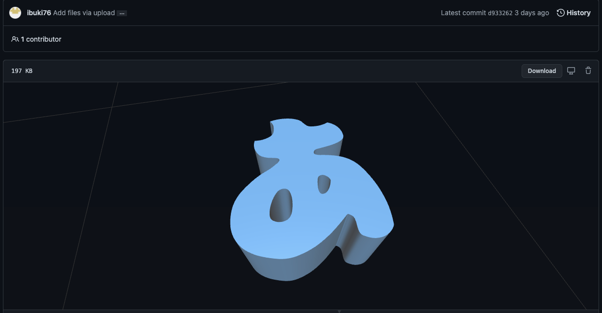
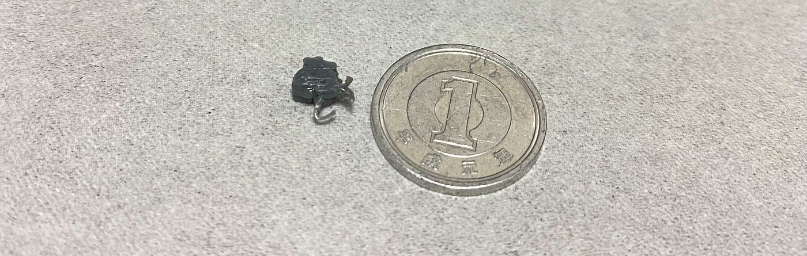
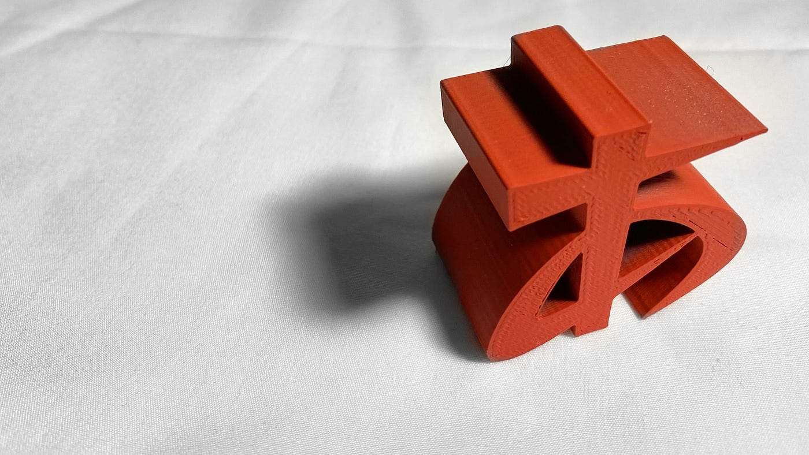
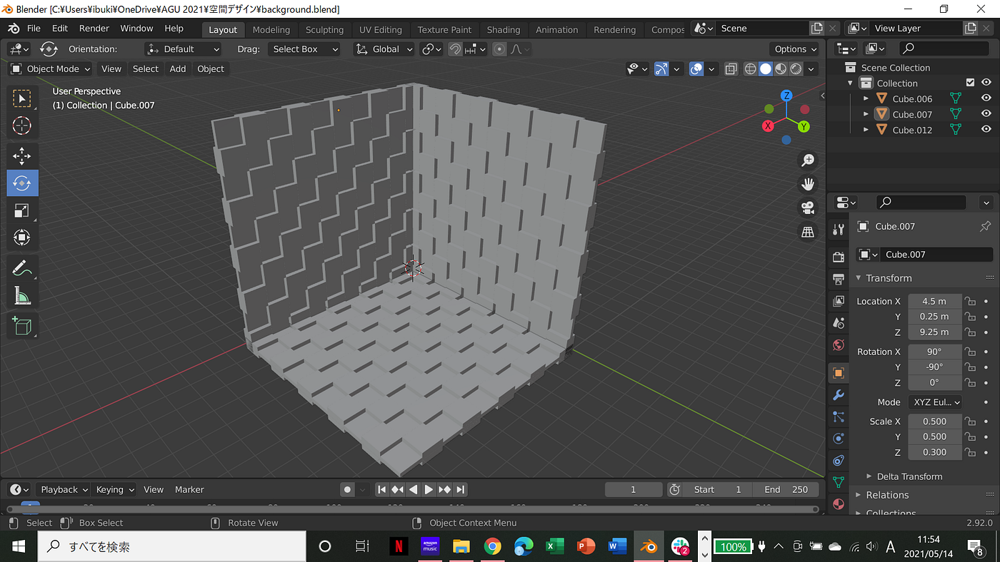
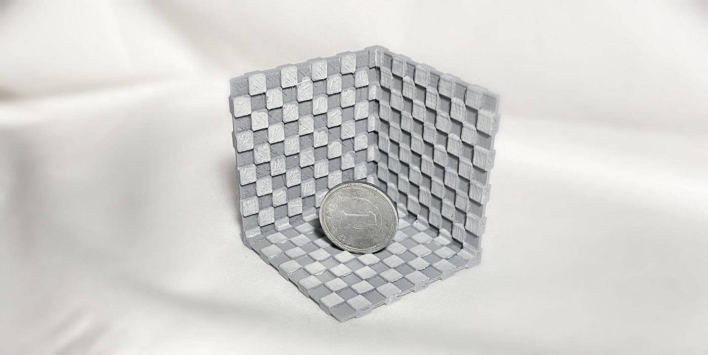
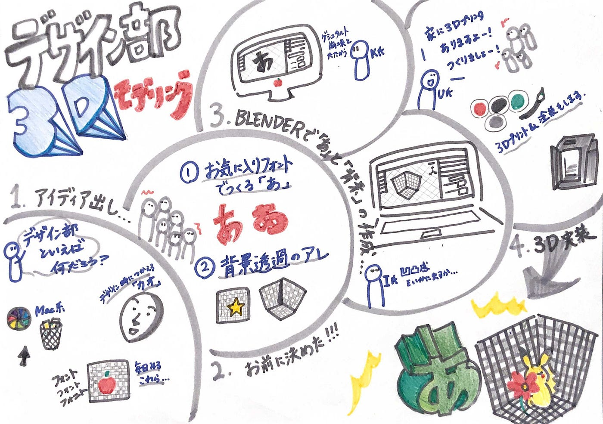

### フォントが３Dに！

こんにちは！デザイン部4年、佐藤です。
今回は５月１１日からのハッカソンについてです！

> 案出し

デザイン部らしいモノを案出しすると、意外にも沢山の案が出ました（笑）
特に**背景透過の格子柄**など、面白い視点の案が人気でした！
今回はデザインに欠かせない**「フォント」**を軸に作ることに。。。

＜案＞
・背景透過の後ろの格子柄（灰色と白のやつ）
→３dプリンターだと色が付けられないので断念！かと思いきや、色塗りを前提にこれも作ることにしました！

・Mac特有の虹色のぐるぐる
→３dプリンターだと色が付けられないので断念

・Mac特有のゴミ箱のデザイン

・Mac特有の指のデザイン

・人の顔

### ・フォント
→難易度も低そうなのでこれを試作！

（長嶋うららのお父さんが３Dプリンターを持っているそうなので、実際に作ってみることに。）

> 担当

・レポジトリ作成→若松
・メディウム→佐藤
・グラレコ→斎藤
・発表資料→若松、安田
・３Dモデリング作成→柴山、菊池
・発表→長嶋

> スケジュール

５月１５日→成果物完成
５月１６日〜１７日→発表資料完成
５月１７日→メディウム＆グラレコ

> 成果物と感想

制作チームの仕事が早い早いで、沢山のフォントが３Dモデリングされました！ちなみにフォントは、[Google Font](https://fonts.google.com/)のフォントを使いました！

こんな感じ〜(^^)

詳しくは[こちら](https://github.com/furuhashilab/fc_Design)!

また、長嶋が実際に３Dプリントしてくれたので、こちらに少々ご紹介。。。色も塗ってくれました！

### ちっちゃい「あ」！
一円と比べてもちっちゃい！

### 性格きつそうな「あ」

### そして、背景透過も！

これが〜、、、

こうなった！笑
実際に色を塗らないと、ですが、色ぬりも含めて楽しく遊べそう！

### 以上、デザイン部発案のガチャガチャの中身でした！

> その他共有

・[GitHubプロジェクト](https://github.com/furuhashilab/fc_Design/projects/2)
・[発表資料](https://docs.google.com/presentation/d/1dMXVSsDdVD4J1DzS8enkzQn8SovU0fHvuhpjOOT-Exo/edit?usp=sharing)
・グラレコ

