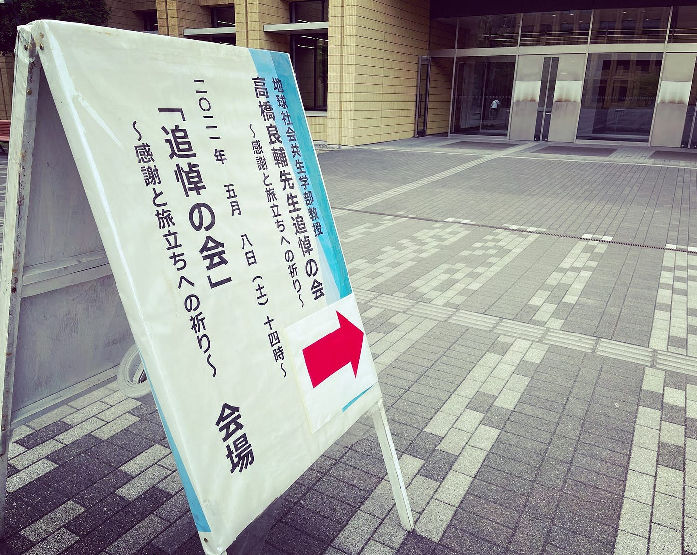
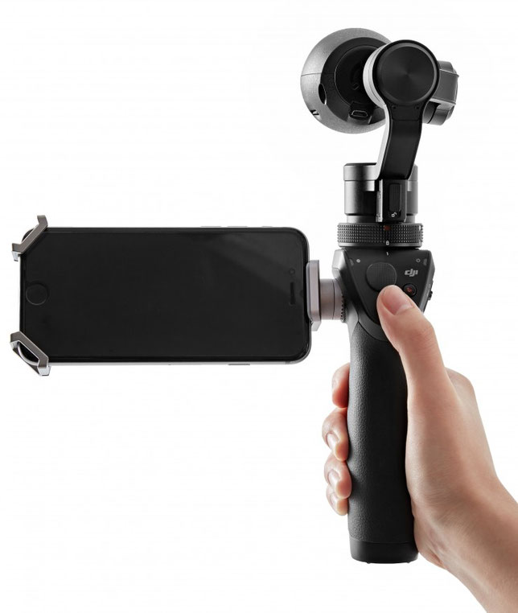
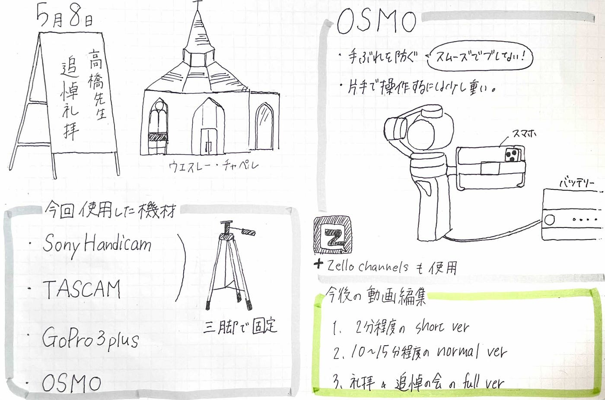

### 高橋良輔先生追悼礼拝

#### V & F 週報

先日の５月８日（土）に青山学院大学相模原キャンパスのウエスレー・チャペルにて、高橋良輔先生追悼礼拝が行われました。

そこでV & Fは高橋良輔先生追悼礼拝と追悼の会の撮影を担当させて頂きました。

私たち３年生にとって初めての活動としての撮影が追悼礼拝というのは正直、胸が痛むところではありました。

無事撮影を終えることが出来て少しホッとしていますが、撮影したデータを編集していく作業はこれからなのでまだまだ気は抜けないところです。

今回使用した機械

・SonyHandicam

・TASCAM

・GOPRO3plus

・OSMO

上記2つのカメラは脚立で固定して使用。OSMOはiPhoneに取り付けて使用。

追悼礼拝では、チャペルの一階と二階にカメラを固定して撮影。

追悼の会ではセンターからと斜めから別の角度にて撮影。

↓OSMO

今回使用したOSMOは手持ちで撮影する際で一番大変な手ぶれを防ぐことができ、通常のiPhoneで撮影するのと比べて安定感が格段に違うと感じました。

なぜOSMOはブレないのか…

ドローンを開発しているDJIから販売されているOSMOにはスタビライザー機能が凄く、撮影者が動いてもカメラを一定の向きに保つことが可能です。そのため揺れや傾きを軽減でき、いわゆる「ヌルヌル動く」スムーズな視点映像の撮影が可能になります。

また、アプリのZello channelsをトランシーバー代わりに使い、連絡を取り合いながら撮影しました。

撮影作業で気づいたことや反省点

### # GoPro

* SDカードの残量チェックを画面表示の数字だけで行ってしまったが、実際には Estimation値よりも短く終了してしまった。結果、追悼礼拝の前半10分程度しか撮影できなかった。
→ 次回はSDカードを抜いて、最低16GB以上、できれば32GB以上の容量があることを確認する。
 * GoPro3+ はそろそろ貧弱なので GoPro9 以降を導入すべき。
 * GoPro3+ の Wi-Fi は本体メニューボタンから任意にONにする必要あり。Wi-Fi パスワードは goprohero

### # Sony Handycam

* 年代物ビデオカメラだったので、予想以上にバッテリーが劣化しており、ACアダプタ外した後、想定よりも短時間でバッテリーが空になった。
→ 新しいバッテリーを追加購入するか、ビデオカメラ刷新

### # iPhone

* 今回想定していなかったが、iPhone用の三脚を用意しておけば、養生テープでの固定が不要なので、次回は iPhone用三脚か OSMO Mobile で固定して、OSMO用三脚で対応すべき。

今の段階での動画の編集パターン

１．礼拝と追悼の会をフルで繋げるフルバージョン（ご親族様への動画）

２．１０〜１５分程にまとめたバージョン

３．２分程にまとめたバージョン

以上の3パターンを現段階では考えています。

参考文献

[https://www.cyring.co.jp/2016/05/15/dji-osmo-使い方/](https://www.cyring.co.jp/2016/05/15/dji-osmo-%E4%BD%BF%E3%81%84%E6%96%B9/)

今週のグラレコ↓

