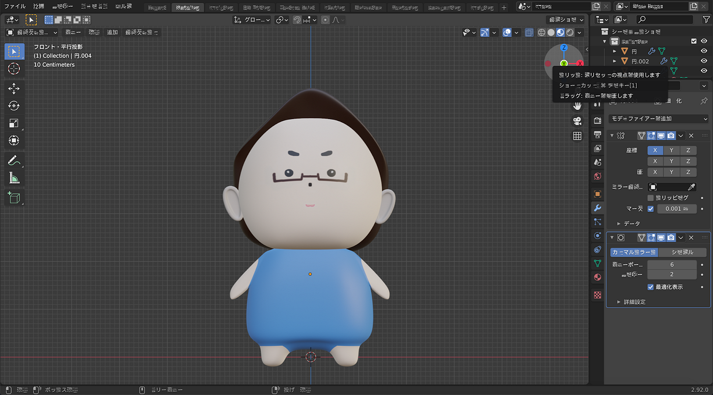
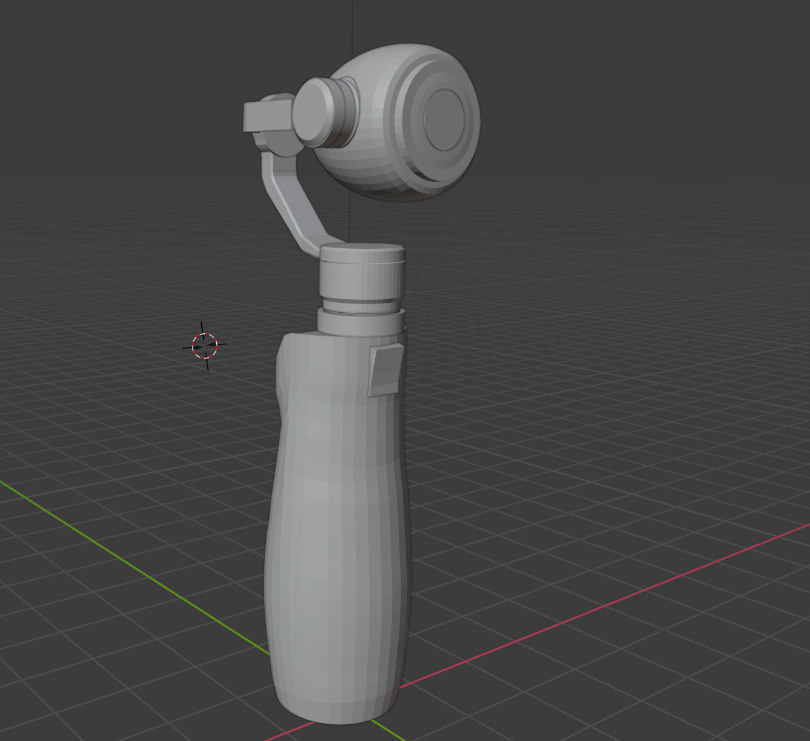
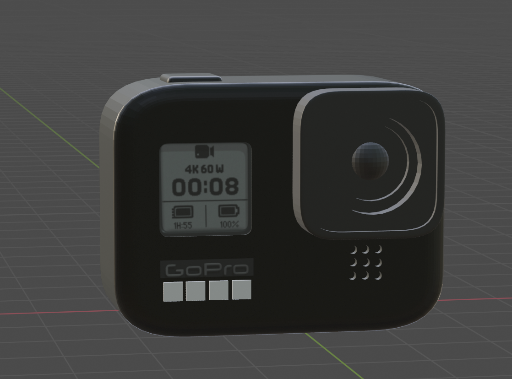
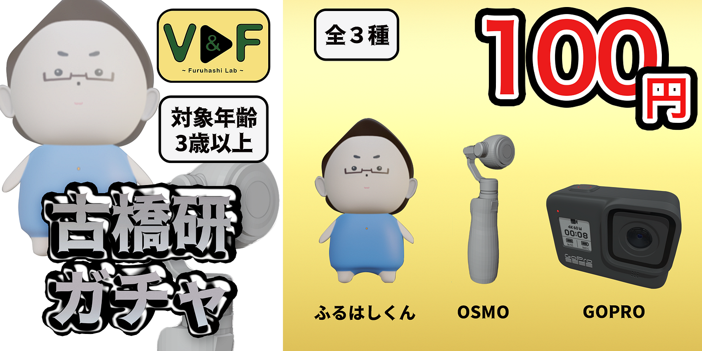
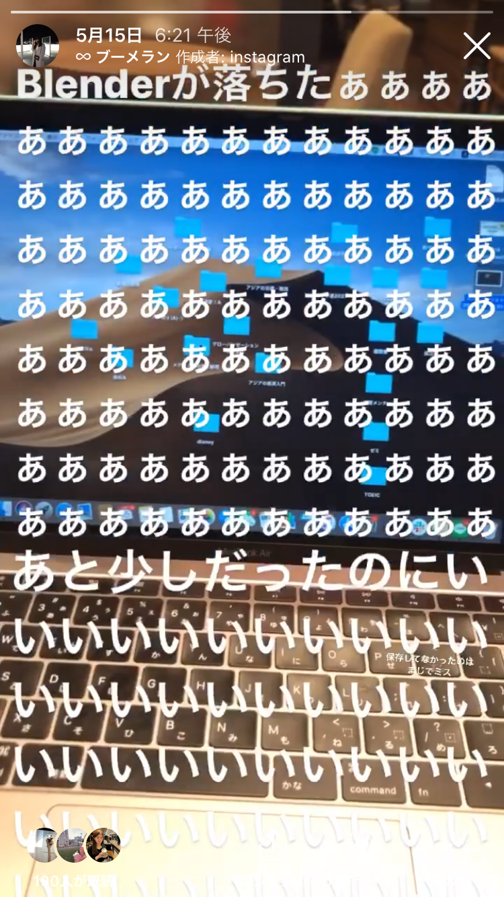
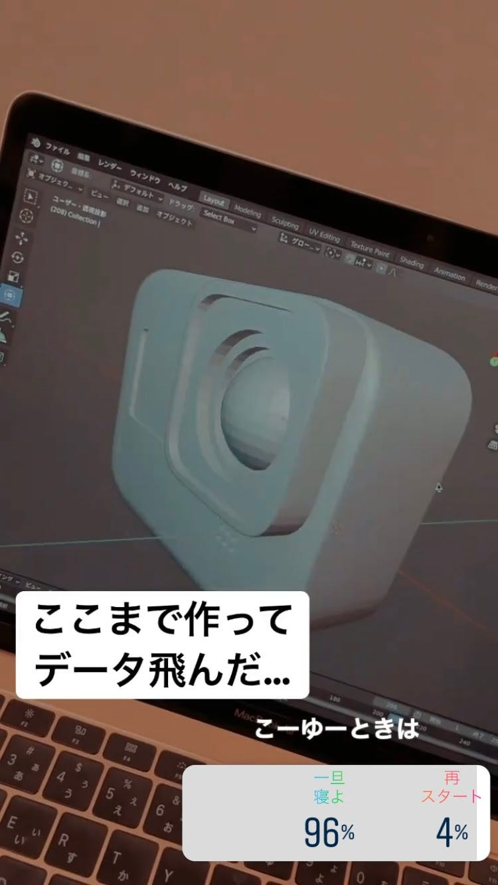
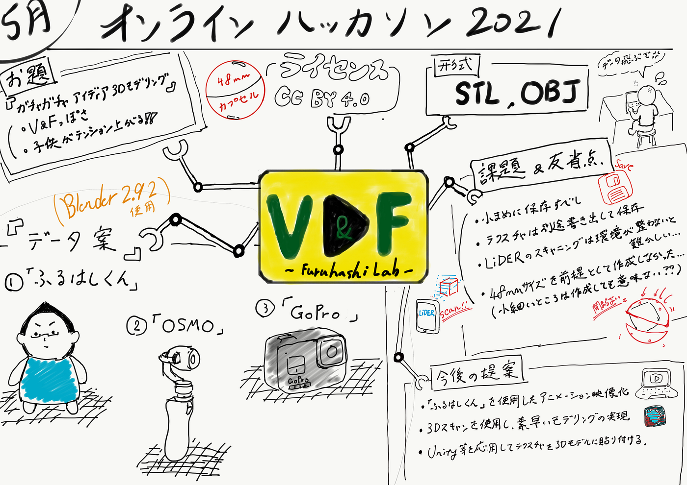

### ガチャガチャ「ふるはしくん」！？

2021年の古橋ゼミの初回のハッカソンのお題は

**「古橋研究室ガチャガチャのアイデア 3Dモデリング」**

モデリングのスキルをあげるためにガチャガチャ用のおもちゃを考えようという会ですね。

### まずは、大まかにルールを確認しましょう。

> ・48mmカプセルに収まるサイズで3Dプリンター出力前提の3Dモデルを作成する

> ・最低１データセット。複数のデータで組み合わせることも可能。

> ・データ形式は STLファイル及び、OBJファイル(テスクチャ/スタイル付きが望ましい)

> ・著作物としてのライセンスはオープンデータ化可能なものとする(事実データならば良い)。

> ・作成したデータは CC BY 4.0 で公開予定

### チームV&Fとしては、どういうアイデアを出したのでしょうか？

簡単に言うと、「V&Fっぽいもの」「子供がテンション上がりそうなもの」「古橋研究室っぽいもの」等、こんなところですね。

> **◆V&Fに関係あるもの
**◎カメラ系
・OSMO
・GOPRO
・カチンコ(カットするときに使う板)
◎その他撮影系
・グリーンバック
・マイク

> **◆子供が好きそうなもの
**◎キャラ系
・古橋先生
・ゴロリ
◎ガジェット系
・G-SHOCK

> **◆古橋研究室っぽいもの
**・バルミューダ
・Mac系
・Amazon Echo

### ３つ作ることに

作ることになったのは３つ

> ◎OSMO
◎GOPRO
◎古橋先生の新キャラ「ふるはしくん」

古橋研究室っぽいものをつくると言いつつ、本人を作るという。
芸がなくてすいません。しかし、そろそろ新キャラがいても良いのではないでしょうか？

### 3Dモデリング

当初は iPhone12のLiDARを駆使して現物をスキャンして取り込んでから修正する予定でした。ところが、スキャンが思いのほかうまくいかず、Blenderで1から写真や現物を見ながらモデリングをすることになりました。今回、主にモデリングをしたのはBabby、Yoshihara、Hagaです。

まずは完成品を見ていきましょう。

### 成果物

※使用ソフト
Blender ver.2.92

### 「ふるはしくん」

**・制作ポイント**
子供受けの良い丸いフォルム。
Texture Paint を使って顔の細かいパーツを表現。

**・参考文献**

[【2021】Blender(ブレンダー)の使い方を日本語でわかりやすく解説
無料で初心者でも導入しやすいCG制作ソフトBlender（ブレンダー）。 「いろいろなことができるみたいだけれど、情報が多すぎていまいちどうすれば良いのかわからない」という方も少なくないかと思います。…jp.renderpool.net](https://jp.renderpool.net/blog/blender%E3%81%AE%E4%BD%BF%E3%81%84%E6%96%B9)

### OSMO

**・制作ポイント
**接続部分等の細かいところの作成。
実物とおなじところにDJIのロゴを配置し、不要な部分は除去しました。

**・参考文献**

[Blender | Blenderチートシート・基本操作ショートカット一覧表（日本語）2.91+業界互換キーマップ
Blenderショートカット一覧表、ver2.91対応です。 Blender 2.91 デフォルト (2020-12-04更新） 業界互換キーマップ (2019-12-04更新）…rt3dcg.blogspot.com](http://rt3dcg.blogspot.com/2020/12/blender29x-cheatsheet.html)

### GoPro

**・制作ポイント**
ベベルを駆使してGoPro特有の丸みのあるフォルムを再現。
ひと目見てGoProだと認識してもらえるように特徴を捉えた作品作りに注力した。

**・参考文献**

### ガチャガチャのもう一つの重要な要素

ガチャガチャと言えば、引くときに「中身が見えそうで見えない」あのワクワク感がまた楽しい要素の一つですよね。
**「説明書」**あってのガチャガチャだと思ってます。

作りました。

### 苦労した点

皆、使い慣れていないソフトな上に、3Dモデリングのような重い作業だからこその、あるあるな苦悩がいくつかありました。

> ・スキャン難しい

> ・日本語表記にすると文字化けする

> ・エクスポートがうまくできない

> ・テクスチャが反映されない

さらに、、、やってしまった

### データ消える事件

### 課題/反省点

> ・データは飛ぶもの。小まめに保存しよう。

> ・テクスチャ込みでの書き出し方法を理解しておくべき。

> ・ GitHubへのデータのアップロードが25MB 以下でないと出来ないので、別案で対処しないといけない。

> ・LiDARでのスキャンは、無料版だと実用性はあまりないかもしれない。スキャンの技術の問題なのか、アプリの問題なのか、そもそも精度がまだまだなのか、これから試していきたい。

> ・48mmサイズをあまり想定せずに制作してしまった。

### 今後への提案

> ・「ふるはしくん」にアニメーションをつけて今後の動画に組み込む。動画で使用したい。

> ・Unityなどのソフトを応用してテクスチャーを３Dモデルに貼り付ける。

> ・３Dスキャンを使い、素早いモデリングを目指す。別の 精度の良い有料のものを購入してみる等、試してみる。

> ・細かくバックアップすべし。最重要ですね。

#### 参考文献

[V&F 参考資料
資料 動画/資料タイトル,URL,ジャンル(ソフトの種類とか),内容 How I Make My Maps,YouTube…docs.google.com](https://docs.google.com/spreadsheets/d/1uEuObadMe0p8iEDhlEdV4rXgmF0ZzPFmOqyGGkFBC4Y/edit?usp=sharing)

#### グラレコ

#### Githubプロジェクト

[furuhashilab/Hackathon_VF
You can't perform that action at this time. You signed in with another tab or window. You signed out in another tab or…github.com](https://github.com/furuhashilab/Hackathon_VF/projects/1)

#### スライド
